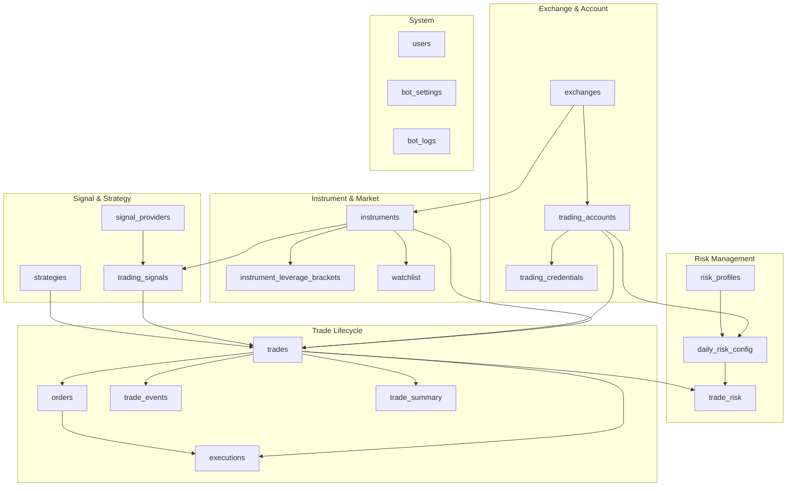

# Database Schema Documentation

> **Auto-generated from:** `backend/src/database/models/`
> **Last Updated:** 2026-08-28
> **ORM:** SQLAlchemy 2.0 (Mapped Column style)
> **Supported Dialects:** PostgreSQL (primary), SQLite (fallback development)

Dokumentasi ini menjelaskan seluruh schema database yang digunakan oleh **Semi-Automated Binance Futures Trading Bot**. Schema terdiri dari **19 tabel** yang dikelompokkan ke dalam 6 domain fungsional.

---

## Daftar Isi

- [Entity Relationship Diagram (ERD)](#entity-relationship-diagram-erd)
  - [Full ERD](#full-erd)
  - [Simplified Domain Grouping](#simplified-domain-grouping)
- [Ringkasan Tabel](#ringkasan-tabel)
- [Table Definitions](#table-definitions)
  - [Domain: Exchange & Account Management](#domain-exchange--account-management)
    - [exchanges](#1-exchanges)
    - [trading_accounts](#2-trading_accounts)
    - [trading_credentials](#3-trading_credentials)
  - [Domain: Instrument & Market Data](#domain-instrument--market-data)
    - [instruments](#4-instruments)
    - [instrument_leverage_brackets](#5-instrument_leverage_brackets)
    - [watchlist](#6-watchlist)
  - [Domain: Signal & Strategy](#domain-signal--strategy)
    - [signal_providers](#7-signal_providers)
    - [strategies](#8-strategies)
    - [trading_signals](#9-trading_signals)
  - [Domain: Risk Management](#domain-risk-management)
    - [risk_profiles](#10-risk_profiles)
    - [daily_risk_config](#11-daily_risk_config)
    - [trade_risk](#12-trade_risk)
  - [Domain: Trade Lifecycle](#domain-trade-lifecycle)
    - [trades](#13-trades)
    - [orders](#14-orders)
    - [executions](#15-executions)
    - [trade_events](#16-trade_events)
    - [trade_summary](#17-trade_summary)
  - [Domain: System & Operations](#domain-system--operations)
    - [users](#18-users)
    - [bot_settings](#19-bot_settings)
    - [bot_logs](#20-bot_logs)
- [Enum & Check Constraint Reference](#enum--check-constraint-reference)
- [Index Reference](#index-reference)

---

## Entity Relationship Diagram (ERD)

### Full ERD

```mermaid
erDiagram
    exchanges ||--o{ trading_accounts : "has many"
    exchanges ||--o{ instruments : "lists"

    trading_accounts ||--o{ trading_credentials : "has many"
    trading_accounts ||--o{ trades : "initiates"
    trading_accounts ||--o{ daily_risk_config : "snapshots"

    instruments ||--o{ instrument_leverage_brackets : "has tiers"
    instruments ||--o{ watchlist : "tracked in"
    instruments ||--o{ trading_signals : "targets"
    instruments ||--o{ trades : "traded on"

    signal_providers ||--o{ trading_signals : "produces"

    strategies ||--o{ trades : "used by"

    risk_profiles ||--o{ daily_risk_config : "configures"

    trading_signals ||--o{ trades : "triggers"

    daily_risk_config ||--o{ trade_risk : "budgets"

    trades ||--|| trade_risk : "has one"
    trades ||--o{ orders : "comprises"
    trades ||--o{ executions : "fills"
    trades ||--o{ trade_events : "logs"
    trades ||--|| trade_summary : "summarized by"

    orders ||--o{ executions : "filled by"

    exchanges {
        int id PK
        string code UK
        string name
        bool status
        datetime created_at
        datetime updated_at
    }

    trading_accounts {
        int id PK
        int exchange_id FK
        string name
        string account_type
        string environment
        bool is_active
        datetime created_at
        datetime updated_at
    }

    trading_credentials {
        int id PK
        int account_id FK
        string key_name
        string encrypted_api_key
        string encrypted_secret_key
        string encrypted_passphrase
        int key_version
        bool is_active
        datetime created_at
        datetime updated_at
    }

    instruments {
        int id PK
        int exchange_id FK
        string symbol
        string base_asset
        string quote_asset
        decimal tick_size
        decimal step_size
        decimal min_qty
        decimal min_notional
        int price_precision
        int qty_precision
        bool is_active
        datetime updated_at
    }

    instrument_leverage_brackets {
        int id PK
        int instrument_id FK
        int bracket
        int initial_leverage
        decimal notional_cap
        decimal notional_floor
        decimal maint_margin_ratio
        decimal cum
        datetime updated_at
    }

    watchlist {
        int id PK
        int instrument_id FK
        bool enabled
        datetime created_at
        datetime updated_at
    }

    signal_providers {
        int id PK
        string name UK
        string type
        bool is_active
        datetime created_at
    }

    strategies {
        int id PK
        string name
        string version
        string description
        bool is_active
        datetime created_at
    }

    trading_signals {
        int id PK
        int provider_id FK
        int instrument_id FK
        int telegram_message_id
        string timeframe
        string side
        decimal entry_min
        decimal entry_max
        decimal sl_price
        decimal tp1_price
        decimal tp2_price
        decimal tp3_price
        decimal confidence
        string raw_message
        string parsed_json
        string status
        string confirmation_status
        datetime created_at
        datetime updated_at
    }

    risk_profiles {
        int id PK
        string name UK
        decimal risk_percent
        decimal max_daily_loss
        int max_open_trade
        bool is_active
    }

    daily_risk_config {
        int id PK
        int account_id FK
        int risk_profile_id FK
        date date
        decimal balance
        decimal risk_amount
        datetime created_at
    }

    trade_risk {
        int trade_id PK_FK
        int daily_risk_id FK
        decimal entry
        decimal stop
        decimal stop_distance
        decimal qty
        decimal margin
        decimal risk_amount
        int leverage
        datetime created_at
    }

    trades {
        int id PK
        int account_id FK
        int strategy_id FK
        int signal_id FK
        int instrument_id FK
        string side
        string status
        decimal entry_price
        decimal avg_entry_price
        decimal sl_price
        decimal tp1_price
        decimal tp2_price
        decimal tp3_price
        int leverage
        string margin_mode
        decimal position_size
        decimal remaining_qty
        datetime opened_at
        datetime closed_at
        datetime created_at
        datetime updated_at
    }

    orders {
        int id PK
        int trade_id FK
        string exchange_order_id UK
        string client_order_id UK
        string purpose
        string order_type
        string side
        bool reduce_only
        bool close_position
        string time_in_force
        decimal price
        decimal qty
        decimal filled_qty
        string status
        datetime created_at
        datetime updated_at
    }

    executions {
        int id PK
        int order_id FK
        int trade_id FK
        decimal price
        decimal qty
        decimal commission
        string commission_asset
        decimal realized_pnl
        bool is_maker
        datetime executed_at
    }

    trade_events {
        int id PK
        int trade_id FK
        string event_type
        string payload_json
        datetime created_at
    }

    trade_summary {
        int trade_id PK_FK
        decimal gross_pnl
        decimal net_pnl
        decimal commission
        decimal funding
        decimal roi
        decimal rr
        string result
        int duration_seconds
        string close_reason
        datetime closed_at
    }

    users {
        int id PK
        string username UK
        string password_hash
        string role
        bool is_active
        datetime created_at
        datetime updated_at
    }

    bot_settings {
        string key PK
        string category
        string type
        string value
        string description
        datetime updated_at
    }

    bot_logs {
        int id PK
        string module
        string level
        string message
        string context_json
        datetime created_at
    }
```

### Simplified Domain Grouping



---

## Ringkasan Tabel

| No | Tabel | PK | Deskripsi Singkat | FK Count | Child Tables |
|:--:|:------|:---|:------------------|:--------:|:-------------|
| 1 | `exchanges` | `id` (auto) | Platform exchange crypto (Binance, Bybit, dll) | 0 | trading_accounts, instruments |
| 2 | `trading_accounts` | `id` (auto) | Akun trading per exchange per environment | 1 | trading_credentials, trades, daily_risk_config |
| 3 | `trading_credentials` | `id` (auto) | API key terenkripsi untuk akun trading | 1 | — |
| 4 | `instruments` | `id` (auto) | Detail simbol trading dan pengaturan presisi | 1 | instrument_leverage_brackets, watchlist, trading_signals, trades |
| 5 | `instrument_leverage_brackets` | `id` (auto) | Tiered leverage dan notional limit dari exchange | 1 | — |
| 6 | `watchlist` | `id` (auto) | Daftar instrumen yang diizinkan untuk trading aktif | 1 | — |
| 7 | `signal_providers` | `id` (auto) | Sumber sinyal trading (Telegram, Webhook, dll) | 0 | trading_signals |
| 8 | `strategies` | `id` (auto) | Konfigurasi dan metadata strategi trading | 0 | trades |
| 9 | `trading_signals` | `id` (auto) | Sinyal trading dari provider beserta lifecycle-nya | 2 | trades |
| 10 | `risk_profiles` | `id` (auto) | Profil manajemen risiko (risk%, max loss, max positions) | 0 | daily_risk_config |
| 11 | `daily_risk_config` | `id` (auto) | Snapshot saldo harian dan budget risiko per-trade | 2 | trade_risk |
| 12 | `trade_risk` | `trade_id` (FK) | Detail kalkulasi risiko yang melekat pada trade | 2 | — |
| 13 | `trades` | `id` (auto) | Record posisi trading dari entry sampai close | 4 | trade_risk, orders, executions, trade_events, trade_summary |
| 14 | `orders` | `id` (auto) | Order yang dikirim ke exchange untuk suatu trade | 1 | executions |
| 15 | `executions` | `id` (auto) | Record fill (eksekusi) dari order di exchange | 2 | — |
| 16 | `trade_events` | `id` (auto) | Audit log event lifecycle suatu trade | 1 | — |
| 17 | `trade_summary` | `trade_id` (FK) | Ringkasan performa trade setelah ditutup | 1 | — |
| 18 | `users` | `id` (auto) | Akun user untuk dashboard web dan otorisasi | 0 | — |
| 19 | `bot_settings` | `key` (natural) | Key-value store untuk konfigurasi bot persisten | 0 | — |
| 20 | `bot_logs` | `id` (auto) | Log aplikasi yang disimpan ke database | 0 | — |

---

## Table Definitions

### Domain: Exchange & Account Management

Mengelola koneksi ke crypto exchange, akun trading, dan kredensial API terenkripsi. Mendukung multi-exchange dan multi-environment (Mainnet/Testnet).

---

#### 1. `exchanges`

Platform exchange crypto yang didukung oleh sistem. Setiap exchange bisa memiliki banyak akun trading dan instrumen.

**Source:** [`src/database/models/exchange.py`](../src/database/models/exchange.py)

| Column | Type | Nullable | Default | Constraint | Deskripsi |
|:-------|:-----|:--------:|:-------:|:-----------|:----------|
| `id` | `Integer` | ❌ | Auto-increment | **PK** | Primary key auto-increment. |
| `code` | `Text` | ❌ | — | **UNIQUE** | Kode identifikasi unik exchange (contoh: `BINANCE`, `BYBIT`, `OKX`). Digunakan sebagai lookup key di seluruh sistem. |
| `name` | `Text` | ❌ | — | — | Nama exchange yang human-readable untuk tampilan UI (contoh: "Binance Futures"). |
| `status` | `Boolean` | ❌ | `TRUE` | — | Flag aktif/nonaktif exchange. Jika `FALSE`, exchange tidak akan digunakan untuk operasi trading. |
| `created_at` | `DateTime` | ❌ | `CURRENT_TIMESTAMP` | — | Timestamp pembuatan record. |
| `updated_at` | `DateTime` | ❌ | `CURRENT_TIMESTAMP` | Auto-update on change | Timestamp terakhir record diubah. |

**Relationships:**
- `trading_accounts` → **One-to-Many** ke `trading_accounts` (cascade: all, delete-orphan)
- `instruments` → **One-to-Many** ke `instruments` (cascade: all, delete-orphan)

**Indexes:**
| Nama Index | Kolom | Tujuan |
|:-----------|:------|:-------|
| `idx_exchanges_status` | `status` | Filter cepat exchange aktif/nonaktif. |

---

#### 2. `trading_accounts`

Akun trading yang terhubung ke suatu exchange. Satu exchange bisa memiliki banyak akun (misalnya akun Testnet dan Mainnet terpisah). Setiap akun bisa memiliki banyak kredensial API (rotasi key).

**Source:** [`src/database/models/trading_accounts.py`](../src/database/models/trading_accounts.py)

| Column | Type | Nullable | Default | Constraint | Deskripsi |
|:-------|:-----|:--------:|:-------:|:-----------|:----------|
| `id` | `Integer` | ❌ | Auto-increment | **PK** | Primary key auto-increment. |
| `exchange_id` | `Integer` | ❌ | — | **FK** → `exchanges.id` (ON DELETE RESTRICT) | Referensi ke exchange tempat akun ini terdaftar. Restrict delete agar exchange yang masih dipakai tidak bisa dihapus. |
| `name` | `Text` | ❌ | — | — | Label identifikasi akun (contoh: "Main Trading Account", "Test Account Alpha"). |
| `account_type` | `Text` | ❌ | — | — | Tipe akun: `SPOT`, `FUTURES`, `MARGIN`. Menentukan endpoint API yang digunakan. |
| `environment` | `Text` | ❌ | `MAINNET` | — | Environment trading: `MAINNET` untuk live trading, `TESTNET` untuk paper trading. Menentukan apakah sandbox mode aktif. |
| `is_active` | `Boolean` | ❌ | `TRUE` | — | Flag aktif. Hanya satu akun aktif per exchange yang digunakan untuk operasi. |
| `created_at` | `DateTime` | ❌ | `CURRENT_TIMESTAMP` | — | Timestamp pembuatan record. |
| `updated_at` | `DateTime` | ❌ | `CURRENT_TIMESTAMP` | Auto-update on change | Timestamp terakhir record diubah. |

**Relationships:**
- `exchange` → **Many-to-One** ke `exchanges`
- `credentials` → **One-to-Many** ke `trading_credentials` (cascade: all, delete-orphan)

**Indexes:**
| Nama Index | Kolom | Tujuan |
|:-----------|:------|:-------|
| `idx_trading_accounts_exchange_id` | `exchange_id` | Lookup akun per exchange. |
| `idx_trading_accounts_is_active` | `is_active` | Filter cepat akun aktif. |

---

#### 3. `trading_credentials`

Kredensial API terenkripsi untuk mengakses exchange. Mendukung key rotation — satu akun bisa memiliki banyak credential dengan `key_version` yang berbeda, dan hanya yang `is_active = TRUE` yang digunakan.

**Source:** [`src/database/models/trading_credentials.py`](../src/database/models/trading_credentials.py)

| Column | Type | Nullable | Default | Constraint | Deskripsi |
|:-------|:-----|:--------:|:-------:|:-----------|:----------|
| `id` | `Integer` | ❌ | Auto-increment | **PK** | Primary key auto-increment. |
| `account_id` | `Integer` | ❌ | — | **FK** → `trading_accounts.id` (ON DELETE CASCADE) | Referensi ke akun trading pemilik credential ini. Cascade delete — jika akun dihapus, semua credential ikut terhapus. |
| `key_name` | `Text` | ❌ | — | — | Label deskriptif untuk key pair ini (contoh: "Production Key v2", "Read-Only Key"). |
| `encrypted_api_key` | `Text` | ❌ | — | — | API key yang telah dienkripsi. Tidak pernah disimpan dalam bentuk plaintext. |
| `encrypted_secret_key` | `Text` | ❌ | — | — | Secret key yang telah dienkripsi. Didekripsi hanya saat runtime untuk autentikasi exchange. |
| `encrypted_passphrase` | `Text` | ✅ | `NULL` | — | Passphrase terenkripsi (opsional). Diperlukan oleh beberapa exchange seperti OKX dan KuCoin. |
| `key_version` | `Integer` | ❌ | `1` | — | Nomor versi untuk key rotation. Diincrement setiap kali credential dirotasi/diperbarui. |
| `is_active` | `Boolean` | ❌ | `TRUE` | — | Flag aktif. Hanya credential aktif yang digunakan untuk koneksi exchange. |
| `created_at` | `DateTime` | ❌ | `CURRENT_TIMESTAMP` | — | Timestamp pembuatan record. |
| `updated_at` | `DateTime` | ❌ | `CURRENT_TIMESTAMP` | Auto-update on change | Timestamp terakhir record diubah. |

**Relationships:**
- `account` → **Many-to-One** ke `trading_accounts`

**Indexes:**
| Nama Index | Kolom | Tujuan |
|:-----------|:------|:-------|
| `idx_trading_credentials_account_id` | `account_id` | Lookup credential per akun. |
| `idx_trading_credentials_is_active` | `is_active` | Filter cepat credential aktif. |

---

### Domain: Instrument & Market Data

Menyimpan informasi simbol trading, spesifikasi presisi dari exchange, tiered leverage brackets, dan daftar watchlist untuk whitelist instrumen yang diizinkan ditradingkan.

---

#### 4. `instruments`

Detail simbol trading dan pengaturan presisi numerik dari exchange. Data ini disinkronisasi secara periodik dari API exchange (Binance `exchangeInfo`). Semua kalkulasi risk, order sizing, dan price rounding merujuk ke tabel ini.

**Source:** [`src/database/models/instruments.py`](../src/database/models/instruments.py)

| Column | Type | Nullable | Default | Constraint | Deskripsi |
|:-------|:-----|:--------:|:-------:|:-----------|:----------|
| `id` | `Integer` | ❌ | Auto-increment | **PK** | Primary key auto-increment. |
| `exchange_id` | `Integer` | ❌ | — | **FK** → `exchanges.id` (ON DELETE RESTRICT) | Exchange tempat instrumen ini diperdagangkan. |
| `symbol` | `Text` | ❌ | — | **UNIQUE** (bersama `exchange_id`) | Kode pair trading (contoh: `BTCUSDT`, `ETHUSDT`). Unik per exchange — constraint `uk_instruments_exchange_symbol`. |
| `base_asset` | `Text` | ❌ | — | — | Aset dasar (contoh: `BTC`, `ETH`, `SOL`). |
| `quote_asset` | `Text` | ❌ | — | — | Aset kutipan/settlement (contoh: `USDT`). |
| `tick_size` | `Numeric(18,8)` | ❌ | — | — | Minimum pergerakan harga (price step). Contoh: `0.10` untuk BTCUSDT berarti harga hanya bisa bergerak kelipatan $0.10. Digunakan untuk price rounding pada order. |
| `step_size` | `Numeric(18,8)` | ❌ | — | — | Minimum pergerakan kuantitas (qty step). Contoh: `0.001` berarti qty harus kelipatan 0.001. Digunakan untuk position sizing. |
| `min_qty` | `Numeric(18,8)` | ❌ | — | — | Kuantitas order minimum yang diterima exchange. Order di bawah nilai ini akan ditolak. |
| `min_notional` | `Numeric(18,8)` | ❌ | — | — | Nilai notional minimum (`price × qty`). Order dengan notional di bawah threshold ini ditolak oleh exchange. |
| `price_precision` | `Integer` | ❌ | — | — | Jumlah desimal yang diizinkan untuk harga. Contoh: `2` berarti harga bisa sampai 2 desimal (99999.99). |
| `qty_precision` | `Integer` | ❌ | — | — | Jumlah desimal yang diizinkan untuk kuantitas. Contoh: `3` berarti qty bisa sampai 3 desimal (0.001). |
| `is_active` | `Boolean` | ❌ | `TRUE` | — | Flag apakah instrumen masih aktif di exchange. Instrumen yang di-delist akan diset `FALSE`. |
| `updated_at` | `DateTime` | ❌ | `CURRENT_TIMESTAMP` | Auto-update on change | Timestamp terakhir data disinkronisasi dari exchange. |

**Relationships:**
- `exchange` → **Many-to-One** ke `exchanges`
- `leverage_brackets` → **One-to-Many** ke `instrument_leverage_brackets` (cascade: all, delete-orphan)

**Unique Constraints:**
| Nama | Kolom | Keterangan |
|:-----|:------|:-----------|
| `uk_instruments_exchange_symbol` | `exchange_id`, `symbol` | Satu simbol hanya boleh ada sekali per exchange. |

**Indexes:**
| Nama Index | Kolom | Tujuan |
|:-----------|:------|:-------|
| `idx_instruments_symbol` | `symbol` | Lookup cepat berdasarkan simbol. |
| `idx_instruments_is_active` | `is_active` | Filter instrumen aktif untuk watchlist sync. |

---

#### 5. `instrument_leverage_brackets`

Tiered leverage dan batas notional posisi per instrumen dari exchange. Binance menerapkan sistem bracket — semakin besar posisi notional, semakin kecil leverage maksimum yang diizinkan. Data ini disinkronisasi dari endpoint `leverageBrackets` Binance.

**Source:** [`src/database/models/instrument_leverage_brackets.py`](../src/database/models/instrument_leverage_brackets.py)

| Column | Type | Nullable | Default | Constraint | Deskripsi |
|:-------|:-----|:--------:|:-------:|:-----------|:----------|
| `id` | `Integer` | ❌ | Auto-increment | **PK** | Primary key auto-increment. |
| `instrument_id` | `Integer` | ❌ | — | **FK** → `instruments.id` (ON DELETE CASCADE) | Instrumen yang memiliki bracket ini. Cascade delete jika instrumen dihapus. |
| `bracket` | `Integer` | ❌ | — | **UNIQUE** (bersama `instrument_id`) | Nomor tier bracket (1, 2, 3, dst). Bracket 1 = posisi terkecil dengan leverage tertinggi. |
| `initial_leverage` | `Integer` | ❌ | — | — | Leverage maksimum yang diizinkan pada bracket ini. Contoh: bracket 1 BTCUSDT = 125x. |
| `notional_cap` | `Numeric(18,8)` | ❌ | — | — | Batas atas nilai notional posisi (dalam USDT) untuk bracket ini. |
| `notional_floor` | `Numeric(18,8)` | ❌ | — | — | Batas bawah nilai notional posisi (dalam USDT) untuk bracket ini. |
| `maint_margin_ratio` | `Numeric(10,6)` | ❌ | — | — | Maintenance Margin Ratio (MMR). Jika margin jatuh di bawah rasio ini, posisi akan terlikuidasi. Contoh: `0.004000` = 0.4%. |
| `cum` | `Numeric(18,8)` | ❌ | `0` | — | Cumulative maintenance margin deduction factor. Digunakan dalam formula kalkulasi harga likuidasi Binance. |
| `updated_at` | `DateTime` | ❌ | `CURRENT_TIMESTAMP` | Auto-update on change | Timestamp terakhir bracket disinkronisasi dari exchange. |

**Relationships:**
- `instrument` → **Many-to-One** ke `instruments`

**Unique Constraints:**
| Nama | Kolom | Keterangan |
|:-----|:------|:-----------|
| `uk_instrument_brackets_bracket` | `instrument_id`, `bracket` | Satu nomor bracket hanya boleh ada sekali per instrumen. |

**Indexes:**
| Nama Index | Kolom | Tujuan |
|:-----------|:------|:-------|
| `idx_instrument_brackets_instrument_id` | `instrument_id` | Lookup brackets per instrumen. |

---

#### 6. `watchlist`

Daftar instrumen yang diizinkan untuk trading aktif (whitelist). Hanya instrumen yang ada di watchlist dengan `enabled = TRUE` yang bisa menerima sinyal dan membuka posisi baru. Berfungsi sebagai filter keamanan untuk mencegah trading pada pair yang tidak diinginkan.

**Source:** [`src/database/models/watchlists.py`](../src/database/models/watchlists.py)

| Column | Type | Nullable | Default | Constraint | Deskripsi |
|:-------|:-----|:--------:|:-------:|:-----------|:----------|
| `id` | `Integer` | ❌ | Auto-increment | **PK** | Primary key auto-increment. |
| `instrument_id` | `Integer` | ❌ | — | **FK** → `instruments.id` (ON DELETE CASCADE), **UNIQUE** | Instrumen yang di-whitelist. Satu instrumen hanya boleh ada sekali di watchlist (constraint `uk_watchlist_instrument_id`). |
| `enabled` | `Boolean` | ❌ | `TRUE` | — | Flag apakah instrumen ini aktif di watchlist. `FALSE` = instrumen masih ada di list tapi tidak akan menerima sinyal. |
| `created_at` | `DateTime` | ❌ | `CURRENT_TIMESTAMP` | — | Timestamp pertama kali instrumen ditambahkan ke watchlist. |
| `updated_at` | `DateTime` | ❌ | `CURRENT_TIMESTAMP` | Auto-update on change | Timestamp terakhir status watchlist diubah. |

**Relationships:**
- `instrument` → **Many-to-One** ke `instruments`

**Unique Constraints:**
| Nama | Kolom | Keterangan |
|:-----|:------|:-----------|
| `uk_watchlist_instrument_id` | `instrument_id` | Satu instrumen hanya boleh ada sekali di watchlist. |

**Indexes:**
| Nama Index | Kolom | Tujuan |
|:-----------|:------|:-------|
| `idx_watchlist_instrument_id` | `instrument_id` | Lookup cepat status watchlist per instrumen. |
| `idx_watchlist_enabled` | `enabled` | Filter instrumen yang aktif di watchlist. |

---

### Domain: Signal & Strategy

Menyimpan sumber sinyal trading, konfigurasi strategi, dan record sinyal trading yang diterima dari berbagai provider (Telegram, webhook, internal).

---

#### 7. `signal_providers`

Sumber sinyal trading yang mengirim rekomendasi entry/exit ke bot. Bisa berupa Telegram channel, webhook dari TradingView, atau generator sinyal internal.

**Source:** [`src/database/models/signal_providers.py`](../src/database/models/signal_providers.py)

| Column | Type | Nullable | Default | Constraint | Deskripsi |
|:-------|:-----|:--------:|:-------:|:-----------|:----------|
| `id` | `Integer` | ❌ | Auto-increment | **PK** | Primary key auto-increment. |
| `name` | `Text` | ❌ | — | **UNIQUE** | Nama provider yang unik (contoh: "CryptoSignals Premium", "TradingView Webhook"). |
| `type` | `Text` | ❌ | — | — | Tipe/protokol provider: `WEBHOOK`, `REST_API`, `TELEGRAM`, `INTERNAL`. Menentukan bagaimana sinyal diterima. |
| `is_active` | `Boolean` | ❌ | `TRUE` | — | Flag aktif. Provider yang nonaktif tidak akan diproses sinyalnya. |
| `created_at` | `DateTime` | ❌ | `CURRENT_TIMESTAMP` | — | Timestamp pembuatan record. |

**Indexes:**
| Nama Index | Kolom | Tujuan |
|:-----------|:------|:-------|
| `idx_signal_providers_is_active` | `is_active` | Filter provider aktif. |
| `idx_signal_providers_type` | `type` | Filter berdasarkan tipe provider. |

---

#### 8. `strategies`

Konfigurasi dan metadata strategi trading. Setiap trade bisa diasosiasikan dengan strategi tertentu untuk pelacakan performa per strategi.

**Source:** [`src/database/models/strategies.py`](../src/database/models/strategies.py)

| Column | Type | Nullable | Default | Constraint | Deskripsi |
|:-------|:-----|:--------:|:-------:|:-----------|:----------|
| `id` | `Integer` | ❌ | Auto-increment | **PK** | Primary key auto-increment. |
| `name` | `Text` | ❌ | — | **UNIQUE** (bersama `version`) | Nama strategi (contoh: "SMC_OB_Reversal", "Breakout_EMA"). |
| `version` | `Text` | ❌ | — | **UNIQUE** (bersama `name`) | Versi strategi (contoh: "1.0.0", "2.1.0"). Memungkinkan tracking evolusi strategi dari waktu ke waktu. |
| `description` | `Text` | ✅ | `NULL` | — | Deskripsi opsional tentang parameter dan logika strategi. |
| `is_active` | `Boolean` | ❌ | `TRUE` | — | Flag aktif. Strategi nonaktif tidak bisa dipilih untuk trade baru. |
| `created_at` | `DateTime` | ❌ | `CURRENT_TIMESTAMP` | — | Timestamp pembuatan record. |

**Unique Constraints:**
| Nama | Kolom | Keterangan |
|:-----|:------|:-----------|
| `uk_strategies_name_version` | `name`, `version` | Kombinasi nama dan versi harus unik. |

**Indexes:**
| Nama Index | Kolom | Tujuan |
|:-----------|:------|:-------|
| `idx_strategies_is_active` | `is_active` | Filter strategi aktif. |

---

#### 9. `trading_signals`

Sinyal trading yang diterima dari provider eksternal. Merekam seluruh lifecycle sinyal dari `RECEIVED` → `EXECUTED` atau `REJECTED`. Mendukung mekanisme konfirmasi manual untuk sinyal dengan confidence rendah.

**Source:** [`src/database/models/trading_signals.py`](../src/database/models/trading_signals.py)

| Column | Type | Nullable | Default | Constraint | Deskripsi |
|:-------|:-----|:--------:|:-------:|:-----------|:----------|
| `id` | `Integer` | ❌ | Auto-increment | **PK** | Primary key auto-increment. |
| `provider_id` | `Integer` | ❌ | — | **FK** → `signal_providers.id` (ON DELETE RESTRICT) | Provider yang mengirim sinyal. Restrict delete agar riwayat sinyal tetap utuh. |
| `instrument_id` | `Integer` | ❌ | — | **FK** → `instruments.id` (ON DELETE RESTRICT) | Instrumen target sinyal. |
| `telegram_message_id` | `Integer` | ✅ | `NULL` | — | ID pesan Telegram asli untuk deduplikasi. Mencegah sinyal yang sama diproses dua kali jika pesan di-forward. |
| `timeframe` | `Text` | ✅ | `NULL` | — | Timeframe analisis sinyal (contoh: `15m`, `1h`, `4h`, `1d`). |
| `side` | `Text` | ❌ | — | **CHECK** `IN ('BUY','SELL')` | Arah posisi: `BUY` untuk long, `SELL` untuk short. |
| `entry_min` | `Numeric(18,8)` | ✅ | `NULL` | — | Batas bawah zona entry. Jika sinyal memberikan range harga entry, ini adalah harga terendah. |
| `entry_max` | `Numeric(18,8)` | ✅ | `NULL` | — | Batas atas zona entry. Bersama `entry_min`, mendefinisikan entry zone yang valid. |
| `sl_price` | `Numeric(18,8)` | ❌ | — | — | Harga stop-loss. Wajib ada — setiap sinyal harus memiliki SL untuk kalkulasi risiko. |
| `tp1_price` | `Numeric(18,8)` | ✅ | `NULL` | — | Harga take-profit level 1 (target primer). Biasanya menerima alokasi terbesar (~50%). |
| `tp2_price` | `Numeric(18,8)` | ✅ | `NULL` | — | Harga take-profit level 2 (target sekunder). Alokasi menengah (~30%). |
| `tp3_price` | `Numeric(18,8)` | ✅ | `NULL` | — | Harga take-profit level 3 (target final). Alokasi terkecil (~20%), biasanya close-all. |
| `confidence` | `Numeric(5,4)` | ✅ | `NULL` | — | Skor confidence dari provider/AI (0.0000 – 1.0000). Sinyal di bawah threshold `CONFIDENCE_THRESHOLD` (default 0.70) memerlukan konfirmasi manual. |
| `raw_message` | `Text` | ✅ | `NULL` | — | Body pesan mentah yang belum di-parse. Disimpan untuk debugging dan audit trail. |
| `parsed_json` | `Text` | ✅ | `NULL` | — | Payload terstruktur setelah parsing dalam format JSON string. Berisi semua field yang diekstrak dari `raw_message`. |
| `status` | `Text` | ❌ | `RECEIVED` | **CHECK** `IN (...)` | Status lifecycle sinyal. Lihat [enum reference](#enum--check-constraint-reference). |
| `confirmation_status` | `Text` | ❌ | `NOT_REQUIRED` | **CHECK** `IN (...)` | Status konfirmasi user. Lihat [enum reference](#enum--check-constraint-reference). |
| `created_at` | `DateTime` | ❌ | `CURRENT_TIMESTAMP` | — | Timestamp sinyal diterima oleh bot. |
| `updated_at` | `DateTime` | ❌ | `CURRENT_TIMESTAMP` | Auto-update on change | Timestamp terakhir status sinyal diubah. |

**Relationships:**
- `provider` → **Many-to-One** ke `signal_providers`
- `instrument` → **Many-to-One** ke `instruments`
- `trades` → **One-to-Many** ke `trades` (satu sinyal bisa menghasilkan multiple trade)

**Indexes:**
| Nama Index | Kolom | Tujuan |
|:-----------|:------|:-------|
| `idx_signal_provider_id` | `provider_id` | Filter sinyal per provider. |
| `idx_signal_instrument_id` | `instrument_id` | Filter sinyal per instrumen. |
| `idx_signal_status` | `status` | Filter sinyal berdasarkan status lifecycle. |
| `idx_signals_tg_msg_id` | `telegram_message_id` | Deduplikasi pesan Telegram. |
| `idx_signals_status_created` | `status`, `created_at` | Query sinyal terbaru berdasarkan status (compound). |

---

### Domain: Risk Management

Mengelola profil risiko, snapshot saldo harian, dan detail kalkulasi risiko per-trade. Menegakkan aturan manajemen uang (money management) yang ketat.

---

#### 10. `risk_profiles`

Profil manajemen risiko yang mendefinisikan parameter risk management. Bisa dibuat beberapa profil (LOW_RISK, MODERATE, AGGRESSIVE) dan diaktifkan sesuai kondisi pasar.

**Source:** [`src/database/models/risk_profiles.py`](../src/database/models/risk_profiles.py)

| Column | Type | Nullable | Default | Constraint | Deskripsi |
|:-------|:-----|:--------:|:-------:|:-----------|:----------|
| `id` | `Integer` | ❌ | Auto-increment | **PK** | Primary key auto-increment. |
| `name` | `Text` | ❌ | — | **UNIQUE** | Nama profil unik (contoh: `LOW_RISK`, `MODERATE`, `AGGRESSIVE`). |
| `risk_percent` | `Numeric(10,4)` | ❌ | — | — | Persentase saldo yang dirisikokan per trade. Contoh: `2.0000` berarti 2% dari saldo. Nilai ini digunakan oleh `RiskCalculatorService` untuk menghitung position size. |
| `max_daily_loss` | `Numeric(18,8)` | ❌ | — | — | Batas maksimum kerugian harian (dalam persentase atau nominal USDT). Jika tercapai, bot menolak sinyal baru untuk hari itu. |
| `max_open_trade` | `Integer` | ❌ | — | — | Jumlah maksimum posisi terbuka secara bersamaan. Mencegah over-exposure. |
| `is_active` | `Boolean` | ❌ | `TRUE` | — | Flag aktif. Hanya profil aktif yang digunakan untuk kalkulasi risk harian. |

**Relationships:**
- `daily_risk_configs` → **One-to-Many** ke `daily_risk_config` (cascade: all, delete-orphan)

**Indexes:**
| Nama Index | Kolom | Tujuan |
|:-----------|:------|:-------|
| `idx_risk_profiles_is_active` | `is_active` | Filter profil aktif. |

---

#### 11. `daily_risk_config`

Snapshot saldo harian dan budget risiko per-trade. Dibuat secara otomatis oleh `SchedulerService` setiap hari (cron job), atau secara manual saat diperlukan. Menjadi basis perhitungan risk amount untuk setiap trade yang dibuka pada hari tersebut.

**Source:** [`src/database/models/daily_risk_configs.py`](../src/database/models/daily_risk_configs.py)

| Column | Type | Nullable | Default | Constraint | Deskripsi |
|:-------|:-----|:--------:|:-------:|:-----------|:----------|
| `id` | `Integer` | ❌ | Auto-increment | **PK** | Primary key auto-increment. |
| `account_id` | `Integer` | ❌ | — | **FK** → `trading_accounts.id` (ON DELETE RESTRICT) | Akun trading yang disnapshot. |
| `risk_profile_id` | `Integer` | ❌ | — | **FK** → `risk_profiles.id` (ON DELETE RESTRICT) | Profil risiko yang digunakan pada hari ini. |
| `date` | `Date` | ❌ | — | **UNIQUE** (bersama `account_id`) | Tanggal snapshot. Satu akun hanya boleh memiliki satu snapshot per hari. |
| `balance` | `Numeric(18,8)` | ❌ | — | — | Total saldo akun (equity) pada saat snapshot. Diambil dari API exchange. |
| `risk_amount` | `Numeric(18,8)` | ❌ | — | — | Jumlah risiko yang sudah dikalkulasi (`balance × risk_percent / 100`). Ini adalah budget risiko per-trade untuk hari ini. |
| `created_at` | `DateTime` | ❌ | `CURRENT_TIMESTAMP` | — | Timestamp snapshot dibuat. |

**Relationships:**
- `account` → **Many-to-One** ke `trading_accounts`
- `risk_profile` → **Many-to-One** ke `risk_profiles`
- `trade_risks` → **One-to-Many** ke `trade_risk`

**Unique Constraints:**
| Nama | Kolom | Keterangan |
|:-----|:------|:-----------|
| `uk_daily_risk_account_date` | `account_id`, `date` | Satu akun hanya boleh memiliki satu daily risk config per tanggal. |

**Indexes:**
| Nama Index | Kolom | Tujuan |
|:-----------|:------|:-------|
| `idx_daily_risk_date` | `date` | Lookup berdasarkan tanggal. |
| `idx_daily_risk_account_id` | `account_id` | Lookup per akun. |
| `idx_daily_risk_profile_id` | `risk_profile_id` | Lookup per profil risiko. |

---

#### 12. `trade_risk`

Detail kalkulasi risiko yang melekat pada suatu trade. Merekam snapshot parameter risiko pada saat trade dibuka — entry price, stop-loss, stop distance, qty, margin, dan leverage yang digunakan.

**Source:** [`src/database/models/trade_risks.py`](../src/database/models/trade_risks.py)

| Column | Type | Nullable | Default | Constraint | Deskripsi |
|:-------|:-----|:--------:|:-------:|:-----------|:----------|
| `trade_id` | `Integer` | ❌ | — | **PK**, **FK** → `trades.id` (ON DELETE CASCADE) | Primary key sekaligus foreign key ke trade. Relasi **One-to-One** — setiap trade hanya memiliki satu record risk. |
| `daily_risk_id` | `Integer` | ❌ | — | **FK** → `daily_risk_config.id` (ON DELETE RESTRICT) | Daily risk config yang digunakan sebagai basis kalkulasi. |
| `entry` | `Numeric(18,8)` | ❌ | — | — | Harga entry yang digunakan untuk kalkulasi. Bisa avg dari entry zone sinyal. |
| `stop` | `Numeric(18,8)` | ❌ | — | — | Harga stop-loss yang digunakan untuk kalkulasi. |
| `stop_distance` | `Numeric(18,8)` | ❌ | — | — | Jarak absolut antara entry dan stop (`|entry - stop|`). Komponen utama formula position sizing. |
| `qty` | `Numeric(18,8)` | ❌ | — | — | Kuantitas posisi yang dikalkulasi (`risk_amount / stop_distance`). |
| `margin` | `Numeric(18,8)` | ❌ | — | — | Margin yang dibutuhkan dalam USDT (`qty × entry / leverage`). |
| `risk_amount` | `Numeric(18,8)` | ❌ | — | — | Jumlah USDT yang dirisikokan jika SL terkena (`qty × stop_distance`). |
| `leverage` | `Integer` | ❌ | — | — | Leverage yang digunakan untuk trade ini. Mungkin sudah di-downscale dari requested leverage berdasarkan bracket limit. |
| `created_at` | `DateTime` | ❌ | `CURRENT_TIMESTAMP` | — | Timestamp kalkulasi risk dibuat. |

**Relationships:**
- `trade` → **One-to-One** ke `trades` (back_populates: `trade_risk`)
- `daily_risk` → **Many-to-One** ke `daily_risk_config`

**Indexes:**
| Nama Index | Kolom | Tujuan |
|:-----------|:------|:-------|
| `idx_trade_risk_daily_risk_id` | `daily_risk_id` | Lookup trade risk per daily risk config. |

---

### Domain: Trade Lifecycle

Domain inti yang merekam seluruh lifecycle posisi trading — dari pembukaan hingga penutupan. Terdiri dari trade (posisi), orders (perintah ke exchange), executions (fill), events (audit log), dan summary (ringkasan performa).

---

#### 13. `trades`

Record utama posisi trading. Merepresentasikan satu posisi dari lifecycle `WAITING_ENTRY` → `OPEN` → `PARTIAL` → `CLOSED` atau `CANCELLED`. Menjadi aggregate root untuk orders, executions, events, dan summary.

**Source:** [`src/database/models/trades.py`](../src/database/models/trades.py)

| Column | Type | Nullable | Default | Constraint | Deskripsi |
|:-------|:-----|:--------:|:-------:|:-----------|:----------|
| `id` | `Integer` | ❌ | Auto-increment | **PK** | Primary key auto-increment. |
| `account_id` | `Integer` | ❌ | — | **FK** → `trading_accounts.id` (ON DELETE RESTRICT) | Akun trading yang menginisiasi posisi ini. |
| `strategy_id` | `Integer` | ✅ | `NULL` | **FK** → `strategies.id` (ON DELETE SET NULL) | Strategi yang digunakan untuk trade ini. `NULL` jika trade manual tanpa strategi. SET NULL agar riwayat trade tidak hilang jika strategi dihapus. |
| `signal_id` | `Integer` | ✅ | `NULL` | **FK** → `trading_signals.id` (ON DELETE SET NULL) | Sinyal yang memicu trade ini. `NULL` jika trade dibuka secara manual. |
| `instrument_id` | `Integer` | ❌ | — | **FK** → `instruments.id` (ON DELETE RESTRICT) | Instrumen yang ditradingkan. |
| `side` | `Text` | ❌ | — | **CHECK** `IN ('BUY','SELL')` | Arah posisi: `BUY` = Long, `SELL` = Short. |
| `status` | `Text` | ❌ | `WAITING_ENTRY` | **CHECK** `IN (...)` | Status lifecycle posisi. Lihat [enum reference](#enum--check-constraint-reference). |
| `entry_price` | `Numeric(18,8)` | ✅ | `NULL` | — | Harga entry aktual. `NULL` sampai order entry ter-fill. Untuk LIMIT order, akan terisi saat fill. |
| `avg_entry_price` | `Numeric(18,8)` | ✅ | `NULL` | — | Harga entry rata-rata jika ada multiple partial fills pada entry order. |
| `sl_price` | `Numeric(18,8)` | ❌ | — | — | Harga stop-loss saat ini. Bisa berubah jika ada BEP/trailing SL adjustment. |
| `tp1_price` | `Numeric(18,8)` | ✅ | `NULL` | — | Harga take-profit level 1. |
| `tp2_price` | `Numeric(18,8)` | ✅ | `NULL` | — | Harga take-profit level 2. |
| `tp3_price` | `Numeric(18,8)` | ✅ | `NULL` | — | Harga take-profit level 3. |
| `leverage` | `Integer` | ❌ | — | — | Leverage posisi (1x – 125x). |
| `margin_mode` | `Text` | ❌ | `ISOLATED` | **CHECK** `IN ('ISOLATED','CROSSED')` | Mode margin: `ISOLATED` (margin per-posisi) atau `CROSSED` (shared margin). |
| `position_size` | `Numeric(18,8)` | ❌ | — | — | Total kuantitas posisi awal. |
| `remaining_qty` | `Numeric(18,8)` | ❌ | — | — | Kuantitas posisi yang masih terbuka. Berkurang seiring TP hit. `0` berarti posisi fully closed. |
| `opened_at` | `DateTime` | ✅ | `NULL` | — | Timestamp posisi pertama kali terbuka (entry order ter-fill). |
| `closed_at` | `DateTime` | ✅ | `NULL` | — | Timestamp posisi fully closed (SL/TP3/manual close). |
| `created_at` | `DateTime` | ❌ | `CURRENT_TIMESTAMP` | — | Timestamp record trade dibuat (saat sinyal diproses). |
| `updated_at` | `DateTime` | ❌ | `CURRENT_TIMESTAMP` | Auto-update on change | Timestamp terakhir record diubah. |

**Relationships:**
- `account` → **Many-to-One** ke `trading_accounts`
- `strategy` → **Many-to-One** ke `strategies` (nullable)
- `signal` → **Many-to-One** ke `trading_signals` (nullable, back_populates: `trades`)
- `instrument` → **Many-to-One** ke `instruments`
- `trade_risk` → **One-to-One** ke `trade_risk` (cascade: all, delete-orphan)
- `orders` → **One-to-Many** ke `orders` (cascade: all, delete-orphan)
- `executions` → **One-to-Many** ke `executions` (cascade: all, delete-orphan)
- `events` → **One-to-Many** ke `trade_events` (cascade: all, delete-orphan)
- `summary` → **One-to-One** ke `trade_summary` (cascade: all, delete-orphan)

**Indexes:**
| Nama Index | Kolom | Tujuan |
|:-----------|:------|:-------|
| `idx_trade_account_id` | `account_id` | Lookup trade per akun. |
| `idx_trade_strategy_id` | `strategy_id` | Lookup trade per strategi. |
| `idx_trade_signal_id` | `signal_id` | Lookup trade per sinyal. |
| `idx_trade_instrument_id` | `instrument_id` | Lookup trade per instrumen. |
| `idx_trade_status` | `status` | Filter trade berdasarkan status. |
| `idx_trades_instrument_status` | `instrument_id`, `status` | Query posisi aktif per instrumen (compound). Digunakan untuk cek apakah sudah ada posisi terbuka pada pair tertentu. |
| `idx_trades_status_created_at` | `status`, `created_at` | Query riwayat trade berdasarkan status dan waktu (compound). |
| `idx_trades_account_status` | `account_id`, `status` | Query posisi aktif per akun (compound). |

---

#### 14. `orders`

Order yang dikirim ke exchange sebagai bagian dari suatu trade. Setiap trade memiliki minimal 1 order (entry) dan bisa memiliki hingga 5+ order (entry + SL + TP1 + TP2 + TP3 + BEP/trailing adjustments).

**Source:** [`src/database/models/orders.py`](../src/database/models/orders.py)

| Column | Type | Nullable | Default | Constraint | Deskripsi |
|:-------|:-----|:--------:|:-------:|:-----------|:----------|
| `id` | `Integer` | ❌ | Auto-increment | **PK** | Primary key auto-increment. |
| `trade_id` | `Integer` | ❌ | — | **FK** → `trades.id` (ON DELETE CASCADE) | Trade parent yang memiliki order ini. |
| `exchange_order_id` | `Text` | ✅ | `NULL` | **UNIQUE** | Order ID dari sisi exchange (Binance). Unik secara global. `NULL` jika order belum dikirim ke exchange. |
| `client_order_id` | `Text` | ✅ | `NULL` | **UNIQUE** | Client-generated order ID. Digunakan untuk tracking order sebelum exchange merespons. Format: `cb_{purpose}_{uuid}`. |
| `purpose` | `Text` | ❌ | — | **CHECK** `IN (...)` | Fungsi/tujuan order dalam lifecycle trade. Lihat [enum reference](#enum--check-constraint-reference). |
| `order_type` | `Text` | ❌ | — | **CHECK** `IN (...)` | Tipe order exchange. Lihat [enum reference](#enum--check-constraint-reference). |
| `side` | `Text` | ❌ | — | **CHECK** `IN ('BUY','SELL')` | Arah order: `BUY` atau `SELL`. Perlu diperhatikan bahwa untuk menutup posisi LONG, side order adalah `SELL`. |
| `reduce_only` | `Boolean` | ❌ | `FALSE` | — | Flag bahwa order hanya boleh mengurangi posisi (tidak boleh membuka posisi baru). Diaktifkan untuk SL, TP, dan close order. |
| `close_position` | `Boolean` | ❌ | `FALSE` | — | Flag bahwa order menutup seluruh posisi. Digunakan untuk panic close atau TP3 close-all. |
| `time_in_force` | `Text` | ✅ | `NULL` | — | Kebijakan waktu berlaku order: `GTC` (Good Till Cancel), `IOC` (Immediate Or Cancel), `FOK` (Fill Or Kill), `GTX` (Post Only). |
| `price` | `Numeric(18,8)` | ✅ | `NULL` | — | Harga order. `NULL` untuk market orders. Untuk LIMIT/STOP orders, berisi harga trigger atau limit. |
| `qty` | `Numeric(18,8)` | ❌ | — | — | Kuantitas order yang diminta. |
| `filled_qty` | `Numeric(18,8)` | ❌ | `0` | — | Kuantitas yang sudah ter-fill (kumulatif). Update secara real-time dari WebSocket stream. |
| `status` | `Text` | ❌ | `NEW` | **CHECK** `IN (...)` | Status order di exchange. Lihat [enum reference](#enum--check-constraint-reference). |
| `created_at` | `DateTime` | ❌ | `CURRENT_TIMESTAMP` | — | Timestamp order dibuat di database. |
| `updated_at` | `DateTime` | ❌ | `CURRENT_TIMESTAMP` | Auto-update on change | Timestamp terakhir status order diperbarui. |

**Relationships:**
- `trade` → **Many-to-One** ke `trades` (back_populates: `orders`)
- `executions` → **One-to-Many** ke `executions` (cascade: all, delete-orphan)

**Indexes:**
| Nama Index | Kolom | Tujuan |
|:-----------|:------|:-------|
| `idx_orders_trade` | `trade_id` | Lookup order per trade. |
| `idx_orders_status` | `status` | Filter order berdasarkan status. |
| `idx_orders_exchange_order_id` | `exchange_order_id` | Lookup cepat berdasarkan exchange order ID (WebSocket fill matching). |
| `idx_orders_purpose` | `purpose` | Filter order berdasarkan fungsi (ENTRY, SL, TP). |
| `idx_orders_trade_status` | `trade_id`, `status` | Query order aktif per trade (compound). |
| `idx_orders_purpose_status` | `purpose`, `status` | Query order berdasarkan fungsi dan status (compound). |

---

#### 15. `executions`

Record fill (eksekusi) individual dari order di exchange. Satu order bisa memiliki beberapa execution jika ter-fill secara partial. Merekam harga fill aktual, kuantitas, komisi, dan realized PnL.

**Source:** [`src/database/models/executions.py`](../src/database/models/executions.py)

| Column | Type | Nullable | Default | Constraint | Deskripsi |
|:-------|:-----|:--------:|:-------:|:-----------|:----------|
| `id` | `Integer` | ❌ | Auto-increment | **PK** | Primary key auto-increment. |
| `order_id` | `Integer` | ❌ | — | **FK** → `orders.id` (ON DELETE CASCADE) | Order yang menghasilkan fill ini. |
| `trade_id` | `Integer` | ❌ | — | **FK** → `trades.id` (ON DELETE CASCADE) | Trade parent (denormalized dari order untuk query performance). |
| `price` | `Numeric(18,8)` | ❌ | — | — | Harga fill aktual dari exchange. Untuk market order, bisa berbeda dari expected price (slippage). |
| `qty` | `Numeric(18,8)` | ❌ | — | — | Kuantitas yang ter-fill pada eksekusi ini (bukan kumulatif). |
| `commission` | `Numeric(18,8)` | ❌ | `0` | — | Biaya/fee yang dibayarkan untuk fill ini. |
| `commission_asset` | `Text` | ❌ | `USDT` | — | Aset yang digunakan untuk pembayaran fee (biasanya `USDT` atau `BNB`). |
| `realized_pnl` | `Numeric(18,8)` | ❌ | `0` | — | Realized PnL dari fill ini. Hanya terisi untuk closing fills (TP/SL). Entry fills memiliki PnL = 0. |
| `is_maker` | `Boolean` | ❌ | `FALSE` | — | Flag apakah fill ini adalah maker (menambah liquidity) atau taker. Maker biasanya mendapat fee lebih rendah. |
| `executed_at` | `DateTime` | ❌ | `CURRENT_TIMESTAMP` | — | Timestamp fill terjadi di exchange. |

**Relationships:**
- `order` → **Many-to-One** ke `orders` (back_populates: `executions`)
- `trade` → **Many-to-One** ke `trades` (back_populates: `executions`)

**Indexes:**
| Nama Index | Kolom | Tujuan |
|:-----------|:------|:-------|
| `idx_executions_order_id` | `order_id` | Lookup fills per order. |
| `idx_executions_trade_id` | `trade_id` | Lookup fills per trade. |
| `idx_executions_trade_time` | `trade_id`, `executed_at` | Query fills per trade secara kronologis (compound). |

---

#### 16. `trade_events`

Audit log event lifecycle suatu trade. Merekam setiap event penting yang terjadi selama lifecycle posisi — dari entry fill, TP hit, SL adjustment, sampai penutupan.

**Source:** [`src/database/models/trade_events.py`](../src/database/models/trade_events.py)

| Column | Type | Nullable | Default | Constraint | Deskripsi |
|:-------|:-----|:--------:|:-------:|:-----------|:----------|
| `id` | `Integer` | ❌ | Auto-increment | **PK** | Primary key auto-increment. |
| `trade_id` | `Integer` | ❌ | — | **FK** → `trades.id` (ON DELETE CASCADE) | Trade yang memiliki event ini. |
| `event_type` | `Text` | ❌ | — | **CHECK** `IN (...)` | Tipe event. Lihat [enum reference](#enum--check-constraint-reference) untuk daftar lengkap 17 event types. |
| `payload_json` | `Text` | ✅ | `NULL` | — | Payload detail event dalam format JSON string. Contoh: `{"old_sl": "50000", "new_sl": "52000", "reason": "BEP_ADJUSTMENT"}`. |
| `created_at` | `DateTime` | ❌ | `CURRENT_TIMESTAMP` | — | Timestamp event terjadi. |

**Relationships:**
- `trade` → **Many-to-One** ke `trades` (back_populates: `events`)

**Indexes:**
| Nama Index | Kolom | Tujuan |
|:-----------|:------|:-------|
| `idx_trade_events_trade` | `trade_id` | Lookup events per trade. |
| `idx_trade_events_trade_time` | `trade_id`, `created_at` | Query events per trade secara kronologis (compound). |

---

#### 17. `trade_summary`

Ringkasan performa yang dihitung saat trade ditutup. Berisi metrik PnL, ROI, risk-reward, durasi, dan alasan penutupan. Dibuat secara atomik oleh `PositionManager` saat semua kuantitas posisi habis.

**Source:** [`src/database/models/trade_summaries.py`](../src/database/models/trade_summaries.py)

| Column | Type | Nullable | Default | Constraint | Deskripsi |
|:-------|:-----|:--------:|:-------:|:-----------|:----------|
| `trade_id` | `Integer` | ❌ | — | **PK**, **FK** → `trades.id` (ON DELETE CASCADE) | Primary key sekaligus FK ke trade. Relasi **One-to-One**. |
| `gross_pnl` | `Numeric(18,8)` | ❌ | — | — | Profit/loss kotor sebelum fee. Positif = profit, negatif = loss. |
| `net_pnl` | `Numeric(18,8)` | ❌ | — | — | Profit/loss bersih setelah dikurangi commission dan funding cost. Ini adalah angka PnL yang sebenarnya. |
| `commission` | `Numeric(18,8)` | ❌ | — | — | Total fee yang dibayarkan untuk seluruh order dalam trade ini. |
| `funding` | `Numeric(18,8)` | ❌ | `0` | — | Total biaya funding rate yang terakumulasi selama posisi terbuka. Bisa positif (dibayar) atau negatif (diterima). |
| `roi` | `Numeric(10,4)` | ❌ | — | — | Return on Investment sebagai persentase dari margin. Contoh: `15.2500` = 15.25% ROI. |
| `rr` | `Numeric(10,4)` | ❌ | — | — | Risk-Reward ratio aktual. Contoh: `2.5000` = risiko 1 untuk reward 2.5. Negatif jika trade loss. |
| `result` | `Text` | ❌ | — | **CHECK** `IN ('WIN','LOSS','BREAKEVEN')` | Hasil akhir trade. |
| `duration_seconds` | `Integer` | ❌ | — | — | Durasi posisi terbuka dalam detik (`closed_at - opened_at`). |
| `close_reason` | `Text` | ❌ | — | — | Alasan penutupan trade (contoh: `TP1`, `TP2`, `TP3`, `SL`, `MANUAL_CLOSE`, `FORCE_CLOSE`, `TRAILING_SL`). |
| `closed_at` | `DateTime` | ❌ | — | — | Timestamp trade ditutup sepenuhnya. |

**Relationships:**
- `trade` → **One-to-One** ke `trades` (back_populates: `summary`)

**Indexes:**
| Nama Index | Kolom | Tujuan |
|:-----------|:------|:-------|
| `idx_trade_summary_result` | `result` | Filter trade berdasarkan hasil (WIN/LOSS/BREAKEVEN) untuk analytics. |

---

### Domain: System & Operations

Tabel untuk manajemen user, konfigurasi bot, dan logging.

---

#### 18. `users`

Akun user untuk autentikasi web dashboard dan otorisasi berbasis role. Mendukung JWT-based authentication dengan access token dan refresh token.

**Source:** [`src/database/models/users.py`](../src/database/models/users.py)

| Column | Type | Nullable | Default | Constraint | Deskripsi |
|:-------|:-----|:--------:|:-------:|:-----------|:----------|
| `id` | `Integer` | ❌ | Auto-increment | **PK** | Primary key auto-increment. |
| `username` | `String(50)` | ❌ | — | **UNIQUE**, **INDEXED** | Username unik untuk login. Maksimum 50 karakter. |
| `password_hash` | `String(255)` | ❌ | — | — | Password yang di-hash menggunakan bcrypt. Tidak pernah disimpan plaintext. |
| `role` | `String(20)` | ❌ | `ADMIN` | — | Role user untuk access control: `ADMIN` (full access) atau `VIEWER` (read-only). |
| `is_active` | `Boolean` | ❌ | `TRUE` | — | Flag akun aktif. User yang nonaktif tidak bisa login meskipun kredensialnya valid. |
| `created_at` | `DateTime(tz)` | ❌ | `now(UTC)` | — | Timestamp pembuatan akun (timezone-aware). |
| `updated_at` | `DateTime(tz)` | ❌ | `now(UTC)` | Auto-update on change | Timestamp terakhir akun dimodifikasi (timezone-aware). |

> **Catatan:** Tabel `users` tidak memiliki FK relationship ke tabel lain. User management bersifat independen dari trading data. Saat ini bot menggunakan single-user mode dengan default admin yang di-seed otomatis saat startup.

---

#### 19. `bot_settings`

Key-value store untuk konfigurasi bot yang persisten di database. Memungkinkan perubahan konfigurasi tanpa restart aplikasi. Diakses via Telegram bot commands dan web dashboard.

**Source:** [`src/database/models/bot_settings.py`](../src/database/models/bot_settings.py)

| Column | Type | Nullable | Default | Constraint | Deskripsi |
|:-------|:-----|:--------:|:-------:|:-----------|:----------|
| `key` | `Text` | ❌ | — | **PK** (Natural Key) | Nama setting yang unik. Menggunakan naming convention `CATEGORY.SETTING_NAME` (contoh: `RISK.AUTO_APPROVE`, `BOT.PANIC_MODE`, `TRADING.MAX_LEVERAGE`). |
| `category` | `Text` | ✅ | `NULL` | — | Kategori/grup setting untuk organisasi UI (contoh: `RISK`, `TRADING`, `BOT`, `NOTIFICATION`). |
| `type` | `Text` | ✅ | `NULL` | — | Tipe data value: `STRING`, `INT`, `FLOAT`, `BOOL`, `JSON`. Digunakan untuk validasi dan casting saat runtime. |
| `value` | `Text` | ❌ | — | — | Nilai setting yang disimpan sebagai text. Perlu di-cast sesuai `type` saat digunakan. |
| `description` | `Text` | ✅ | `NULL` | — | Penjelasan human-readable tentang setting ini. Ditampilkan di UI sebagai tooltip/help text. |
| `updated_at` | `DateTime` | ❌ | `CURRENT_TIMESTAMP` | Auto-update on change | Timestamp terakhir setting diubah. |

> **Catatan:** Tabel ini menggunakan **natural key** (`key` sebagai PK) bukan auto-increment integer. Ini dipilih karena setting selalu diakses berdasarkan nama key-nya, bukan ID numerik.

**Indexes:**
| Nama Index | Kolom | Tujuan |
|:-----------|:------|:-------|
| `idx_bot_settings_category` | `category` | Grouping setting per kategori untuk display UI. |

---

#### 20. `bot_logs`

Log aplikasi yang disimpan ke database untuk monitoring dan debugging via web dashboard. Melengkapi file-based logging (`bot.log`) dengan kemampuan query terstruktur.

**Source:** [`src/database/models/bot_logs.py`](../src/database/models/bot_logs.py)

| Column | Type | Nullable | Default | Constraint | Deskripsi |
|:-------|:-----|:--------:|:-------:|:-----------|:----------|
| `id` | `Integer` | ❌ | Auto-increment | **PK** | Primary key auto-increment. |
| `module` | `Text` | ✅ | `NULL` | — | Nama modul/komponen yang menghasilkan log (contoh: `TRADE_SERVICE`, `POSITION_MANAGER`, `SCHEDULER`). |
| `level` | `Text` | ❌ | — | **CHECK** `IN ('DEBUG','INFO','WARNING','ERROR','CRITICAL')` | Level severity log mengikuti standar Python logging. |
| `message` | `Text` | ❌ | — | — | Isi pesan log. |
| `context_json` | `Text` | ✅ | `NULL` | — | Konteks tambahan dalam format JSON (contoh: `{"trade_id": 42, "symbol": "BTCUSDT", "error_code": "INSUFFICIENT_MARGIN"}`). |
| `created_at` | `DateTime` | ❌ | `CURRENT_TIMESTAMP` | — | Timestamp log entry dibuat. |

**Indexes:**
| Nama Index | Kolom | Tujuan |
|:-----------|:------|:-------|
| `idx_bot_logs_level` | `level` | Filter log berdasarkan severity. |
| `idx_bot_logs_module` | `module` | Filter log berdasarkan modul/komponen. |
| `idx_bot_logs_level_created` | `level`, `created_at` | Query log per level secara kronologis (compound). |

---

## Enum & Check Constraint Reference

Daftar lengkap nilai yang diizinkan oleh CHECK constraints pada database.

### Trade Status (`trades.status`)
| Value | Deskripsi |
|:------|:----------|
| `WAITING_ENTRY` | Trade dibuat, menunggu entry order ter-fill. |
| `OPEN` | Posisi terbuka penuh (entry ter-fill sepenuhnya). |
| `PARTIAL` | Posisi terbuka sebagian (beberapa TP sudah ter-fill). |
| `CLOSED` | Posisi ditutup sepenuhnya (semua qty = 0). |
| `CANCELLED` | Trade dibatalkan sebelum entry ter-fill. |

### Trade Side (`trades.side`, `orders.side`, `trading_signals.side`)
| Value | Deskripsi |
|:------|:----------|
| `BUY` | Long position — profit saat harga naik. |
| `SELL` | Short position — profit saat harga turun. |

### Margin Mode (`trades.margin_mode`)
| Value | Deskripsi |
|:------|:----------|
| `ISOLATED` | Margin terisolasi per posisi. Kerugian maksimal = margin yang dialokasikan. |
| `CROSSED` | Margin dibagi antar semua posisi. Seluruh saldo bisa terkena likuidasi. |

### Order Purpose (`orders.purpose`)
| Value | Deskripsi |
|:------|:----------|
| `ENTRY` | Order pembukaan posisi. |
| `TP1` | Take-profit level 1 (~50% alokasi qty). |
| `TP2` | Take-profit level 2 (~30% alokasi qty). |
| `TP3` | Take-profit level 3 (sisa qty, close-all). |
| `SL` | Stop-loss order (menutup semua sisa qty). |
| `BEP_SL` | Adjusted stop-loss ke break-even point. |
| `TRAILING_SL` | Trailing stop-loss yang bergerak mengikuti harga. |
| `MANUAL_CLOSE` | Penutupan posisi manual oleh user. |

### Order Type (`orders.order_type`)
| Value | Deskripsi |
|:------|:----------|
| `MARKET` | Eksekusi instan pada harga pasar terbaik. |
| `LIMIT` | Eksekusi pada harga tertentu atau lebih baik. |
| `STOP_MARKET` | Market order yang aktif saat harga mencapai trigger. Digunakan untuk SL. |
| `TAKE_PROFIT_MARKET` | Market order yang aktif saat harga mencapai TP. Digunakan untuk TP. |
| `TRAILING_STOP_MARKET` | Stop order yang mengikuti pergerakan harga dengan callback rate. |

### Order Status (`orders.status`)
| Value | Deskripsi |
|:------|:----------|
| `NEW` | Order diterima oleh exchange, menunggu fill. |
| `PARTIALLY_FILLED` | Sebagian qty sudah ter-fill. |
| `FILLED` | Order ter-fill sepenuhnya. |
| `CANCELED` | Order dibatalkan (oleh user atau sistem). |
| `EXPIRED` | Order kadaluarsa (time_in_force habis). |
| `REJECTED` | Order ditolak oleh exchange (insufficient margin, dll). |

### Signal Status (`trading_signals.status`)
| Value | Deskripsi |
|:------|:----------|
| `RECEIVED` | Sinyal baru diterima, belum diproses. |
| `EXECUTED` | Sinyal berhasil dieksekusi menjadi trade. |
| `REJECTED` | Sinyal ditolak (gagal validasi, user reject, dll). |
| `CANCELLED` | Sinyal dibatalkan oleh user. |
| `EXPIRED` | Sinyal kadaluarsa (harga sudah di luar entry zone). |

### Signal Confirmation Status (`trading_signals.confirmation_status`)
| Value | Deskripsi |
|:------|:----------|
| `NOT_REQUIRED` | Konfirmasi tidak diperlukan (confidence ≥ threshold). |
| `PENDING` | Menunggu konfirmasi user (confidence < threshold). |
| `APPROVED` | User menyetujui sinyal untuk dieksekusi. |
| `REJECTED` | User menolak sinyal. |

### Trade Event Type (`trade_events.event_type`)
| Value | Deskripsi |
|:------|:----------|
| `ENTRY` | Entry order ter-fill, posisi terbuka. |
| `TP1` | Take-profit 1 order ditempatkan. |
| `TP2` | Take-profit 2 order ditempatkan. |
| `TP3` | Take-profit 3 order ditempatkan. |
| `SL` | Stop-loss order ditempatkan. |
| `SL_MOVED_TO_BEP` | SL dipindahkan ke break-even point. |
| `SL_MOVED_TO_TP1` | SL dipindahkan ke level TP1. |
| `TRAILING_ENABLED` | Trailing stop diaktifkan. |
| `MANUAL_CLOSE` | Posisi ditutup manual oleh user. |
| `FORCE_CLOSE` | Posisi ditutup paksa (panic mode). |
| `FAILSAFE_SYNC` | Sinkronisasi darurat posisi dengan exchange. |
| `FUNDING` | Pembayaran/penerimaan funding rate. |
| `TP1_HIT` | TP1 ter-fill di exchange. |
| `TP2_HIT` | TP2 ter-fill di exchange. |
| `TRAILING_SL_UPDATED` | Level trailing SL diperbarui. |
| `LIQUIDATION_WARNING` | Peringatan mendekati harga likuidasi. |
| `ORDER_ERROR` | Error pada order di exchange. |

### Trade Summary Result (`trade_summary.result`)
| Value | Deskripsi |
|:------|:----------|
| `WIN` | Trade ditutup dengan profit (net_pnl > 0). |
| `LOSS` | Trade ditutup dengan kerugian (net_pnl < 0). |
| `BREAKEVEN` | Trade ditutup impas (net_pnl ≈ 0). |

### Bot Log Level (`bot_logs.level`)
| Value | Deskripsi |
|:------|:----------|
| `DEBUG` | Informasi detail untuk debugging. |
| `INFO` | Informasi operasional umum. |
| `WARNING` | Situasi yang perlu perhatian tapi tidak kritis. |
| `ERROR` | Error yang mengganggu operasi tertentu. |
| `CRITICAL` | Error fatal yang memerlukan intervensi segera. |

---

## Index Reference

Ringkasan lengkap semua index non-PK yang ada di database, diurutkan per tabel.

| Tabel | Nama Index | Kolom | Tipe |
|:------|:-----------|:------|:-----|
| `exchanges` | `idx_exchanges_status` | `status` | Single |
| `trading_accounts` | `idx_trading_accounts_exchange_id` | `exchange_id` | Single |
| `trading_accounts` | `idx_trading_accounts_is_active` | `is_active` | Single |
| `trading_credentials` | `idx_trading_credentials_account_id` | `account_id` | Single |
| `trading_credentials` | `idx_trading_credentials_is_active` | `is_active` | Single |
| `instruments` | `idx_instruments_symbol` | `symbol` | Single |
| `instruments` | `idx_instruments_is_active` | `is_active` | Single |
| `instrument_leverage_brackets` | `idx_instrument_brackets_instrument_id` | `instrument_id` | Single |
| `watchlist` | `idx_watchlist_instrument_id` | `instrument_id` | Single |
| `watchlist` | `idx_watchlist_enabled` | `enabled` | Single |
| `signal_providers` | `idx_signal_providers_is_active` | `is_active` | Single |
| `signal_providers` | `idx_signal_providers_type` | `type` | Single |
| `strategies` | `idx_strategies_is_active` | `is_active` | Single |
| `trading_signals` | `idx_signal_provider_id` | `provider_id` | Single |
| `trading_signals` | `idx_signal_instrument_id` | `instrument_id` | Single |
| `trading_signals` | `idx_signal_status` | `status` | Single |
| `trading_signals` | `idx_signals_tg_msg_id` | `telegram_message_id` | Single |
| `trading_signals` | `idx_signals_status_created` | `status`, `created_at` | Compound |
| `risk_profiles` | `idx_risk_profiles_is_active` | `is_active` | Single |
| `daily_risk_config` | `idx_daily_risk_date` | `date` | Single |
| `daily_risk_config` | `idx_daily_risk_account_id` | `account_id` | Single |
| `daily_risk_config` | `idx_daily_risk_profile_id` | `risk_profile_id` | Single |
| `trade_risk` | `idx_trade_risk_daily_risk_id` | `daily_risk_id` | Single |
| `trades` | `idx_trade_account_id` | `account_id` | Single |
| `trades` | `idx_trade_strategy_id` | `strategy_id` | Single |
| `trades` | `idx_trade_signal_id` | `signal_id` | Single |
| `trades` | `idx_trade_instrument_id` | `instrument_id` | Single |
| `trades` | `idx_trade_status` | `status` | Single |
| `trades` | `idx_trades_instrument_status` | `instrument_id`, `status` | Compound |
| `trades` | `idx_trades_status_created_at` | `status`, `created_at` | Compound |
| `trades` | `idx_trades_account_status` | `account_id`, `status` | Compound |
| `orders` | `idx_orders_trade` | `trade_id` | Single |
| `orders` | `idx_orders_status` | `status` | Single |
| `orders` | `idx_orders_exchange_order_id` | `exchange_order_id` | Single |
| `orders` | `idx_orders_purpose` | `purpose` | Single |
| `orders` | `idx_orders_trade_status` | `trade_id`, `status` | Compound |
| `orders` | `idx_orders_purpose_status` | `purpose`, `status` | Compound |
| `executions` | `idx_executions_order_id` | `order_id` | Single |
| `executions` | `idx_executions_trade_id` | `trade_id` | Single |
| `executions` | `idx_executions_trade_time` | `trade_id`, `executed_at` | Compound |
| `trade_events` | `idx_trade_events_trade` | `trade_id` | Single |
| `trade_events` | `idx_trade_events_trade_time` | `trade_id`, `created_at` | Compound |
| `trade_summary` | `idx_trade_summary_result` | `result` | Single |
| `bot_settings` | `idx_bot_settings_category` | `category` | Single |
| `bot_logs` | `idx_bot_logs_level` | `level` | Single |
| `bot_logs` | `idx_bot_logs_module` | `module` | Single |
| `bot_logs` | `idx_bot_logs_level_created` | `level`, `created_at` | Compound |
