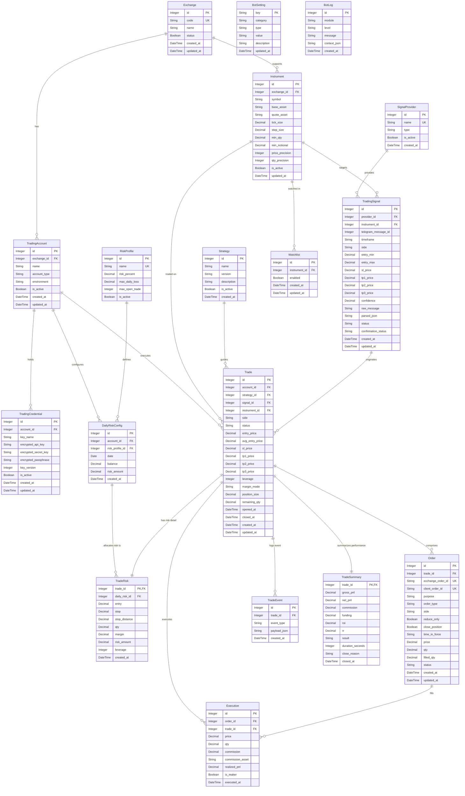

# DATABASE.md: Binance Futures Trading Bot V2

Dokumen ini menjelaskan skema database relasional, *Entity Relationship Diagram* (ERD), definisi tabel, dan model SQLAlchemy Async ORM yang digunakan pada **Semi-Automated Binance Futures Trading Bot V2** (`backend/`).

---

## ERD

---

## Table Definitions

Bagian ini menjelaskan tabel-tabel utama yang digunakan oleh sistem bot trading V2 beserta bidang, tipe data, dan deskripsinya.

### Exchange
Menyimpan konfigurasi platform exchange (misal: Binance, Bybit).
| Field | Type | Description |
|:------|:-----|:------------|
| `id` | INTEGER (PK) | Auto-increment primary key |
| `code` | TEXT (UK, NOT NULL) | Kode unik exchange (e.g. BINANCE) |
| `name` | TEXT (NOT NULL) | Nama lengkap exchange |
| `status` | BOOLEAN (DEFAULT TRUE) | Status aktif exchange |
| `created_at` | DATETIME | Waktu pembuatan record |
| `updated_at` | DATETIME | Waktu update record |

### TradingAccount
Menyimpan data akun trading per exchange.
| Field | Type | Description |
|:------|:-----|:------------|
| `id` | INTEGER (PK) | Auto-increment primary key |
| `exchange_id` | INTEGER (FK, NOT NULL) | Relasi ke `exchanges.id` |
| `name` | TEXT (NOT NULL) | Label/nama akun |
| `account_type` | TEXT (NOT NULL) | Tipe akun (e.g. SPOT, FUTURES) |
| `environment` | TEXT (DEFAULT 'MAINNET') | Lingkungan (MAINNET/TESTNET) |
| `is_active` | BOOLEAN (DEFAULT TRUE) | Status aktif akun |
| `created_at` | DATETIME | Waktu pembuatan record |
| `updated_at` | DATETIME | Waktu update record |

### TradingCredential
Menyimpan kredensial API terenkripsi untuk akun trading.
| Field | Type | Description |
|:------|:-----|:------------|
| `id` | INTEGER (PK) | Auto-increment primary key |
| `account_id` | INTEGER (FK, NOT NULL) | Relasi ke `trading_accounts.id` |
| `key_name` | TEXT (NOT NULL) | Label / identifikasi kunci |
| `encrypted_api_key` | TEXT (NOT NULL) | API key terenkripsi |
| `encrypted_secret_key` | TEXT (NOT NULL) | Secret key terenkripsi |
| `encrypted_passphrase` | TEXT | Passphrase terenkripsi (opsional untuk exchange tertentu) |
| `key_version` | INTEGER (DEFAULT 1) | Versi rotasi kunci API |
| `is_active` | BOOLEAN (DEFAULT TRUE) | Status aktif kredensial |
| `created_at` | DATETIME | Waktu pembuatan record |
| `updated_at` | DATETIME | Waktu update record |

### Instrument
Menyimpan detail pasang simbol dan aturan presisi perdagangan.
| Field | Type | Description |
|:------|:-----|:------------|
| `id` | INTEGER (PK) | Auto-increment primary key |
| `exchange_id` | INTEGER (FK, NOT NULL) | Relasi ke `exchanges.id` |
| `symbol` | TEXT (NOT NULL) | Simbol trading (e.g. BTCUSDT) |
| `base_asset` | TEXT (NOT NULL) | Asset dasar (e.g. BTC) |
| `quote_asset` | TEXT (NOT NULL) | Asset kuotasi (e.g. USDT) |
| `tick_size` | NUMERIC(18,8) | Perubahan harga terkecil |
| `step_size` | NUMERIC(18,8) | Perubahan kuantitas terkecil |
| `min_qty` | NUMERIC(18,8) | Minimum jumlah order |
| `min_notional` | NUMERIC(18,8) | Minimum nilai order (price * qty) |
| `price_precision` | INTEGER | Jumlah desimal presisi harga |
| `qty_precision` | INTEGER | Jumlah desimal presisi kuantitas |
| `is_active` | BOOLEAN (DEFAULT TRUE) | Status aktif perdagangan simbol |
| `updated_at` | DATETIME | Waktu update record |

### Strategy
Menyimpan data strategi trading yang digunakan.
| Field | Type | Description |
|:------|:-----|:------------|
| `id` | INTEGER (PK) | Auto-increment primary key |
| `name` | TEXT (NOT NULL) | Nama strategi |
| `version` | TEXT (NOT NULL) | Versi strategi |
| `description` | TEXT | Deskripsi strategi |
| `is_active` | BOOLEAN (DEFAULT TRUE) | Status aktif strategi |
| `created_at` | DATETIME | Waktu pembuatan record |

### SignalProvider
Menyimpan penyedia sinyal perdagangan.
| Field | Type | Description |
|:------|:-----|:------------|
| `id` | INTEGER (PK) | Auto-increment primary key |
| `name` | TEXT (UK, NOT NULL) | Nama provider |
| `type` | TEXT (NOT NULL) | Tipe provider (WEBHOOK, REST_API, dll) |
| `is_active` | BOOLEAN (DEFAULT TRUE) | Status aktif provider |
| `created_at` | DATETIME | Waktu pembuatan record |

### RiskProfile
Menyimpan profil manajemen risiko.
| Field | Type | Description |
|:------|:-----|:------------|
| `id` | INTEGER (PK) | Auto-increment primary key |
| `name` | TEXT (UK, NOT NULL) | Nama profil risiko |
| `risk_percent` | NUMERIC(10,4) | Persentase risiko per trade |
| `max_daily_loss` | NUMERIC(18,8) | Batas kerugian harian maksimum |
| `max_open_trade` | INTEGER | Batas maksimal trade terbuka |
| `is_active` | BOOLEAN (DEFAULT TRUE) | Status profil |

### DailyRiskConfig
Snapshot saldo akun dan anggaran risiko harian.
| Field | Type | Description |
|:------|:-----|:------------|
| `id` | INTEGER (PK) | Auto-increment primary key |
| `account_id` | INTEGER (FK, NOT NULL) | Relasi ke `trading_accounts.id` |
| `risk_profile_id` | INTEGER (FK, NOT NULL) | Relasi ke `risk_profiles.id` |
| `date` | DATE (NOT NULL) | Tanggal snapshot |
| `balance` | NUMERIC(18,8) | Saldo total snapshot |
| `risk_amount` | NUMERIC(18,8) | Anggaran risiko harian |
| `created_at` | DATETIME | Waktu pembuatan record |

### TradingSignal
Sinyal perdagangan yang diterima dari provider.
| Field | Type | Description |
|:------|:-----|:------------|
| `id` | INTEGER (PK) | Auto-increment primary key |
| `provider_id` | INTEGER (FK, NOT NULL) | Relasi ke `signal_providers.id` |
| `instrument_id` | INTEGER (FK, NOT NULL) | Relasi ke `instruments.id` |
| `telegram_message_id` | INTEGER | ID pesan Telegram (opsional) |
| `timeframe` | TEXT | Timeframe sinyal (e.g. 15m, 1h) |
| `side` | TEXT (NOT NULL) | `BUY` atau `SELL` |
| `entry_min` / `entry_max` | NUMERIC(18,8) | Rentang harga masuk |
| `sl_price` | NUMERIC(18,8) | Harga stop loss |
| `tp1_price` - `tp3_price` | NUMERIC(18,8) | Target harga take profit |
| `confidence` | NUMERIC(5,4) | Skor keyakinan sinyal |
| `raw_message` | TEXT | Pesan mentah |
| `parsed_json` | TEXT | JSON data terstruktur |
| `status` | TEXT (DEFAULT 'RECEIVED') | Status sinyal |
| `confirmation_status` | TEXT (DEFAULT 'NOT_REQUIRED') | Status konfirmasi pengguna |
| `created_at` | DATETIME | Waktu pembuatan record |
| `updated_at` | DATETIME | Waktu update record |

### Trade
Catatan posisi perdagangan aktif maupun tertutup.
| Field | Type | Description |
|:------|:-----|:------------|
| `id` | INTEGER (PK) | Auto-increment primary key |
| `account_id` | INTEGER (FK, NOT NULL) | Relasi ke `trading_accounts.id` |
| `strategy_id` | INTEGER (FK) | Relasi ke `strategies.id` |
| `signal_id` | INTEGER (FK) | Relasi ke `trading_signals.id` |
| `instrument_id` | INTEGER (FK, NOT NULL) | Relasi ke `instruments.id` |
| `side` | TEXT (NOT NULL) | `BUY` atau `SELL` |
| `status` | TEXT (DEFAULT 'WAITING_ENTRY') | Status siklus hidup posisi |
| `entry_price` | NUMERIC(18,8) | Harga entry aktual |
| `avg_entry_price` | NUMERIC(18,8) | Rata-rata harga entry partial |
| `sl_price` | NUMERIC(18,8) | Harga stop loss |
| `tp1_price` - `tp3_price` | NUMERIC(18,8) | Target harga take profit |
| `leverage` | INTEGER | Leverage posisi |
| `margin_mode` | TEXT (DEFAULT 'ISOLATED') | `ISOLATED` atau `CROSSED` |
| `position_size` | NUMERIC(18,8) | Ukuran total posisi |
| `remaining_qty` | NUMERIC(18,8) | Sisa kuantitas belum terisi |
| `opened_at` / `closed_at` | DATETIME | Waktu posisi dibuka / ditutup |
| `created_at` | DATETIME | Waktu pembuatan record |
| `updated_at` | DATETIME | Waktu update record |

### TradeRisk
Rincian perhitungan risiko untuk sebuah trade.
| Field | Type | Description |
|:------|:-----|:------------|
| `trade_id` | INTEGER (PK, FK) | Relasi ke `trades.id` |
| `daily_risk_id` | INTEGER (FK, NOT NULL) | Relasi ke `daily_risk_config.id` |
| `entry` | NUMERIC(18,8) | Harga entry rencana |
| `stop` | NUMERIC(18,8) | Harga stop loss rencana |
| `stop_distance` | NUMERIC(18,8) | Jarak harga ke stop loss |
| `qty` | NUMERIC(18,8) | Jumlah kalkulasi kuantitas |
| `margin` | NUMERIC(18,8) | Margin yang dibutuhkan |
| `risk_amount` | NUMERIC(18,8) | Jumlah nominal risiko |
| `leverage` | INTEGER | Leverage yang dipakai |
| `created_at` | DATETIME | Waktu pembuatan record |

### Order
Order yang dikirimkan ke exchange.
| Field | Type | Description |
|:------|:-----|:------------|
| `id` | INTEGER (PK) | Auto-increment primary key |
| `trade_id` | INTEGER (FK, NOT NULL) | Relasi ke `trades.id` |
| `exchange_order_id` | TEXT (UK) | Order ID dari exchange |
| `client_order_id` | TEXT (UK) | Order ID dari client |
| `purpose` | TEXT (NOT NULL) | Peran order (`ENTRY`, `TP1`, `SL`, dll) |
| `order_type` | TEXT (NOT NULL) | Tipe order (`MARKET`, `LIMIT`, dll) |
| `side` | TEXT (NOT NULL) | `BUY` atau `SELL` |
| `reduce_only` | BOOLEAN (DEFAULT FALSE) | Flag reduce-only |
| `close_position` | BOOLEAN (DEFAULT FALSE) | Flag close-position |
| `time_in_force` | TEXT | Policy time-in-force (GTC, IOC, dll) |
| `price` | NUMERIC(18,8) | Harga order |
| `qty` | NUMERIC(18,8) | Kuantitas order |
| `filled_qty` | NUMERIC(18,8) | Kuantitas terisi |
| `status` | TEXT (DEFAULT 'NEW') | Status order |
| `created_at` | DATETIME | Waktu pembuatan record |
| `updated_at` | DATETIME | Waktu update record |

### Execution
Pengeksekusian terisi (fill) dari exchange.
| Field | Type | Description |
|:------|:-----|:------------|
| `id` | INTEGER (PK) | Auto-increment primary key |
| `order_id` | INTEGER (FK, NOT NULL) | Relasi ke `orders.id` |
| `trade_id` | INTEGER (FK, NOT NULL) | Relasi ke `trades.id` |
| `price` | NUMERIC(18,8) | Harga fill |
| `qty` | NUMERIC(18,8) | Kuantitas terisi |
| `commission` | NUMERIC(18,8) | Komisi fee |
| `commission_asset` | TEXT | Aset pembayaran komisi |
| `realized_pnl` | NUMERIC(18,8) | Realized PnL fill |
| `is_maker` | BOOLEAN (DEFAULT FALSE) | Flag order maker |
| `executed_at` | DATETIME | Waktu eksekusi |

### TradeEvent
Event log siklus hidup posisi trade.
| Field | Type | Description |
|:------|:-----|:------------|
| `id` | INTEGER (PK) | Auto-increment primary key |
| `trade_id` | INTEGER (FK, NOT NULL) | Relasi ke `trades.id` |
| `event_type` | TEXT (NOT NULL) | Kategori event |
| `payload_json` | TEXT | Rincian detail JSON |
| `created_at` | DATETIME | Waktu event |

### TradeSummary
Ringkasan performa trade setelah ditutup.
| Field | Type | Description |
|:------|:-----|:------------|
| `trade_id` | INTEGER (PK, FK) | Relasi ke `trades.id` |
| `gross_pnl` | NUMERIC(18,8) | PnL kotor |
| `net_pnl` | NUMERIC(18,8) | PnL bersih |
| `commission` | NUMERIC(18,8) | Total fee |
| `funding` | NUMERIC(18,8) | Total biaya funding |
| `roi` | NUMERIC(10,4) | Return on margin (%) |
| `rr` | NUMERIC(10,4) | Risk-Reward ratio |
| `result` | TEXT (NOT NULL) | Hasil trade (`WIN`, `LOSS`, `BREAKEVEN`) |
| `duration_seconds` | INTEGER | Durasi trade dalam detik |
| `close_reason` | TEXT (NOT NULL) | Alasan penutupan |
| `closed_at` | DATETIME | Waktu penutupan |

### Watchlist
Instrumen yang diizinkan untuk diperdagangkan oleh bot.
| Field | Type | Description |
|:------|:-----|:------------|
| `id` | INTEGER (PK) | Auto-increment primary key |
| `instrument_id` | INTEGER (FK, NOT NULL) | Relasi ke `instruments.id` |
| `enabled` | BOOLEAN (DEFAULT TRUE) | Status aktif instrumen |
| `created_at` | DATETIME | Waktu pembuatan record |
| `updated_at` | DATETIME | Waktu update record |

### BotSetting
Penyimpanan key-value konfigurasi bot.
| Field | Type | Description |
|:------|:-----|:------------|
| `key` | TEXT (PK) | Nama setting unik |
| `category` | TEXT | Kategori setting |
| `type` | TEXT | Tipe data nilai (STRING, INT, JSON, dll) |
| `value` | TEXT (NOT NULL) | Nilai konfigurasi |
| `description` | TEXT | Deskripsi penjelasan |
| `updated_at` | DATETIME | Waktu update record |

### BotLog
Log aplikasi yang tersimpan di database.
| Field | Type | Description |
|:------|:-----|:------------|
| `id` | INTEGER (PK) | Auto-increment primary key |
| `module` | TEXT | Nama modul / logger |
| `level` | TEXT (NOT NULL) | Tingkat log (`DEBUG`, `INFO`, `WARNING`, `ERROR`, `CRITICAL`) |
| `message` | TEXT (NOT NULL) | Pesan log |
| `context_json` | TEXT | Detail konteks JSON |
| `created_at` | DATETIME | Waktu log |

---

## Code Reference Index

Seluruh model ORM SQLAlchemy Async 2.0 terimplementasi secara modular pada direktori `backend/src/database/models/`:

* [`exchange.py`](file:///home/rodex/Documents/cell/projects/crypto-bot/backend/src/database/models/exchange.py) - Model `Exchange`
* [`trading_accounts.py`](file:///home/rodex/Documents/cell/projects/crypto-bot/backend/src/database/models/trading_accounts.py) - Model `TradingAccount`
* [`trading_credentials.py`](file:///home/rodex/Documents/cell/projects/crypto-bot/backend/src/database/models/trading_credentials.py) - Model `TradingCredential`
* [`instruments.py`](file:///home/rodex/Documents/cell/projects/crypto-bot/backend/src/database/models/instruments.py) - Model `Instrument`
* [`strategies.py`](file:///home/rodex/Documents/cell/projects/crypto-bot/backend/src/database/models/strategies.py) - Model `Strategy`
* [`signal_providers.py`](file:///home/rodex/Documents/cell/projects/crypto-bot/backend/src/database/models/signal_providers.py) - Model `SignalProvider`
* [`risk_profiles.py`](file:///home/rodex/Documents/cell/projects/crypto-bot/backend/src/database/models/risk_profiles.py) - Model `RiskProfile`
* [`daily_risk_configs.py`](file:///home/rodex/Documents/cell/projects/crypto-bot/backend/src/database/models/daily_risk_configs.py) - Model `DailyRiskConfig`
* [`trading_signals.py`](file:///home/rodex/Documents/cell/projects/crypto-bot/backend/src/database/models/trading_signals.py) - Model `TradingSignal`
* [`trades.py`](file:///home/rodex/Documents/cell/projects/crypto-bot/backend/src/database/models/trades.py) - Model `Trade`
* [`trade_risks.py`](file:///home/rodex/Documents/cell/projects/crypto-bot/backend/src/database/models/trade_risks.py) - Model `TradeRisk`
* [`orders.py`](file:///home/rodex/Documents/cell/projects/crypto-bot/backend/src/database/models/orders.py) - Model `Order`
* [`executions.py`](file:///home/rodex/Documents/cell/projects/crypto-bot/backend/src/database/models/executions.py) - Model `Execution`
* [`trade_events.py`](file:///home/rodex/Documents/cell/projects/crypto-bot/backend/src/database/models/trade_events.py) - Model `TradeEvent`
* [`trade_summaries.py`](file:///home/rodex/Documents/cell/projects/crypto-bot/backend/src/database/models/trade_summaries.py) - Model `TradeSummary`
* [`watchlists.py`](file:///home/rodex/Documents/cell/projects/crypto-bot/backend/src/database/models/watchlists.py) - Model `Watchlist`
* [`bot_settings.py`](file:///home/rodex/Documents/cell/projects/crypto-bot/backend/src/database/models/bot_settings.py) - Model `BotSetting`
* [`bot_logs.py`](file:///home/rodex/Documents/cell/projects/crypto-bot/backend/src/database/models/bot_logs.py) - Model `BotLog`
