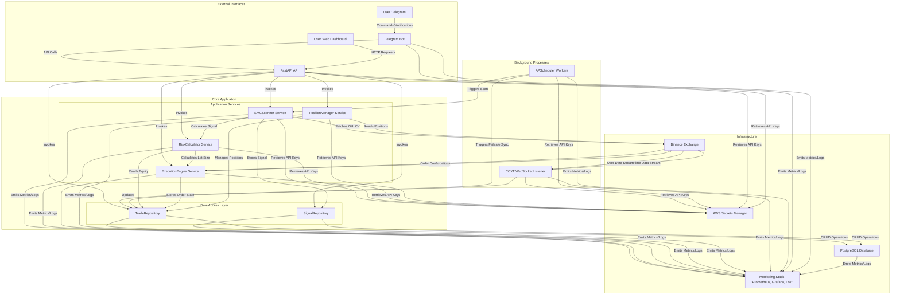
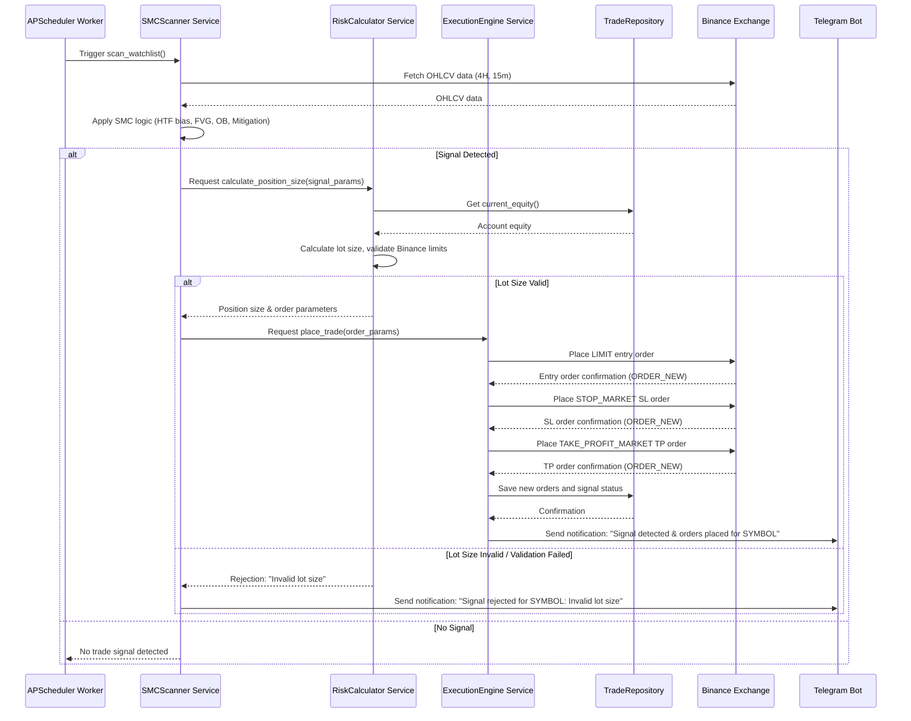

# ARCHITECTURE.md: SMC QuantEngine

## System Overview

The SMC QuantEngine employs a Hexagonal Architecture (Ports and Adapters) with a Clean Service-Repository Pattern, designed for high-performance, asynchronous algorithmic trading. The core application logic, encapsulated within the `services` layer, remains independent of external concerns, communicating through well-defined interfaces (ports). External components like the Telegram bot, FastAPI web API, and background workers act as adapters, interacting with these ports. All components are built with Python's `asyncio` for non-blocking I/O, ensuring responsiveness and efficient resource utilization across multiple concurrent operations, from real-time market data processing to order execution and state synchronization.

## High-Level Architecture Diagram

## Component Breakdown

The system is structured following a Hexagonal Architecture, separating core business logic from external concerns.

### External Interfaces (Adapters)

These components handle interactions with external users and systems.

*   **Telegram Bot (`backend/src/bot/`)**
    *   **Responsibility**: Provides a user-friendly interface for real-time notifications (trade signals, order fills, PnL updates), emergency controls (`/close_all`), and status checks (`/status`). Acts as an adapter to the core services via the FastAPI API.
    *   **Key Features**: Asynchronous message handling, command parsing, integration with core services for data retrieval and action execution.
*   **FastAPI API (`backend/src/api/`)**
    *   **Responsibility**: Exposes RESTful endpoints for real-time monitoring (e.g., `/v1/overview`), dynamic watchlist management (`/v1/watchlist`), and potential manual overrides. Serves as the primary interface for a web dashboard and the Telegram bot.
    *   **Key Features**: Pydantic for data validation, dependency injection for service access, JWT authentication. See `API.md` for detailed specifications.

### Background Processes (Adapters)

These components run continuously in the background, performing scheduled tasks and maintaining real-time data streams.

*   **APScheduler Workers (`backend/src/worker/`)**
    *   **Responsibility**: Orchestrates scheduled tasks, primarily the `SMC Scanner` (periodic market analysis) and `Failsafe DB Sync` (reconciling database state with exchange via REST API).
    *   **Key Features**: In-process scheduling, robust error handling for job failures, integration with `SMCScanner Service` and `TradeRepository`.
*   **CCXT WebSocket Listener (`backend/src/worker/`)**
    *   **Responsibility**: Maintains a persistent, real-time connection to the Binance User Data Stream. It listens for order updates, position changes, and account balance modifications, ensuring the local database state is always synchronized with the exchange.
    *   **Key Features**: Asynchronous WebSocket client, message parsing, robust reconnection logic, direct updates to `TradeRepository`.

### Core Application (Ports & Domain Logic)

This is the heart of the system, containing the business rules and orchestrating operations.

#### Application Services (`backend/src/services/`)

These services encapsulate the core business logic, independent of how they are invoked or how data is stored.

*   **SMCScanner Service**
    *   **Responsibility**: Fetches OHLCV data from Binance, applies the Smart Money Concepts (SMC) algorithm (HTF bias, FVG, Order Block identification, mitigation check), and identifies potential trade signals.
    *   **Key Features**: `ccxt.pro` for data fetching, `pandas` and `pandas-ta` for indicator calculation, signal generation, watchlist management.
*   **RiskCalculator Service**
    *   **Responsibility**: Calculates the appropriate position size for a trade based on predefined risk parameters (e.g., 2% max equity risk per trade), entry price, and stop-loss level. Validates lot size against Binance's symbol-specific trading limits (`minNotional`, `tickSize`, `stepSize`).
    *   **Key Features**: Equity retrieval from `TradeRepository`, dynamic lot sizing, Binance limit validation.
*   **ExecutionEngine Service**
    *   **Responsibility**: Places and manages orders on the Binance exchange. Handles order types (LIMIT, STOP_MARKET, TAKE_PROFIT_MARKET), monitors order status, and manages order lifecycle.
    *   **Key Features**: `ccxt.pro` for order placement, error handling (rate limits, network errors), updates `TradeRepository` with order and trade details.
*   **PositionManager Service**
    *   **Responsibility**: Monitors and manages open positions. Provides functionality for position closure (e.g., `/close_all` command), PnL calculation, and ensures position state consistency.
    *   **Key Features**: Interacts with `TradeRepository` for position data, can issue market orders for emergency exits.

#### Data Access Layer (Repositories) (`backend/src/repository/`)

These components provide an abstraction over the database, defining how application services interact with persistent storage.

*   **TradeRepository**
    *   **Responsibility**: Manages all persistent data related to trades, orders, positions, and account balances. Provides methods for CRUD operations on these entities.
    *   **Key Features**: Asynchronous database interactions using `SQLAlchemy 2.0` and `asyncpg`, ensures data integrity. See `DATABASE.md` for schema details.
*   **SignalRepository**
    *   **Responsibility**: Stores identified trade signals, their parameters, and their status (e.g., `PENDING`, `EXECUTED`, `REJECTED`).
    *   **Key Features**: Asynchronous database interactions, supports querying and updating signal states.

### Infrastructure (`backend/src/database/`, `backend/config/`)

*   **PostgreSQL Database**
    *   **Responsibility**: Persistent storage for all trading data, including watchlist, signals, orders, trades, positions, and account history.
    *   **Key Features**: High reliability, transactional integrity, optimized for financial data. See `DATABASE.md` for schema.
*   **AWS Secrets Manager**
    *   **Responsibility**: Securely stores and manages sensitive credentials such as Binance API keys and Telegram bot tokens.
    *   **Key Features**: Centralized secret management, rotation capabilities, access control.
*   **Monitoring Stack (Prometheus, Grafana, Loki)**
    *   **Responsibility**: Collects metrics (Prometheus), visualizes data (Grafana), and aggregates logs (Loki) from all components for operational visibility, performance analysis, and alerting.

## Critical Flow Sequence Diagram: Signal Detection to Order Placement

This sequence illustrates the primary automated trading workflow, from a scheduled scan to placing orders on the exchange.

## Deployment Strategy

The SMC QuantEngine is designed for a cloud-native deployment on AWS, leveraging serverless container orchestration for scalability, resilience, and operational efficiency.

*   **Core Application (FastAPI API, APScheduler Workers, CCXT WebSocket Listener)**
    *   **Hosting**: Deployed as Docker containers on **AWS ECS on Fargate**. Each logical component (API, Worker, Listener) will run as a separate service within an ECS cluster.
    *   **Rationale**: Fargate eliminates the need to manage EC2 instances, providing a serverless experience for containers. ECS ensures high availability, auto-scaling, and load balancing.
    *   **Containerization**: All Python components are containerized using Docker, ensuring consistent environments across development, testing, and production.
*   **Database (PostgreSQL)**
    *   **Hosting**: Managed service **AWS RDS for PostgreSQL**.
    *   **Rationale**: RDS provides automated backups, patching, scaling, and high availability (Multi-AZ deployments), reducing operational overhead.
    *   **Network Access**: The RDS instance will be deployed in a private subnet, accessible only by the ECS services within the same VPC, ensuring no direct public internet access.
*   **Secrets Management**
    *   **Hosting**: **AWS Secrets Manager**.
    *   **Rationale**: Securely stores and retrieves sensitive information (API keys, database credentials) at runtime, preventing hardcoding and enabling rotation. ECS tasks will be granted IAM roles with permissions to access specific secrets.
*   **Monitoring & Logging**
    *   **Metrics**: **Prometheus** for time-series data collection, with **Grafana** for dashboarding and alerting. Prometheus will scrape metrics endpoints exposed by the FastAPI application and custom metrics from workers.
    *   **Logging**: **Loki** for log aggregation, with **Grafana** for querying and visualization. All application logs will be sent to a centralized logging solution (e.g., AWS CloudWatch Logs, then forwarded to Loki).
    *   **Rationale**: Provides comprehensive observability into system health, performance, and operational issues.
*   **Networking**
    *   **AWS VPC**: All resources (ECS, RDS, Secrets Manager) will reside within a dedicated Virtual Private Cloud (VPC) with appropriate subnets, security groups, and network ACLs to enforce least-privilege access.
    *   **Load Balancing**: An **AWS Application Load Balancer (ALB)** will front the FastAPI API service, distributing incoming traffic and handling SSL termination.
*   **CI/CD**
    *   **Tools**: Integration with **AWS CodePipeline** and **AWS CodeBuild** for automated build, test, and deployment of Docker images to **AWS ECR (Elastic Container Registry)** and subsequent deployment to ECS.