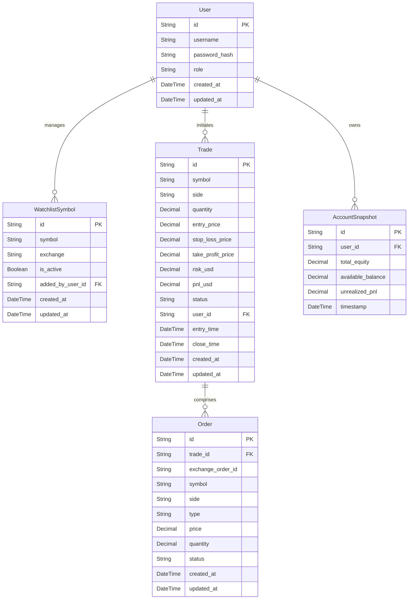

# DATABASE.md: SMC QuantEngine

## ERD



## Table Definitions

This section details the primary business tables crucial for the SMC QuantEngine's operation. Trivial lookup tables or highly granular logging tables are summarized or omitted to maintain focus on core entities.

### User
Stores information about system users, including their roles for access control.
| Field | Type | Description |
|:------|:-----|:------------|
| `id` | String | Unique identifier for the user. |
| `username` | String | Unique username for login. |
| `password_hash` | String | Hashed password for security. |
| `role` | String | User's role (e.g., 'Admin', 'Trader'). |
| `created_at` | DateTime | Timestamp of user creation. |
| `updated_at` | DateTime | Last update timestamp. |

### WatchlistSymbol
Manages the list of cryptocurrency pairs the SMC Scanner actively monitors for trading signals. This table supports dynamic updates as per `FR-05`.
| Field | Type | Description |
|:------|:-----|:------------|
| `id` | String | Unique identifier for the watchlist entry. |
| `symbol` | String | Trading pair (e.g., "BTCUSDT"). |
| `exchange` | String | Exchange where the symbol is traded (e.g., "BINANCE"). |
| `is_active` | Boolean | Flag indicating if the symbol is currently being scanned. |
| `added_by_user_id` | String | Foreign key to the User who added the symbol. |
| `created_at` | DateTime | Timestamp of symbol addition. |
| `updated_at` | DateTime | Last update timestamp. |

### Trade
Represents a single, complete trading idea or position, from entry signal to closure (TP/SL/manual). It aggregates details of the strategy's execution.
| Field | Type | Description |
|:------|:-----|:------------|
| `id` | String | Unique identifier for the trade. |
| `symbol` | String | Trading pair for this trade. |
| `side` | String | Direction of the trade ('BUY'/'SELL'). |
| `quantity` | Decimal | Total quantity traded. |
| `entry_price` | Decimal | Average entry price of the position. |
| `stop_loss_price` | Decimal | Price at which the stop loss is set. |
| `take_profit_price` | Decimal | Price at which the take profit is set. |
| `risk_usd` | Decimal | Calculated USD risk for this trade (`FR-09`). |
| `pnl_usd` | Decimal | Profit or Loss in USD upon trade closure. |
| `status` | String | Current status ('OPEN', 'CLOSED_TP', 'CLOSED_SL', 'CLOSED_MANUAL', 'REJECTED'). |
| `user_id` | String | Foreign key to the User associated with the trade. |
| `entry_time` | DateTime | Timestamp when the trade was entered. |
| `close_time` | DateTime | Timestamp when the trade was closed. |
| `created_at` | DateTime | Timestamp of trade record creation. |
| `updated_at` | DateTime | Last update timestamp. |

### Order
Records individual orders placed on the exchange, which collectively form a `Trade`. This includes entry, stop-loss, and take-profit orders.
| Field | Type | Description |
|:------|:-----|:------------|
| `id` | String | Unique identifier for the order. |
| `trade_id` | String | Foreign key to the associated Trade. |
| `exchange_order_id` | String | Unique ID assigned by the exchange. |
| `symbol` | String | Trading pair for this order. |
| `side` | String | Order side ('BUY', 'SELL'). |
| `type` | String | Order type ('LIMIT', 'MARKET', 'STOP_MARKET', 'TAKE_PROFIT_MARKET'). |
| `price` | Decimal | Price of the order (for LIMIT orders). |
| `quantity` | Decimal | Quantity of the order. |
| `status` | String | Current status ('NEW', 'FILLED', 'PARTIALLY_FILLED', 'CANCELED', 'EXPIRED'). |
| `created_at` | DateTime | Timestamp of order creation. |
| `updated_at` | DateTime | Last update timestamp. |

### AccountSnapshot
Captures periodic snapshots of the trading account's financial state, essential for PnL tracking, risk management, and dashboard reporting (`FR-03`, `FR-04`).
| Field | Type | Description |
|:------|:-----|:------------|
| `id` | String | Unique identifier for the snapshot. |
| `user_id` | String | Foreign key to the User whose account is snapshotted. |
| `total_equity` | Decimal | Total account equity at the time of snapshot. |
| `available_balance` | Decimal | Available balance for new trades. |
| `unrealized_pnl` | Decimal | Unrealized Profit/Loss from open positions. |
| `timestamp` | DateTime | Timestamp when the snapshot was taken. |

## Prisma Schema

```prisma
// This is your Prisma schema file,
// learn more about it in the docs: https://pris.ly/d/prisma-schema

generator client {
  provider = "prisma-client-py"
  # output = "../src/database/prisma" // Adjust path if needed
}

datasource db {
  provider = "postgresql"
  url      = env("DATABASE_URL")
}

model User {
  id              String            @id @default(cuid())
  username        String            @unique
  password_hash   String
  role            String            @default("Trader") // e.g., "Admin", "Trader"
  createdAt       DateTime          @default(now())
  updatedAt       DateTime          @updatedAt
  watchlistSymbols WatchlistSymbol[]
  trades          Trade[]
  accountSnapshots AccountSnapshot[]
}

model WatchlistSymbol {
  id           String   @id @default(cuid())
  symbol       String
  exchange     String   @default("BINANCE")
  isActive     Boolean  @default(true)
  addedByUserId String
  user         User     @relation(fields: [addedByUserId], references: [id])
  createdAt    DateTime @default(now())
  updatedAt    DateTime @updatedAt

  @@unique([symbol, exchange]) // Ensure unique symbol per exchange
}

model Trade {
  id              String   @id @default(cuid())
  symbol          String
  side            String   // "BUY" or "SELL"
  quantity        Decimal  @db.Decimal(20, 8)
  entryPrice      Decimal  @db.Decimal(20, 8)
  stopLossPrice   Decimal  @db.Decimal(20, 8)
  takeProfitPrice Decimal  @db.Decimal(20, 8)
  riskUsd         Decimal  @db.Decimal(20, 8)
  pnlUsd          Decimal? @db.Decimal(20, 8) // Nullable until trade is closed
  status          String   @default("OPEN") // "OPEN", "CLOSED_TP", "CLOSED_SL", "CLOSED_MANUAL", "REJECTED"
  userId          String
  user            User     @relation(fields: [userId], references: [id])
  entryTime       DateTime
  closeTime       DateTime? // Nullable until trade is closed
  createdAt       DateTime @default(now())
  updatedAt       DateTime @updatedAt
  orders          Order[]
}

model Order {
  id              String    @id @default(cuid())
  tradeId         String
  trade           Trade     @relation(fields: [tradeId], references: [id])
  exchangeOrderId String    @unique // Unique ID from the exchange
  symbol          String
  side            String    // "BUY" or "SELL"
  type            String    // "LIMIT", "MARKET", "STOP_MARKET", "TAKE_PROFIT_MARKET"
  price           Decimal?  @db.Decimal(20, 8) // Nullable for MARKET orders
  quantity        Decimal   @db.Decimal(20, 8)
  status          String    @default("NEW") // "NEW", "FILLED", "PARTIALLY_FILLED", "CANCELED", "EXPIRED"
  createdAt       DateTime  @default(now())
  updatedAt       DateTime  @updatedAt
}

model AccountSnapshot {
  id             String    @id @default(cuid())
  userId         String
  user           User      @relation(fields: [userId], references: [id])
  totalEquity    Decimal   @db.Decimal(20, 8)
  availableBalance Decimal   @db.Decimal(20, 8)
  unrealizedPnl  Decimal   @db.Decimal(20, 8)
  timestamp      DateTime  @unique // Each user can only have one snapshot per timestamp
}
```