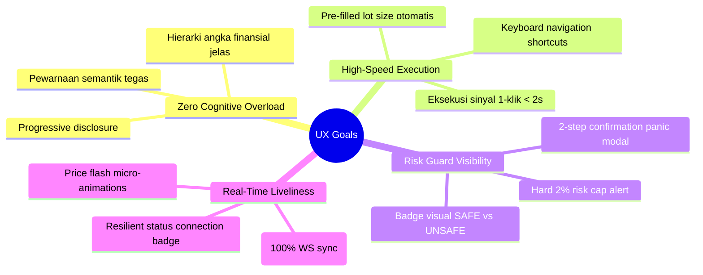
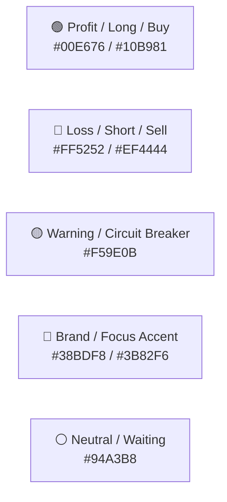
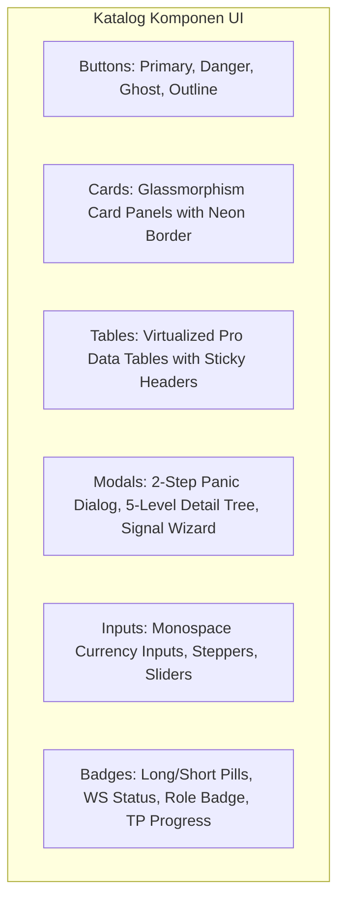
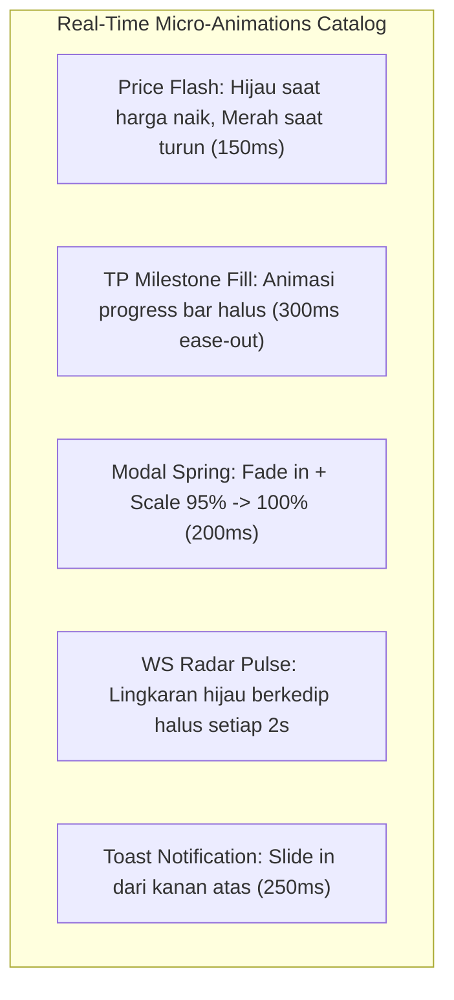

# Design System & UI/UX Architecture (DESIGN.md)
**Project**: SMC CryptoBot – Professional Binance Futures Trading Dashboard  
**Document**: Frontend Design System, UI Components & Ergonomics Specification (`DESIGN.md`)  
**Version**: 2.0.0  
**Status**: Approved / In Development  
**Target Platform**: Web Frontend (Next.js 14 / Vite React + TypeScript + TailwindCSS)  
**Related Documents**: [docs/frontend/PRD.md](./PRD.md) | [docs/frontend/REQUIREMENTS.md](./REQUIREMENTS.md) | [docs/frontend/FEATURES.md](./FEATURES.md) | [docs/frontend/USER_FLOW.md](./USER_FLOW.md)  

---

## 1. Brand & Visual Identity

### 1.1 Brand Identity & Design Philosophy
**SMC CryptoBot Dashboard** mengadopsi filosofi visual *"Cyber-Fintech Pro Terminal"*—antarmuka trading modern berestetika gelap (*Dark Theme*) yang terinspirasi dari standar industri kelas atas seperti **TradingView Pro**, **Binance Futures Dark Terminal**, dan **Linear App**.

Prinsip desain utama:
* **Precision & Spatial Clarity**: Informasi finansial (saldo, margin, lot size, PnL) disajikan secara presisi, terstruktur, dan tidak membingungkan mata saat sesi trading malam hari.
* **Glassmorphism Depth**: Menggunakan layer translucent dengan backdrop blur halus (`backdrop-blur-md`) dan border tipis semi-transparan untuk membedakan kedalaman antar-kartu tanpa membebani memori render.
* **Live Reactivity & Micro-Glow**: Perubahan data real-time dari WebSocket diindikasikan dengan animasi kilat warna (*price flash*) dan aksen pendaran neon halus (*neon glow*), memberikan sensasi terminal yang hidup dan responsif.

---

## 2. User Experience (UX) Goals



1. **Zero Cognitive Overload**: Data kritis (Saldo USDT, Floating PnL, Status Bot) langsung terlihat dalam pandangan pertama (*Above-the-Fold*), sedangkan detail mikro (riwayat eksekusi fills 5-level) diakses melalui *progressive disclosure* (modal/tab).
2. **Sub-2s Execution Speed**: Alur eksekusi sinyal manual dipangkas seminimal mungkin melalui modal wizard yang telah menghitung ukuran lot dan leverage secara otomatis.
3. **Absolute Risk Awareness**: Peringatan risiko (pelanggaran 2% risk cap, margin tidak mencukupi, leverage downscaling) disajikan dengan kontras tinggi sehingga trader tidak dapat melewatkannya secara tidak sengaja.
4. **Resilient Feedback**: Setiap aksi mutasi (close trade, toggle watchlist, panic close) memberikan umpan balik visual instan (optimistic UI update + toast notifications).

---

## 3. Color Palette & Semantic Design Tokens

Desain menggunakan palet warna gelap profesional (*Pro-Trading Dark Palette*) yang dirancang khusus untuk meminimalkan kelelahan mata (*eye fatigue*) dengan rasio kontras tinggi (WCAG AA Compliant).

### 3.1 Core Color Tokens

| Kategori Token | Nama Token | HEX Code | Representasi & Penggunaan UI |
| :--- | :--- | :---: | :--- |
| **Base Background** | `--bg-canvas` | `#080B10` | Latar belakang terdalam aplikasi. |
| **Surface Base** | `--bg-surface` | `#0F172A` | Latar belakang panel sidebar dan navbar. |
| **Surface Card** | `--bg-card` | `#1E293B` | Latar kartu widget, tabel, dan form inputs (80% opacity + blur). |
| **Surface Card Hover**| `--bg-card-hover` | `#334155` | State hover pada baris tabel dan kartu yang dapat diklik. |
| **Border Subdued** | `--border-subdued` | `#1E293B` | Garis pemisah halus antar komponen. |
| **Border Default** | `--border-default` | `#334155` | Border standar kartu widget dan input field. |
| **Border Highlight** | `--border-highlight`| `#475569` | Border kartu saat aktif atau fokus. |

---

### 3.2 Trading Semantics & Status Accents



| Semantic Token | HEX Code | Variasi Tailwind | Penggunaan Utama |
| :--- | :---: | :--- | :--- |
| **Profit / Buy (Long)** | `#00E676` / `#10B981` | `emerald-500 / green-400` | PnL Positif, Badge `BUY / LONG`, Indikator TP Hit, Status `SAFE`. |
| **Loss / Sell (Short)** | `#FF5252` / `#EF4444` | `rose-500 / red-500` | PnL Negatif, Badge `SELL / SHORT`, Tombol Panic, Status `UNSAFE`. |
| **Warning / Caution** | `#F59E0B` | `amber-500` | Bot Paused, Leverage Downscaled Alert, Reconnecting WS Badge. |
| **Brand / Focus** | `#38BDF8` / `#3B82F6` | `sky-400 / blue-500` | Active Tab, Link, Focus Outline, Info Log, Role Badge `ADMIN`. |
| **Neutral Subdued** | `#64748B` / `#94A3B8` | `slate-500 / slate-400` | Label sekunder, teks deskripsi, garis grid chart, status `WAITING`. |

---

## 4. Typography & Numerical Hierarchy

Tipografi mengombinasikan font modern sans-serif untuk label antarmuka dengan font monospaced geometris untuk seluruh data finansial dan angka harga.

### 4.1 Font Families
* **Interface Text**: `Inter`, `-apple-system`, `BlinkMacSystemFont`, `sans-serif` (Sangat terbaca pada ukuran kecil).
* **Financial & Monospace Numbers**: `JetBrains Mono`, `Roboto Mono`, `monospace` (Memastikan seluruh angka, digit koma, dan saldo lurus presisi secara vertikal).

### 4.2 Type Scale Hierarchy

| Tingkat Tipografi | Ukuran & Bobot | Font Family | Contoh Penggunaan |
| :--- | :--- | :--- | :--- |
| **Display H1** | `28px / 1.2` (Bold 700) | `Inter` | Header Halaman Utama Dashboard |
| **Section H2** | `20px / 1.3` (SemiBold 600) | `Inter` | Judul Seksi (misal: "Active Positions") |
| **Widget H3** | `15px / 1.4` (Medium 500) | `Inter` | Judul Kartu Widget & Label Tab |
| **Body Base** | `14px / 1.5` (Regular 400) | `Inter` | Teks penjelasan, deskripsi form |
| **Body Small** | `12px / 1.4` (Regular 400) | `Inter` | Timestamp, subtitle, tooltip label |
| **Financial Hero** | `24px / 1.2` (Bold 700) | `JetBrains Mono` | Angka Total Saldo USDT, Daily Realized PnL |
| **Financial Table**| `13px / 1.4` (Medium 500) | `JetBrains Mono` | Harga Entry/Mark, Volume Lot, Floating PnL |
| **Code / Trace ID**| `11px / 1.4` (Regular 400) | `JetBrains Mono` | Trace ID (`sig-xxx`), Order ID, Hash Kripto |

---

## 5. UI Components, Spacing & Layout System

### 5.1 Spacing & Radius Tokens
* **Base Spacing (4px Grid)**:
  * `xs`: 4px | `sm`: 8px | `md`: 12px | `lg`: 16px | `xl`: 24px | `2xl`: 32px | `3xl`: 48px
* **Corner Radius**:
  * `rounded-sm`: 4px (Badge, pills kecil, tag status)
  * `rounded-md`: 8px (Input fields, dropdowns, tombol)
  * `rounded-lg`: 12px (Kartu widget, panel form)
  * `rounded-xl`: 16px (Modal dialogs, popups besar)
  * `rounded-full`: 9999px (Avatar, bullet status)

---

### 5.2 Component Catalog (Radix UI / Shadcn UI Specification)



#### 1. Buttons (Tombol Aksi)
* **Primary Button**: Background Gradient `#3B82F6` $\rightarrow$ `#2563EB`, teks putih tebal, hover shadow biru pendaran (`shadow-blue-500/25`). Digunakan untuk *Save Settings*, *Execute Signal*.
* **Danger Button**: Background Merah `#EF4444` $\rightarrow$ `#DC2626`, hover shadow merah (`shadow-red-500/25`). Digunakan untuk *Close Position*, *Panic Close*.
* **Secondary / Outline Button**: Background transparan dengan border `#334155`, hover background `#1E293B`. Digunakan untuk *Filter*, *Export CSV*, *Cancel*.
* **Ghost Icon Button**: Tombol ikon tanpa border untuk aksi cepat (Refresh, Minimize, Copy Trace ID).

#### 2. Glassmorphism Cards & Panels
* Styling: `bg-slate-900/80 backdrop-blur-md border border-slate-800 rounded-xl p-5 shadow-xl transition-all duration-200 hover:border-slate-700`.

#### 3. Data Tables (Tabel Finansial)
* Sticky header dengan background pekat `#0F172A`.
* Garis horizontal tipis `#1E293B`, baris zebra alternating opsional, hover baris lembut `#1E293B/60`.
* Kolom angka rata kanan (*text-right*) menggunakan font monospaced.

#### 4. Badges & Status Indicators
* **Long (Buy)**: `bg-emerald-500/10 text-emerald-400 border border-emerald-500/30 px-2 py-0.5 rounded text-xs font-semibold`.
* **Short (Sell)**: `bg-rose-500/10 text-rose-400 border border-rose-500/30 px-2 py-0.5 rounded text-xs font-semibold`.
* **Take Profit Level Hit**: Badge hijau beranimasi pendaran centang.
* **WebSocket Live Indicator**: Titik hijau bulat (`w-2 h-2 rounded-full bg-emerald-400 animate-pulse`).

---

## 6. Screen Priorities, Layout Grid & Breakpoints

### 6.1 Layout Shell Structure (Wireframe Grid)

```
+-----------------------------------------------------------------------------------------------+
| TOP NAVBAR: [Logo SMC Bot] [Bot Status Hero] [WS Badge] [Total Balance Live] [User Profile]   |
+-------------------+---------------------------------------------------------------------------+
| SIDEBAR (Sticky)  | MAIN CONTENT AREA                                                         |
|                   |                                                                           |
| 📊 Overview       | +-----------------------------------------------------------------------+ |
| ⚡ Active Trades  | | 6 KPI SUMMARY CARDS (Balance, Margin, Daily PnL, WinRate, Risk Budget)| |
| 📜 Trade History  | +-----------------------------------------------------------------------+ |
| 🎯 Signal Feed    | +-----------------------------------+ +---------------------------------+ |
| 👁️ Watchlist      | | EQUITY CURVE CHART (TradingView)  | | ACTIVE POSITIONS TABLE          | |
| 🧮 Risk Simulator | | (1D / 7D / 30D / ALL Filter)      | | (Live Unrealized PnL & TP Bars) | |
| 🚨 Bot Operations | +-----------------------------------+ +---------------------------------+ |
| 📋 Logs & Reports | +-----------------------------------------------------------------------+ |
|                   | | RECENT SIGNALS & QUICK EXECUTION WIZARD CARDS                         | |
| [Collapse Menu]   | +-----------------------------------------------------------------------+ |
+-------------------+---------------------------------------------------------------------------+
```

### 6.2 Responsive Breakpoints & Adaptive Behaviors

| Breakpoint | Resolusi | Karakteristik Layout |
| :--- | :--- | :--- |
| **Desktop Ultra (2XL)** | $\ge 1536\text{px}$ | Layout 3-kolom pro terminal: Summary (atas), Chart & Posisi (tengah), Signal Feed & Order Panel (kanan). |
| **Desktop Standar (XL)** | $1280\text{px} - 1535\text{px}$ | Layout 2-kolom: Sidebar tetap (lebar $240\text{px}$), Chart (lebar 60%), Posisi Aktif (lebar 40%). |
| **Tablet (MD / LG)** | $768\text{px} - 1279\text{px}$ | Sidebar ter-collapse menjadi ikon rail ($64\text{px}$), tabel menggunakan scroll horizontal, chart full-width. |
| **Mobile (SM)** | $< 768\text{px}$ | Sidebar berubah menjadi Bottom Navigation Bar, kartu metrik stack vertikal 1 kolom, collapsible accordions. |

---

## 7. Interaction, Motion & Real-Time Micro-Animations

Semua animasi dirancang fungsional dan berlatensi rendah ($< 200\text{ms}$) tanpa menurunkan performa perangkat.



1. **Price Uptick / Downtick Flash**:
   * Saat harga mark koin berubah di tabel posisi aktif, background sel angka berkedip hijau lembut (`bg-emerald-500/20`) jika naik atau merah lembut (`bg-rose-500/20`) jika turun selama $150\text{ms}$ sebelum kembali ke warna normal.
2. **Take Profit Milestone Step Animation**:
   * Saat event `TP_HIT` masuk, progress bar TP1/TP2/TP3 bertransisi warna dari abu-abu ke hijau neon dengan efek partikel pendaran halus (`transition: width 300ms ease-out`).
3. **Modal Transition Physics**:
   * Dialog modal masuk dengan transisi spring elegan: `opacity: 0 -> 1` dan `transform: scale(0.95) -> scale(1.0)` dalam durasi $200\text{ms}$.
4. **Panic Close Emergency Alert Glow**:
   * Tombol *PANIC CLOSE ALL* memiliki animasi pulsasi pendaran merah halus (`ring-4 ring-red-500/20 animate-pulse`) saat kursor didekatkan untuk menegaskan pentingnya aksi tersebut.

---

## 8. Accessibility (a11y) & Ergonomics

1. **Rasio Kontras Warna (WCAG 2.1 AA Compliant)**:
   * Seluruh teks utama memiliki rasio kontras $\ge 4.5:1$ terhadap background kartu slate gelap.
   * Teks profit hijau (`#10B981`) dan loss merah (`#EF4444`) telah dikalibrasi agar tetap terbaca jelas di atas kartu `#1E293B`.
2. **Dual Visual Encoding (Ramah Buta Warna)**:
   * Status posisi `BUY` dan `SELL` tidak hanya dibedakan oleh warna hijau/merah, tetapi juga selalu disertai teks label eksplisit (`BUY` / `SELL`) dan ikon panah (`▲` / `▼`).
   * Status hasil trade selalu menyertakan label kata `WIN`, `LOSS`, atau `BREAKEVEN`.
3. **Keyboard Navigability & Focus Rings**:
   * Seluruh tombol, switch, dan input dapat diakses penuh via tombol `Tab` keyboard.
   * Focus state ditandai dengan outline pendaran biru elektrik yang tegas (`focus-visible:ring-2 focus-visible:ring-sky-400 focus-visible:outline-none`).
4. **Screen Reader ARIA Attributes**:
   * Angka live PnL dan saldo dilengkapi tag `aria-live="polite"` sehingga asisten pembaca layar dapat mengumumkan pembaruan data tanpa memotong suara pengguna.

---

## 9. Konfigurasi Standar TailwindCSS & Design Tokens

File konfigurasi `tailwind.config.js` yang menyatukan seluruh token desain di atas:

```javascript
/** @type {import('tailwindcss').Config} */
module.exports = {
  darkMode: ["class"],
  content: ["./src/**/*.{ts,tsx}", "./index.html"],
  theme: {
    extend: {
      colors: {
        canvas: "#080B10",
        surface: "#0F172A",
        card: {
          DEFAULT: "#1E293B",
          hover: "#334155",
        },
        border: {
          subdued: "#1E293B",
          DEFAULT: "#334155",
          highlight: "#475569",
        },
        brand: {
          50: "#F0F9FF",
          400: "#38BDF8",
          500: "#3B82F6",
          600: "#2563EB",
        },
        trading: {
          profit: "#10B981",
          "profit-neon": "#00E676",
          loss: "#EF4444",
          "loss-neon": "#FF5252",
          warning: "#F59E0B",
          neutral: "#94A3B8",
        },
      },
      fontFamily: {
        sans: ["Inter", "-apple-system", "BlinkMacSystemFont", "sans-serif"],
        mono: ["JetBrains Mono", "Roboto Mono", "monospace"],
      },
      boxShadow: {
        glow: "0 0 20px -5px rgba(56, 189, 248, 0.25)",
        "profit-glow": "0 0 15px -3px rgba(16, 185, 129, 0.3)",
        "loss-glow": "0 0 15px -3px rgba(239, 68, 68, 0.3)",
      },
    },
  },
  plugins: [require("tailwindcss-animate")],
};
```
