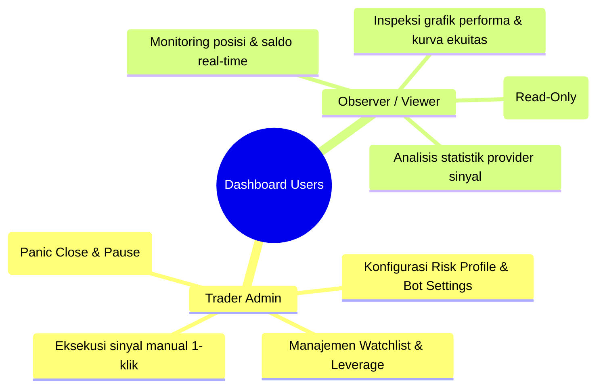
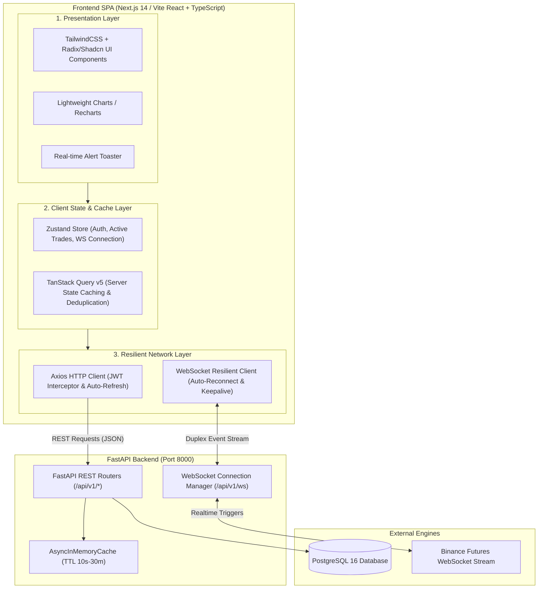
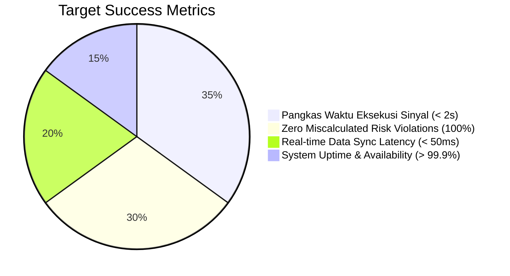

# Product Requirements Document (PRD): Web Dashboard UI
**Project**: SMC CryptoBot – Professional Binance Futures Trading Dashboard  
**Version**: 2.0.0  
**Status**: Approved / In Development  
**Target Platform**: Web (Desktop-First, Tablet & Mobile Responsive)  
**Backend API**: Fast-API REST & WebSocket v2.0.0 ([docs/openapi.yaml](file:///home/rodex/Documents/cell/projects/crypto-bot/docs/openapi.yaml))  

---

## 1. Executive Summary & Product Vision

### 1.1 Executive Summary
**SMC CryptoBot Dashboard UI** adalah antarmuka web modern, interaktif, dan berkinerja tinggi yang dirancang untuk melengkapi backend semi-automated trading bot Binance Futures. Dashboard ini menyajikan visualisasi data komprehensif, streaming status perdagangan secara *real-time*, eksekusi sinyal manual satu-klik (*1-Click Execution*) dengan proteksi risiko otomatis, serta manajemen instrumen dan pengaturan bot secara terpusat.

Dengan mengadopsi arsitektur *Reactive Single Page Application* (SPA) yang terhubung langsung ke WebSocket event broker dan REST API berlatensi rendah, dashboard ini menghilangkan ketergantungan trader pada antarmuka teks Telegram yang terbatas, menghadirkan transparansi penuh atas portofolio, posisi terbuka, dan riwayat kalkulasi risiko.

### 1.2 Product Vision
> *"Menyediakan antarmuka terminal trading profesional yang responsif, estetis, dan aman bagi trader kripto futures—menggabungkan keanggunan visual TradingView/Binance Dark Mode dengan kekuatan otomasi Smart Money Concepts (SMC) dan manajemen risiko mutlak (Zero Risk Violation)."*

---

## 2. Problem Statement & Target Users

### 2.1 Problem Statement
1. **Keterbatasan Antarmuka Chat Telegram**:
   * Memantau posisi terbuka, pergerakan Take Profit bertingkat (TP1/TP2/TP3), dan trailing stop melalui teks chat Telegram rawan terlewat saat frekuensi sinyal tinggi.
   * Tidak adanya visualisasi grafis atas kurva ekuitas (*equity curve*) dan drawdown historis menyulitkan evaluasi performa strategi secara holistik.
2. **Friksi & Risiko Human Error pada Eksekusi Manual**:
   * Saat trader menerima sinyal di Telegram dan ingin mengeksekusinya secara manual di Binance, proses kalkulasi lot size, leverage downscaling, dan penentuan stop distance memakan waktu 30–60 detik yang sering menyebabkan *slippage* atau salah input parameter (*fat-finger error*).
3. **Ketiadaan Kontrol Operasional Terpusat**:
   * Aksi darurat seperti *Emergency Panic Close All* atau *Pause Trading Engine* saat pasar mengalami volatilitas ekstrem membutuhkan akses cepat berbasis antarmuka grafis dengan indikator status yang jelas.

### 2.2 Target User Personas

| Atribut Persona | **Persona 1: Trader Admin (Primary)** | **Persona 2: Observer / Investor (Viewer)** |
| :--- | :--- | :--- |
| **Deskripsi** | Pengelola utama akun trading dan bot engine. | Mitra, investor, atau auditor yang memantau performa. |
| **Tujuan Utama** | Memaksimalkan profitabilitas, mengeksekusi sinyal SMC valid, memitigasi risiko secara real-time. | Memverifikasi pertumbuhan modal, transparansi drawdown, dan ketercapaian target win rate. |
| **Hak Akses** | Akses Penuh: Read, Write, Mutate Settings, Panic Action, Signal Execution. | Akses Terbatas: Read-Only (Dashboard, Trades, Analytics, Logs, Export CSV). |

---

## 3. System Scope & User Roles

### 3.1 System Scope
Dashboard Web mencakup seluruh interaksi visual terhadap 25+ endpoint REST API dan 1 duplex WebSocket stream:
* Autentikasi berbasis JWT dengan mekanisme *silent refresh*.
* Widget ringkasan eksekutif (Saldo USDT, Margin Bebas, Daily PnL, Win Rate, Daily Risk Budget).
* Grafik kurva ekuitas interaktif harian, mingguan, dan bulanan.
* Manajemen tabel posisi aktif (*live unrealized PnL*, milestone progress Take Profit).
* Riwayat closed trades dengan inspeksi detail hierarki 5 level (Trade $\rightarrow$ Risk $\rightarrow$ Orders $\rightarrow$ Executions $\rightarrow$ Summary).
* Live Signal Feed dari Telegram dengan modal eksekusi manual berpelindung risiko (maksimal 2% risk cap).
* Manajemen Watchlist simbol dan sinkronisasi limit bracket Binance.
* Sandbox kalkulator simulasi margin, stop distance, dan harga likuidasi.
* Kontrol operasional bot (*Status*, *Pause*, *Resume*, *Panic Close*, *Settings*, *Credentials Rotation*).
* Penampil audit log sistem dan generator laporan CSV berstandar RFC 4180.

### 3.2 Role-Based Access Control (RBAC) Matrix

| Fitur / Modul | Endpoint Terkait | Role `ADMIN` | Role `VIEWER` | Keterangan UI |
| :--- | :--- | :---: | :---: | :--- |
| **Login & Profile** | `/api/v1/auth/*` | ✅ | ✅ | Dapat login dan melihat profile diri sendiri. |
| **Dashboard Summary** | `/api/v1/analytics/summary` | ✅ | ✅ | Menampilkan ringkasan portofolio live. |
| **Equity Curve Chart** | `/api/v1/analytics/equity-curve` | ✅ | ✅ | Grafik pertumbuhan modal interaktif. |
| **Active Positions** | `/api/v1/trades/active` | ✅ | ✅ | Melihat tabel posisi terbuka live. |
| **Manual Close Trade** | `/api/v1/trades/{id}/close` | ✅ | ❌ | Tombol *Close* dinonaktifkan/disembunyikan untuk Viewer. |
| **Trade Detail Tree** | `/api/v1/trades/{id}` | ✅ | ✅ | Modal inspeksi detail eksekusi trade. |
| **Signal Feed** | `/api/v1/signals` | ✅ | ✅ | Menampilkan daftar sinyal terurai. |
| **Execute Signal** | `/api/v1/signals/manual-execute`| ✅ | ❌ | Tombol *Execute Trade* terproteksi RBAC. |
| **Watchlist Toggle** | `/api/v1/watchlist/toggle` | ✅ | ❌ | Switch toggle dinonaktifkan untuk Viewer. |
| **Sync Instruments** | `/api/v1/instruments/sync` | ✅ | ❌ | Tombol *Sync Binance* dinonaktifkan untuk Viewer. |
| **Risk Simulator** | `/api/v1/calculator/simulate` | ✅ | ✅ | Simulator bebas digunakan seluruh user. |
| **Bot Pause / Resume** | `/api/v1/bot/pause`, `/resume` | ✅ | ❌ | Switch operasional bot hanya untuk Admin. |
| **Panic Close All** | `/api/v1/bot/panic` | ✅ | ❌ | Tombol darurat merah dibatasi untuk Admin. |
| **Settings & Keys** | `/api/v1/settings`, `/credentials` | ✅ | ❌ | Form konfigurasi hanya untuk Admin. |
| **Audit Logs** | `/api/v1/logs` | ✅ | ✅ | Penampil log sistem dapat diakses seluruh role. |
| **CSV Report Export** | `/api/v1/reports/export/csv` | ✅ | ✅ | Unduh file CSV dapat diakses seluruh role. |
| **WebSocket Feed** | `/api/v1/ws` | ✅ | ✅ | Streaming real-time terbuka untuk seluruh user login. |

---

## 4. System Architecture & Tech Stack

### 4.1 Diagram Arsitektur Frontend & Aliran Data

### 4.2 Layer Decomposition
1. **Presentation Layer**:
   * Menggunakan komponen modular atomik berbasis *TailwindCSS* dengan tema gelap *Pro-Trading Dark Theme*.
   * Mengintegrasikan visualisasi grafik performa finansial menggunakan *TradingView Lightweight Charts*.
2. **State & Caching Layer**:
   * **TanStack Query v5**: Menangani *server state*, deduplikasi request, caching ber-TTL (sesuai spesifikasi backend), dan *write-through invalidation*.
   * **Zustand**: Mengelola *client state* lokal (status autentikasi, status koneksi WebSocket live, temporary form state, dan filter preferences).
3. **Network & Communication Layer**:
   * **Axios Interceptor**: Secara transparan menambahkan header `Authorization: Bearer <token>` dan mencegat error HTTP 401 untuk memicu alur *silent token refresh* via `/api/v1/auth/refresh`.
   * **Resilient WebSocket Client**: Mengelola koneksi WebSocket `/api/v1/ws?token=...`, mendeteksi *heartbeat ping/pong*, dan melakukan rekoneksi otomatis dengan *exponential backoff*.

---

## 5. Functional Requirements (FR)

### Module 1: Authentication, Session & User Profile
* **FR-01.1 [Login Form]**: Form login elegan dengan validasi username & password, animasi status loading, dan penanganan pesan error yang deskriptif.
* **FR-01.2 [JWT Token Storage]**: Access Token disimpan di memory/cookie terenkripsi, Refresh Token disimpan aman untuk auto-refresh session.
* **FR-01.3 [Silent Token Refresh]**: Saat Access Token kedaluwarsa ($15\text{ menit}$), Axios interceptor secara transparan meminta token baru tanpa memutus aktivitas pengguna.
* **FR-01.4 [Auto Logout]**: Jika refresh token kedaluwarsa ($7\text{ hari}$) atau user dinonaktifkan, user diarahkan ke `/login` dengan notifikasi "Sesi telah berakhir".
* **FR-01.5 [User Profile Badge]**: Menampilkan nama user, badge role (`ADMIN` / `VIEWER`), dan tombol *Logout* di navigasi atas.

---

### Module 2: Executive Analytics & Equity Curve Overview
* **FR-02.1 [KPI Summary Cards]**: Menampilkan 6 metrik utama portofolio secara real-time:
  * Total Balance (USDT)
  * Free Margin & Margin Utilization (%)
  * Daily Realized PnL ($ dan %) dengan pewarnaan dinamis (Hijau jika profit, Merah jika loss)
  * Win Rate (%) & Total Trades Executed
  * Profit Factor
  * Remaining Daily Risk Budget ($ tersisa sebelum circuit breaker aktif)
* **FR-02.2 [Equity Curve Chart]**: Grafik interaktif yang memplot histori ekuitas akun terhadap waktu, dilengkapi selector rentang waktu (1D, 7D, 30D, All).
* **FR-02.3 [Auto Cache Synchronization]**: Data summary di-cache selama 10 detik dan diperbarui secara otomatis saat event WebSocket `TRADE_CLOSED` diterima.

---

### Module 3: Active Positions & Live Trade Management
* **FR-03.1 [Active Positions Table]**: Menampilkan seluruh posisi terbuka (`WAITING_ENTRY`, `ACTIVE`, `PARTIALLY_FILLED`) dengan kolom:
  * Symbol & Side (Badge `BUY / LONG` hijau, `SELL / SHORT` merah)
  * Entry Price & Current Mark Price
  * Position Size (Qty) & Notional Value (USDT)
  * Effective Leverage (misal: `20x Isolated`)
  * Stop Loss Price & Jarak ke SL (%)
  * Unrealized PnL ($ dan %) ter-update live
* **FR-03.2 [Take Profit Milestone Progress Bar]**: Visualisasi grafis pencapaian level TP1 (50%), TP2 (30%), dan TP3 (20%) secara real-time.
* **FR-03.3 [Emergency Manual Close Button]**: Tombol *Close Position* di setiap baris trade dengan modal konfirmasi cepat untuk mengeksekusi penutupan market instan via `POST /api/v1/trades/{id}/close`.

---

### Module 4: Closed Trade History & Multi-Level Detail Tree
* **FR-04.1 [Paginated Trade History]**: Tabel riwayat closed trades dengan pagination terproteksi, filter berdasarkan simbol, status hasil (`WIN`, `LOSS`, `BREAKEVEN`), dan provider sinyal.
* **FR-04.2 [5-Level Drilldown Modal]**: Modal dialog komprehensif saat baris trade diklik, menyajikan:
  1. *Level 1 - Trade Header*: Informasi umum, durasi waktu, leverage, dan close reason.
  2. *Level 2 - Risk Parameters*: Alokasi risiko modal, batas stop distance, dan validasi bracket leverage.
  3. *Level 3 - Order Lifecycle*: Daftar order exchange terkait (`ENTRY`, `TP1`, `TP2`, `TP3`, `SL`) beserta exchange order ID.
  4. *Level 4 - Order Executions*: Riwayat fill parsial/penuh, harga eksekusi aktual, dan komisi exchange.
  5. *Level 5 - Performance Summary*: Gross PnL, Net PnL, ROI %, dan rasio Risk-to-Reward (RR) terwujud.

---

### Module 5: Telegram Signal Feed & 1-Click Execution Wizard
* **FR-05.1 [Live Signal Feed List]**: Menampilkan feed sinyal telegram terkini lengkap dengan badge status (`PARSED`, `EXECUTED`, `REJECTED`, `EXPIRED`, `SKIPPED`).
* **FR-05.2 [1-Click Execution Wizard]**: Tombol eksekusi yang membuka wizard modal interaktif:
  * Menampilkan preview kalkulasi lot size otomatis berdasarkan balance akun saat ini.
  * Menampilkan verifikasi aturan risiko: **Maksimal 2% Risk Cap**.
  * Input modifikasi manual (opsional) untuk target TP dan SL dengan validasi geometri harga real-time (mencegah SL di atas entry untuk posisi BUY).
  * Tombol *Confirm & Execute* yang mengirim payload ke `POST /api/v1/signals/manual-execute`.

---

### Module 6: Watchlist Manager & Instrument Leverage Synchronizer
* **FR-06.1 [Watchlist Toggle Grid]**: Grid kartu instrumen kripto yang menampilkan status aktifasi perdagangan.
* **FR-06.2 [Instant Toggle Action]**: Switch toggle aktif/nonaktif simbol yang langsung tersimpan ke backend (`POST /api/v1/watchlist/toggle`) dan menginvaliasi cache seketika.
* **FR-06.3 [Binance Leverage Bracket Synchronizer]**: Tombol *Sync Instruments with Binance* yang memicu sinkronisasi tick size, step size, min notional, dan max leverage bracket dari exchange via `POST /api/v1/instruments/sync`.

---

### Module 7: Risk Simulator & Dynamic Leverage Sandbox
* **FR-07.1 [Interactive Simulation Form]**: Form kalkulator interaktif:
  * Pemilihan simbol (auto-fill harga pasar saat ini)
  * Pemilihan arah posisi (`BUY` / `SELL`)
  * Input Entry Price dan Stop Loss Price
  * Input Balance USDT dan Custom Risk % (default: 2.0%)
* **FR-07.2 [Real-Time Simulation Results Panel]**:
  * Ukuran Posisi yang Direkomendasikan (Coin Qty & USDT Value)
  * Leverage Efektif yang Aman (dengan peringatan visual jika terjadi *bracket downscaling*)
  * Estimasi Margin yang Dibutuhkan (USDT)
  * Estimasi Harga Likuidasi (*Estimated Liquidation Price*)
  * Status Keamanan Modal (Badge Hijau: `SAFE`, Badge Merah: `UNSAFE / INSUFFICIENT MARGIN`)

---

### Module 8: Bot Operations, Circuit Breaker & Credential Vault
* **FR-08.1 [Bot Status Hero Banner]**: Banner status operasional di bagian atas aplikasi:
  * Status Engine: `🟢 ACTIVE / RUNNING` atau `🟡 PAUSED`
  * Status WebSocket Binance: `Connected` / `Disconnected`
  * Status Scheduler Cron: `Active (7 Jobs)`
* **FR-08.2 [Pause & Resume Switch]**: Tombol pengubah status bot dengan konfirmasi cepat.
* **FR-08.3 [Emergency Panic Close Modal]**: Tombol merah mencolok *PANIC CLOSE ALL* yang mewajibkan checkbox konfirmasi "Saya mengerti tindakan ini akan menutup seluruh posisi market dan membatalkan semua order aktif" sebelum tombol submit aktif.
* **FR-08.4 [Credential Rotation & Testing]**: Form input API Key dan API Secret Binance dengan tombol *Test Connection Handshake* sebelum menyimpan perubahan.

---

### Module 9: System Audit Logs & CSV Report Exporter
* **FR-09.1 [Live Audit Log Viewer]**: Antarmuka terminal log dengan warna baris berdasarkan severity level (`DEBUG` abu-abu, `INFO` biru, `WARNING` kuning, `ERROR` merah).
* **FR-09.2 [Log Filters & Trace Correlation]**: Filter log instan berdasarkan Level log dan pencarian `trace_id` sinyal (misal: `sig-btc-001`).
* **FR-09.3 [CSV Report Export Date Picker]**: Form pemilihan rentang tanggal (`start_date` dan `end_date`) dengan tombol *Download CSV Report* yang langsung mengunduh stream file CSV transaksi tertutup.

---

### Module 10: Duplex Real-Time WebSocket Event Broker
* **FR-10.1 [Auto-Connect with JWT Auth]**: Membuka koneksi ke `/api/v1/ws?token=<JWT>` setelah login berhasil.
* **FR-10.2 [Live Event Dispatcher]**: Menerima dan memproses event:
  * `TRADE_OPENED` $\rightarrow$ Menambahkan baris ke tabel Active Trades & trigger sound alert.
  * `ORDER_FILLED` $\rightarrow$ Update status order & notifikasi toast.
  * `TP_HIT` $\rightarrow$ Animasi milestone TP tercapai & update realized PnL.
  * `SL_HIT` $\rightarrow$ Notifikasi Stop Loss tersentuh & update status posisi.
  * `TRADE_CLOSED` $\rightarrow$ Memindahkan trade dari tabel aktif ke histori & update summary cards.
  * `CIRCUIT_BREAKER_TRIGGERED` $\rightarrow$ Menampilkan modal peringatan darurat daily loss limit.
  * `BOT_STATUS_CHANGED` $\rightarrow$ Update banner status bot secara instan di seluruh tab browser.
* **FR-10.3 [Resilience & Keep-Alive]**: Mengirimkan ping setiap 30 detik, mendeteksi koneksi terputus, dan melakukan *exponential backoff reconnect* otomatis dengan indikator badge status di navbar (`🟢 Connected`, `🟡 Reconnecting...`, `🔴 Offline`).

---

## 6. Non-Functional Requirements (NFR)

### 6.1 Performance & Latency
* **Initial Page Load**: First Contentful Paint (FCP) $< 1.0\text{s}$, Time to Interactive (TTI) $< 1.8\text{s}$ pada jaringan broadband standar.
* **WebSocket Message-to-UI Latency**: Pembaruan DOM setelah pesan WebSocket diterima tidak boleh melebihi $30\text{ms}$.
* **Frame Rate**: Scrolling tabel dengan 500+ baris trade harus mempertahankan stabil $60\text{ FPS}$ menggunakan teknik *virtualized list* (`@tanstack/react-virtual`).
* **Bundle Size Optimization**: Production bundle awal $< 250\text{ KB}$ (gzipped) dengan *dynamic code splitting* per rute.

### 6.2 Usability & Aesthetic Excellence
* **Pro-Trading Dark Palette**: Menggunakan palet gelap terkurasi (Deep Slate `#0B0E14`, Card Surface `#1E293B`, Neon Profit `#10B981`, Rose Loss `#EF4444`).
* **High Readability Typography**: Font `Inter` untuk body teks dan font monospace `JetBrains Mono` untuk seluruh angka harga, persentase, dan saldo keuangan.
* **Responsive Layout Grid**:
  * Desktop ($> 1280\text{px}$): Multi-column grid dengan sidebar navigasi tetap dan multi-panel terminal view.
  * Tablet ($768\text{px} - 1279\text{px}$): 2-column adaptive layout.
  * Mobile ($< 768\text{px}$): Bottom navigation bar dengan collapsible quick-view cards.
* **Zero Cumulative Layout Shift**: Nilai CLS $< 0.05$ menggunakan skeleton loading placeholder yang presisi saat fetching data.

### 6.3 Security & Session Protection
* **Token Isolation**: JWT Access Token disimpan dalam reactive memory state; refresh token dilindungi dengan mekanisme HTTP-Only secure cookie / encrypted local session.
* **XSS & Injection Sanitization**: Seluruh input teks (simbol, log filter, parameter kalkulator) di-sanitize secara ketat sebelum dikirim ke API atau dirender ke DOM.
* **Route Protection & RBAC Guards**: Middleware pelindung rute di level client-side yang menolak akses pengguna non-admin ke halaman `/settings` atau `/credentials`.

### 6.4 Reliability & Fault Tolerance
* **Graceful Degradation**: Jika WebSocket terputus, sistem otomatis mengaktifkan polling REST API berkala (fallback interval 10 detik) hingga WebSocket kembali terhubung.
* **Global Error Boundary**: Setiap komponen kritis (grafik, tabel posisi, kalkulator) dibungkus *React Error Boundary* sehingga crash lokal tidak merusak keseluruhan aplikasi.

---

## 7. Technology Stack & Rationale

| Layer / Kategori | Teknologi Terpilih | Versi | Rationale & Keunggulan |
| :--- | :--- | :---: | :--- |
| **Framework** | **Next.js 14 / Vite + React** | `14.x / 18.x` | React modern dengan ekosistem hook mutakhir, TypeScript native, dan performa bundling super cepat. |
| **Language** | **TypeScript** | `5.x` | Static typing 100% selaras dengan DTO schema Pydantic di backend untuk mencegah runtime bug. |
| **Styling** | **TailwindCSS** | `3.4.x` | Utilitas styling fleksibel, performa zero-runtime CSS, dan kustomisasi tema pro-trading dark mode yang mudah. |
| **UI Components** | **Radix UI / Shadcn UI** | `Latest` | Komponen headless yang sepenuhnya accessible (WAI-ARIA compliant), keyboard navigable, dan tanpa bloat. |
| **Server State** | **TanStack Query (React Query)** | `v5` | Manajemen caching server-state otomatis, background invalidation, retry logic, dan optimasi query deduplication. |
| **Client State** | **Zustand** | `v4.x` | State management mikro yang sangat ringan ($< 1\text{ KB}$), zero-boilerplate untuk auth dan WebSocket connection state. |
| **Financial Chart** | **TradingView Lightweight Charts** | `v4.x` | Standar industri finansial untuk rendering kurva harga & equity dengan performa canvas 60 FPS. |
| **Icons & Media** | **Lucide React** | `Latest` | Set ikon SVG modern, ringan, dan konsisten untuk dashboard trading. |
| **HTTP Client** | **Axios** | `v1.6.x` | Dukungan interceptor handal untuk menangani alur *silent token refresh* otomatis. |

---

## 8. Success Metrics & KPIs

1. **Waktu Eksekusi Sinyal (*Time-to-Execution*)**:
   * *Target*: Pangkas waktu eksekusi dari sinyal diterima di feed hingga order terkirim ke exchange menjadi **$< 2\text{ detik}$**.
2. **Kepatuhan Aturan Risiko (*Zero Risk Violation*)**:
   * *Target*: **$100\%$ eksekusi manual mematuhi batas 2% modal**, terbukti dengan validasi kalkulator sebelum transaksi disubmit.
3. **Sinkronisasi Data Real-Time (*Latency & Accuracy*)**:
   * *Target*: Update posisi terbuka dan saldo di dashboard mencerminkan kondisi exchange dengan delay **$< 50\text{ms}$**.
4. **Ketersediaan Antarmuka (*Dashboard Availability*)**:
   * *Target*: **$99.9\%$ uptime** tanpa freeze atau unhandled crash pada antarmuka pengguna selama sesi trading aktif.

---

## 9. Risk Analysis & Mitigation Strategies

| No | Identifikasi Risiko | Dampak | Probabilitas | Rencana Mitigasi (*Mitigation Strategy*) |
| :---: | :--- | :---: | :---: | :--- |
| **1** | **Koneksi WebSocket Terputus Diam-diam (*Silent Drop*)** | Tinggi | Sedang | Implementasi *Heartbeat Ping/Pong* setiap 30 detik. Jika pong tidak diterima dalam 5 detik, paksa reconnect dengan exponential backoff dan aktifkan polling REST fallback. |
| **2** | **Ketidaksengajaan Klik Tombol *Panic Close All*** | Sangat Tinggi | Rendah | Menggunakan modal konfirmasi 2 langkah (*2-Step Confirmation*) yang mewajibkan centang checkbox persetujuan sebelum tombol submit aktif. |
| **3** | **Sesi JWT Expired saat Trader Mengisi Form Eksekusi** | Sedang | Sedang | Axios request interceptor secara proaktif memeriksa expiry token dan melakukan refresh transparan di latar belakang tanpa me-reset form input trader. |
| **4** | **Banjir Pesan WebSocket (*Message Flooding*) saat Volatilitas Tinggi** | Sedang | Tinggi | Terapkan teknik *Throttling / RequestAnimationFrame* pada komponen tabel agar tidak melakukan re-render berlebihan di luar refresh rate monitor (60 Hz). |
| **5** | **Perbedaan Presisi Angka Antara Frontend dan Binance** | Tinggi | Rendah | Menggunakan DTO format string/Decimal dari backend dan pustaka formatting angka khusus untuk menghindari pembulatan JavaScript floating-point error. |

---

## 10. Constraints & Assumptions

### 10.1 Constraints (Batasan Sistem)
1. **Exchange Scope**: Antarmuka dashboard dirancang khusus untuk ekosistem **Binance USD-M Futures** sesuai arsitektur backend SMC CryptoBot.
2. **Backend API Dependency**: Dashboard bergantung penuh pada backend FastAPI yang berjalan di port `8000` (atau via reverse proxy Docker/Nginx).
3. **Browser Requirements**: Memerlukan browser modern yang mendukung standar ECMAScript 2022+ dan WebSocket API (Google Chrome 100+, Mozilla Firefox 100+, Apple Safari 16+, Microsoft Edge 100+).

### 10.2 Assumptions (Asumsi)
1. Backend API beroperasi secara stabil dengan konektivitas internet latensi rendah ke server Binance.
2. Pengguna memiliki akun dengan kredensial API Key Binance Futures aktif dengan izin *Futures Trading Enabled*.
3. Layar perangkat pengguna memiliki resolusi minimal $360\text{px}$ (Mobile) hingga $4\text{K}$ (Desktop Pro Setup).

---

## 11. Out of Scope

Fitur-fitur berikut **tidak termasuk** dalam ruang lingkup pengembangan rilis V2.0 ini:
1. **Aplikasi Native Mobile Binary** (File `.apk` Android atau `.ipa` iOS)—Aplikasi web ini bersifat responsif PWA/Mobile Web, bukan native app store binary.
2. **Gateway Deposit / Penarikan Uang Fiat**—Seluruh mutasi transfer saldo USDT tetap dilakukan melalui platform resmi Binance.
3. **Code Editor / Pine Script IDE In-Browser**—Konfigurasi strategi dilakukan melalui visual form dan DTO rule, bukan menulis script kode di dashboard.
4. **Multi-Exchange Arbitrage View**—Fokus eksklusif pada Binance Futures (tidak mencakup Bybit, OKX, atau KuCoin pada versi ini).

---

## 12. Appendix: API Endpoint & Event Mapping Reference

Tabel pemetaan seluruh komponen UI frontend terhadap endpoint backend [docs/openapi.yaml](file:///home/rodex/Documents/cell/projects/crypto-bot/docs/openapi.yaml):

| Modul UI Dashboard | HTTP Method | Endpoint REST API | WebSocket Event Trigger |
| :--- | :---: | :--- | :--- |
| **Login View** | `POST` | `/api/v1/auth/login` | - |
| **Token Refresh Interceptor** | `POST` | `/api/v1/auth/refresh` | - |
| **User Profile Badge** | `GET` | `/api/v1/auth/me` | - |
| **Analytics Summary Cards** | `GET` | `/api/v1/analytics/summary` | `TRADE_CLOSED`, `CIRCUIT_BREAKER_TRIGGERED` |
| **Equity Growth Chart** | `GET` | `/api/v1/analytics/equity-curve` | `TRADE_CLOSED` |
| **Live Positions Table** | `GET` | `/api/v1/trades/active` | `TRADE_OPENED`, `TP_HIT`, `SL_HIT`, `ORDER_FILLED` |
| **Manual Market Close Button** | `POST` | `/api/v1/trades/{id}/close` | `TRADE_CLOSED` |
| **Trade Detail Modal Tree** | `GET` | `/api/v1/trades/{id}` | - |
| **Closed Trades History Table**| `GET` | `/api/v1/trades/history` | `TRADE_CLOSED` |
| **Signal Feed Stream** | `GET` | `/api/v1/signals` | `TRADE_OPENED` |
| **1-Click Signal Execution** | `POST` | `/api/v1/signals/manual-execute` | `TRADE_OPENED`, `ORDER_FILLED` |
| **Watchlist Grid & Toggle** | `GET`, `POST`| `/api/v1/watchlist`, `/toggle` | - |
| **Instrument Leverage Sync** | `GET`, `POST`| `/api/v1/instruments`, `/sync` | - |
| **Signal Provider Analytics** | `GET` | `/api/v1/providers`, `/{id}/analytics` | - |
| **Strategy Configuration** | `GET`, `PUT` | `/api/v1/strategies`, `/{id}` | - |
| **Risk Simulator Sandbox** | `POST` | `/api/v1/calculator/simulate` | - |
| **Bot Status Hero Banner** | `GET` | `/api/v1/bot/status` | `BOT_STATUS_CHANGED`, `CIRCUIT_BREAKER_TRIGGERED` |
| **Bot Pause / Resume Toggle** | `POST` | `/api/v1/bot/pause`, `/resume` | `BOT_STATUS_CHANGED` |
| **Emergency Panic Close Modal**| `POST` | `/api/v1/bot/panic` | `CIRCUIT_BREAKER_TRIGGERED`, `BOT_STATUS_CHANGED` |
| **Bot Settings Form** | `GET`, `PUT` | `/api/v1/settings` | `BOT_STATUS_CHANGED` |
| **Binance Credential Vault** | `POST` | `/api/v1/credentials` | - |
| **System Audit Logs Terminal**| `GET` | `/api/v1/logs` | `CIRCUIT_BREAKER_TRIGGERED`, `BOT_STATUS_CHANGED` |
| **CSV Report Downloader** | `GET` | `/api/v1/reports/export/csv` | - |
| **Live Stream Connection** | `GET (WS)` | `/api/v1/ws` | `CONNECTED`, `PONG` |
