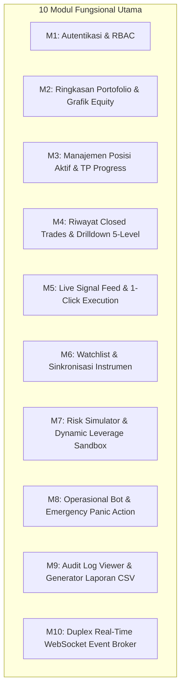

# Software Requirements Specification (SRS): Web Dashboard UI
**Project**: SMC CryptoBot – Professional Binance Futures Trading Dashboard  
**Document**: Frontend Requirements Specification (`REQUIREMENTS.md`)  
**Version**: 2.0.0  
**Status**: Approved / In Development  
**Target Backend**: FastAPI REST & WebSocket API v2.0.0 ([docs/openapi.yaml](file:///home/rodex/Documents/cell/projects/crypto-bot/docs/openapi.yaml))  
**Related Document**: [docs/frontend/PRD.md](file:///home/rodex/Documents/cell/projects/crypto-bot/docs/frontend/PRD.md)  

---

## 1. Pendahuluan & Lingkup Dokumen

Dokumen ini mendefinisikan seluruh spesifikasi kebutuhan fungsional (*Functional Requirements*), kebutuhan non-fungsional (*Non-Functional Requirements*), arsitektur teknis data contract, tata kelola state management, serta kriteria keberhasilan pengujian untuk pengembangan **Frontend Web Dashboard UI**.

Frontend ini dibangun sebagai aplikasi web reaktif berkinerja tinggi yang beroperasi secara *real-time* untuk memantau performa portofolio, mengelola posisi terbuka Binance Futures, mengeksekusi sinyal trading Telegram secara semi-otomatis dengan proteksi risiko ketat (maksimal 2% risk cap), serta mengendalikan operasional bot trading.

---

## 2. Batasan Lingkungan & Prasyarat Sistem

### 2.1 Prasyarat Perangkat Keras & Jaringan
* **Klien Desktop/Laptop**: Resolusi minimal $1366 \times 768$ (Direkomendasikan $1920 \times 1080$ Full HD ke atas).
* **Klien Mobile/Tablet**: Resolusi layar adaptif mulai dari $360\text{px}$ (Mobile) hingga $1024\text{px}$ (Tablet).
* **Konektivitas**: Jaringan internet stabil dengan latensi ke server backend $< 100\text{ms}$.

### 2.2 Kompatibilitas Browser
* **Google Chrome**: Versi 100+
* **Mozilla Firefox**: Versi 100+
* **Apple Safari**: Versi 16+
* **Microsoft Edge**: Versi 100+
* *Catatan*: Seluruh browser wajib mendukung standar modern WebSockets (`wss://` dan `ws://`) serta ECMAScript 2022.

---

## 3. Spesifikasi Kebutuhan Fungsional Rinci (Functional Requirements)



---

### 🟢 Modul 1: Autentikasi, Manajemen Sesi & RBAC Security

#### Deskripsi:
Mengamankan akses ke seluruh fitur dashboard menggunakan protokol JSON Web Token (JWT) dengan penanganan otorisasi berbasis peran (*Role-Based Access Control*).

#### Spesifikasi Kebutuhan Rinci:
* **FR-01.01 [Halaman Login]**:
  * Menyajikan form input `username` dan `password` dengan tombol *Show/Hide Password*.
  * Tombol submit *Sign In* dengan status loading spinner saat memanggil `POST /api/v1/auth/login`.
  * Menampilkan pesan error ramah pengguna jika kredensial salah (HTTP 401: *"Invalid username or password"*).
* **FR-01.02 [Manajemen Token JWT]**:
  * Menyimpan `access_token` ($15\text{ menit TTL}$) di dalam reactive memory state (*Zustand store*).
  * Menyimpan `refresh_token` ($7\text{ hari TTL}$) di dalam secure client-side storage atau cookie.
* **FR-01.03 [Silent Token Refresh Interceptor]**:
  * Axios response interceptor otomatis mencegat respon HTTP 401 saat access token kedaluwarsa.
  * Memanggil endpoint `POST /api/v1/auth/refresh` secara transparan di background untuk mendapatkan access token baru, lalu me-replay request yang sempat gagal tanpa disadari pengguna.
* **FR-01.04 [Session Expiration & Auto-Logout]**:
  * Jika refresh token kedaluwarsa atau server menolak refresh, sesi dibersihkan seketika dan user di-redirect ke `/login` disertai toast notifikasi *"Sesi Anda telah berakhir. Silakan login kembali."*
* **FR-01.05 [User Badge & Profil]**:
  * Memanggil `GET /api/v1/auth/me` untuk menampilkan username dan badge peran (`ADMIN` warna ungu/emas, `VIEWER` warna abu-abu/biru) di sudut kanan atas navbar.
* **FR-01.06 [Client-Side Route Guard]**:
  * Middleware rute mencegah user tanpa token mengakses halaman internal.
  * Menyembunyikan tombol mutasi (seperti *Settings*, *Panic Close*, *Execute Trade*) jika peran pengguna adalah `VIEWER`.

---

### 🟢 Modul 2: Ringkasan Portofolio & Grafik Kurva Ekuitas

#### Deskripsi:
Menyajikan metrik kesehatan finansial portofolio Binance Futures secara ringkas, akurat, dan visual.

#### Spesifikasi Kebutuhan Rinci:
* **FR-02.01 [Executive KPI Summary Cards]**:
  * Mengonsumsi endpoint `GET /api/v1/analytics/summary` (Cached backend TTL 10s):
    1. **Total Balance**: Saldo total akun dalam USDT (Font besar monospaced).
    2. **Free Margin**: Margin bebas yang dapat digunakan untuk entry posisi baru.
    3. **Daily Realized PnL**: Nominal profit/loss hari ini ($) dan persentase (%) terhadap modal awal hari. Jika positif berwarna hijau neon (`#10B981`), jika negatif berwarna merah mawar (`#EF4444`).
    4. **Win Rate (%)**: Rasio trade menang terhadap total trade (disertai indikator visual badge progres).
    5. **Profit Factor**: Rasio gross profit terhadap gross loss.
    6. **Remaining Daily Risk Budget**: Sisa alokasi kerugian yang diperbolehkan hari ini sebelum Circuit Breaker mematikan bot otomatis (misal: `$14.50 / $20.00`).
* **FR-02.02 [Equity Growth Curve Chart]**:
  * Mengonsumsi endpoint `GET /api/v1/analytics/equity-curve` (Cached backend TTL 60s).
  * Merender grafik kurva ekuitas interaktif berbasis kanvas (*TradingView Lightweight Charts* atau *Recharts Area Chart*).
  * Menyediakan tombol rentang waktu: `1D` (24 jam), `7D` (1 minggu), `30D` (1 bulan), `ALL`.
  * Tooltip hover menampilkan tanggal, waktu, saldo ekuitas pada titik tersebut, dan perubahan nominal/persentase.
* **FR-02.03 [Cache Invalidation & Real-Time Sync]**:
  * Saat event WebSocket `TRADE_CLOSED` atau `ORDER_FILLED` diterima, TanStack Query otomatis meng-invaliasi query key `['analytics', 'summary']` dan `['analytics', 'equity-curve']` agar data langsung ter-refresh seketika.

---

### 🟢 Modul 3: Manajemen Posisi Aktif & Take Profit Progress Bar

#### Deskripsi:
Memantau seluruh trade yang sedang berjalan secara real-time dan memberikan kendali penutupan manual darurat per posisi.

#### Spesifikasi Kebutuhan Rinci:
* **FR-03.01 [Tabel Posisi Aktif]**:
  * Mengonsumsi endpoint `GET /api/v1/trades/active`.
  * Kolom tabel memuat:
    * **Symbol & Arah**: Simbol koin (misal: `BTCUSDT`) + Badge Arah (`BUY / LONG` hijau, `SELL / SHORT` merah).
    * **Status**: Badge `WAITING_ENTRY`, `ACTIVE`, `PARTIALLY_FILLED`.
    * **Entry Price & Mark Price**: Harga masuk vs harga live terkini dari exchange.
    * **Position Size & Margin**: Ukuran posisi (koin & notional USDT) serta margin terpakai.
    * **Leverage**: Tingkat leverage efektif (misal: `20x Isolated`).
    * **Stop Loss (SL)**: Harga Stop Loss aktual (termasuk status jika SL telah digeser ke BEP atau Trailing SL).
    * **Unrealized PnL**: Kalkulasi keuntungan/kerugian belum terealisasi secara live dengan format nominal USDT dan ROI % (dinamis berubah warna hijau/merah).
* **FR-03.02 [Take Profit Milestone Progress Bar]**:
  * Widget visual bertingkat pada setiap baris posisi yang menampilkan status pencapaian target TP:
    * `TP1 (50%)`: Indikator abu-abu jika belum hit $\rightarrow$ berubah hijau saat terisi.
    * `TP2 (30%)`: Indikator abu-abu jika belum hit $\rightarrow$ berubah hijau saat terisi.
    * `TP3 (20%)`: Indikator abu-abu jika belum hit $\rightarrow$ berubah hijau saat terisi.
* **FR-03.03 [Aksi Penutupan Manual (Manual Market Close)]**:
  * Tombol aksi merah *Close Position* pada setiap baris trade aktif (Hanya aktif untuk Admin).
  * Membuka modal konfirmasi: *"Apakah Anda yakin ingin menutup posisi BTCUSDT sebesar 0.02 BTC secara instan pada harga pasar?"*
  * Mengirimkan request `POST /api/v1/trades/{id}/close`.
  * Menampilkan loading state pada tombol, diikuti notifikasi toast sukses, dan posisi otomatis terhapus dari tabel aktif.

---

### 🟢 Modul 4: Riwayat Closed Trades & Multi-Level Detail Tree

#### Deskripsi:
Menyajikan rekam jejak historis seluruh transaksi perdagangan yang telah selesai beserta drilldown audit mendalam 5 tingkat.

#### Spesifikasi Kebutuhan Rinci:
* **FR-04.01 [Tabel Riwayat Transaksi]**:
  * Mengonsumsi endpoint `GET /api/v1/trades/history` dengan parameter query: `page`, `page_size`, `symbol`, `status` (`CLOSED`, `CANCELLED`), `result` (`WIN`, `LOSS`, `BREAKEVEN`), `provider_id`.
  * Kontrol pagination lengkap (Tombol *Previous*, *Next*, nomor halaman, dan dropdown *Items per page: 10, 25, 50*).
* **FR-04.02 [Modal Inspeksi Hierarki 5-Level]**:
  * Mengonsumsi endpoint `GET /api/v1/trades/{id}` saat baris riwayat diklik.
  * Menampilkan modal dialog interaktif yang terbagi dalam 5 tab/seksi visual:
    1. **Tab 1: Overview**: Symbol, arah posisi, durasi trade (format jam:menit:detik), close reason (misal: `TP3_HIT`, `SL_HIT`, `MANUAL_CLOSE`).
    2. **Tab 2: Risk Parameters**: Alokasi risiko modal ($), persentase risiko, toleransi stop distance, dan batas leverage bracket exchange.
    3. **Tab 3: Order Lifecycle**: Riwayat pesanan exchange terkait (`ENTRY`, `TP1`, `TP2`, `TP3`, `SL`) dengan status (`FILLED`, `CANCELED`), tipe order, dan exchange order ID.
    4. **Tab 4: Fill Executions**: Detail fills parsial/penuh, harga eksekusi riil, volume terisi, fee komisi exchange, dan realized PnL per fill.
    5. **Tab 5: Financial Summary**: Gross PnL, Komisi Total, Net Realized PnL, ROI %, dan rasio Risk-to-Reward (RR) terwujud.

---

### 🟢 Modul 5: Live Signal Feed & 1-Click Execution Wizard

#### Deskripsi:
Menangkap dan menyajikan feed sinyal perdagangan dari Telegram secara terstruktur, serta menyediakan wizard eksekusi manual berkecepatan tinggi dengan proteksi risiko otomatis.

#### Spesifikasi Kebutuhan Rinci:
* **FR-05.01 [Live Signal Feed Stream]**:
  * Mengonsumsi endpoint `GET /api/v1/signals` dengan filter status (`PARSED`, `EXECUTED`, `REJECTED`, `EXPIRED`, `SKIPPED`).
  * Kartu sinyal menampilkan: Nama Provider, Symbol, Side (`BUY`/`SELL`), Rentang Entry, Stop Loss, Target TP1/TP2/TP3, Trace ID (`sig-xxx`), dan timestamp diterima.
* **FR-05.02 [Wizard Eksekusi Sinyal 1-Klik]**:
  * Tombol *Execute Signal* pada kartu sinyal berstatus `PARSED`.
  * Membuka modal form interaktif yang telah terisi otomatis (*pre-filled*):
    * Simbol & Arah posisi (Read-only / Terkunci).
    * Input Entry Price (bisa diedit).
    * Input Stop Loss (bisa diedit).
    * Target TP1, TP2, TP3.
  * **Visualisasi Proteksi Risiko Real-Time**:
    * Menampilkan saldo akun live.
    * Menampilkan kalkulasi otomatis *Position Size* dan *Margin Required*.
    * Validasi Geometri Harga Live (Contoh: Menampilkan alert merah jika Stop Loss berada di atas Entry Price untuk posisi BUY).
    * **Hard 2% Risk Cap**: Jika user memasukkan parameter yang melebihi batas 2% risiko modal, tombol *Submit Trade* dinonaktifkan dan muncul peringatan: *"Risiko melebihi batas toleransi 2% ($20.00 USDT)"*.
* **FR-05.03 [Submisi Eksekusi]**:
  * Mengirim payload ke `POST /api/v1/signals/manual-execute`.
  * Saat sukses, menampilkan notifikasi toast sukses, memperbarui status sinyal menjadi `EXECUTED`, dan langsung memicu penambahan trade ke tabel posisi aktif.

---

### 🟢 Modul 6: Watchlist Manager & Sinkronisasi Instrumen

#### Deskripsi:
Mengatur daftar pasangan koin kripto yang diperbolehkan untuk diperdagangkan oleh bot dan menyinkronkan parameter limit leverage dari Binance.

#### Spesifikasi Kebutuhan Rinci:
* **FR-06.01 [Grid & Tabel Watchlist]**:
  * Mengonsumsi endpoint `GET /api/v1/watchlist`.
  * Menampilkan daftar simbol aktif dan non-aktif, tier instrumen, leverage maksimal, dan tick/step size.
* **FR-06.02 [Toggle Aktifasi Simbol Instan]**:
  * Switch toggle per baris koin untuk mengaktifkan/menonaktifkan simbol (`POST /api/v1/watchlist/toggle`).
  * Invalidation cache seketika sehingga perubahan langsung berdampak pada ingestor sinyal backend.
* **FR-06.03 [Sinkronisasi Instrumen Binance]**:
  * Tombol *Sync from Binance Exchange* yang memanggil `POST /api/v1/instruments/sync`.
  * Menampilkan status loading animasi saat proses sinkronisasi rules dan bracket leverage exchange berlangsung.
  * Menampilkan toast rekap: *"Berhasil menyinkronkan 35 instrumen dan bracket leverage dari Binance."*

---

### 🟢 Modul 7: Risk Simulator & Dynamic Leverage Sandbox

#### Deskripsi:
Sandbox kalkulator interaktif bagi trader untuk menguji skenario ukuran posisi, margin, dan risiko likuidasi sebelum mengeksekusi order riil.

#### Spesifikasi Kebutuhan Rinci:
* **FR-07.01 [Form Input Simulasi Risiko]**:
  * Pilihan Simbol (Dropdown dengan pencarian live, misal: `BTCUSDT`, `ETHUSDT`).
  * Pilihan Side (`BUY / LONG` atau `SELL / SHORT`).
  * Input Entry Price (dengan tombol *Use Current Market Price*).
  * Input Stop Loss Price.
  * Input Account Balance (Default auto-fill dengan balance live akun).
  * Input Risk Percentage (Slider dan number input, rentang $0.1\% - 5.0\%$, default $2.0\%$).
* **FR-07.02 [Kalkulasi & Hasil Simulasi Live]**:
  * Mengirimkan request ke `POST /api/v1/calculator/simulate` (dibungkus debounce 300ms untuk kalkulasi instan).
  * Menampilkan panel hasil kalkulasi:
    * **Recommended Position Size**: Ukuran koin (misal: `0.045 BTC`) dan nilai notional USDT (misal: `$2,250.00 USDT`).
    * **Recommended Leverage**: Tingkat leverage yang direkomendasikan. Jika terjadi penyesuaian otomatis akibat batasan notional exchange (*Leverage Downscaling*), tampilkan badge info kuning: *"Leverage diturunkan dari 25x ke 20x sesuai bracket Binance"*.
    * **Required Margin**: Nominal margin USDT yang wajib tersedia.
    * **Estimated Liquidation Price**: Perkiraan harga likuidasi posisi.
    * **Risk Safety Indicator**:
      * Badge Hijau: `SAFE (Margin < Balance)`
      * Badge Merah: `UNSAFE / INSUFFICIENT MARGIN` (jika modal tidak mencukupi untuk menahan stop loss tersebut).

---

### 🟢 Modul 8: Operasional Bot, Circuit Breaker & Credential Vault

#### Deskripsi:
Pusat komando status operasional bot trading, tindakan darurat (*Panic Action*), dan manajemen kunci API exchange.

#### Spesifikasi Kebutuhan Rinci:
* **FR-08.01 [Hero Banner Status Bot]**:
  * Mengonsumsi endpoint `GET /api/v1/bot/status`.
  * Menampilkan indikator status dinamis:
    * Trading Engine: `🟢 ACTIVE / RUNNING` atau `🟡 PAUSED`
    * Binance WebSocket Connection: `🟢 Connected` / `🔴 Disconnected`
    * Background Scheduler: `🟢 Healthy (7 Jobs Active)`
    * Circuit Breaker State: `🟢 Normal` / `🚨 TRIPPED (Daily Loss Limit Exceeded)`
* **FR-08.02 [Tombol Pause & Resume Engine]**:
  * Tombol *Pause Trading* memanggil `POST /api/v1/bot/pause` (menolak sinyal baru masuk).
  * Tombol *Resume Trading* memanggil `POST /api/v1/bot/resume` (mengaktifkan kembali konsumsi sinyal).
* **FR-08.03 [Emergency Panic Close All Modal]**:
  * Tombol merah besar dengan ikon peringatan darurat: **PANIC CLOSE ALL**.
  * Modal konfirmasi 2 langkah:
    1. Pesan peringatan: *"Aksi ini akan menutup SELURUH posisi terbuka di pasar secara instan dan membatalkan SEMUA limit/TP/SL order yang aktif."*
    2. Checkbox wajib centang: `[x] Saya mengonfirmasi tindakan darurat ini`.
    3. Tombol submit *EXECUTE PANIC CLOSE* (Hanya aktif jika checkbox tercentang).
  * Memanggil endpoint `POST /api/v1/bot/panic` dengan payload `{"confirmation": true}`.
  * Menampilkan hasil rekap: jumlah trade yang ditutup dan jumlah order yang dibatalkan.
* **FR-08.04 [Binance Credential Vault & Handshake Testing]**:
  * Form input API Key dan Secret Key (dengan field password masking).
  * Pilihan Environment: `TESTNET` / `MAINNET`.
  * Tombol *Test Handshake Connection* (`POST /api/v1/credentials`): Menguji validitas kunci ke server Binance dan menampilkan saldo exchange jika sukses sebelum menyimpan.

---

### 🟢 Modul 9: Audit Log Viewer & Generator Laporan CSV

#### Deskripsi:
Memantau aktivitas internal bot secara transparan dan menyediakan fasilitas ekspor laporan transaksi untuk kebutuhan audit dan pajak.

#### Spesifikasi Kebutuhan Rinci:
* **FR-09.01 [Terminal Audit Log Viewer]**:
  * Mengonsumsi endpoint `GET /api/v1/logs`.
  * Antarmuka berdesain terminal gelap monospaced dengan fitur auto-scroll to bottom.
  * Pewarnaan baris otomatis berdasarkan log severity:
    * `DEBUG`: Abu-abu `#94A3B8`
    * `INFO`: Biru Muda `#38BDF8`
    * `WARNING`: Kuning Amber `#FBBF24`
    * `ERROR` / `CRITICAL`: Merah `#F87171`
* **FR-09.02 [Filter Log & Trace Correlation]**:
  * Dropdown filter level: `ALL`, `INFO`, `WARNING`, `ERROR`.
  * Search bar input untuk melacak korelasi `trace_id` (misal: `sig-btc-001`).
* **FR-09.03 [Ekspor Laporan Transaksi CSV]**:
  * Selector rentang tanggal: Datepicker `Start Date` dan `End Date` (dengan validasi start $\le$ end).
  * Tombol *Export CSV Report* yang memanggil `GET /api/v1/reports/export/csv`.
  * Mengunduh file stream berformat `.csv` (RFC 4180 compliant) secara otomatis ke perangkat pengguna dengan nama file terstruktur `closed_trades_report_YYYYMMDD_YYYYMMDD.csv`.

---

### 🟢 Modul 10: Duplex Real-Time WebSocket Event Broker

#### Deskripsi:
Mengelola konektivitas streaming dua arah dengan backend untuk mendistribusikan pembaruan data secara instan tanpa perlu memuat ulang halaman.

#### Spesifikasi Kebutuhan Rinci:
* **FR-10.01 [Siklus Hidup Koneksi WebSocket]**:
  * Terhubung otomatis ke URL `ws://<host>/api/v1/ws?token=<JWT>` saat user login.
  * Mengirimkan pesan keep-alive text `"ping"` setiap 30 detik untuk menjaga koneksi tetap aktif.
  * Menangani respons `"PONG"` dari server.
* **FR-10.02 [Auto-Reconnect Resilient Strategy]**:
  * Jika koneksi terputus (network down / tab sleep), klien melakukan percobaan koneksi ulang otomatis dengan algoritma *Exponential Backoff* (1s, 2s, 4s, 8s, 16s, maksimal 30s).
  * Menampilkan visual badge koneksi di navbar:
    * `🟢 Real-Time Connected` (Hijau)
    * `🟡 Reconnecting in 3s...` (Kuning berkedip)
    * `🔴 Offline (Polling Fallback Active)` (Merah)
* **FR-10.03 [Peta Dispatching Event ke UI State]**:

| Event Type | Aksi pada State Frontend | Notifikasi Visual / Audio |
| :--- | :--- | :--- |
| `TRADE_OPENED` | Tambahkan baris baru ke tabel Active Trades, update summary balance. | Toast sukses hijau + audio chime notifikasi. |
| `ORDER_FILLED` | Update status order pada Trade Detail Modal. | Toast info biru: *"Order #123 Filled"*. |
| `TP_HIT` | Update milestone progress bar TP1/TP2/TP3 & realized PnL. | Toast profit hijau neon: *"Take Profit Level Hit!"*. |
| `SL_HIT` | Update status trade & catat realized loss. | Toast warning merah: *"Stop Loss Triggered"*. |
| `TRADE_CLOSED` | Pindahkan trade dari tabel aktif ke riwayat, update chart & summary. | Toast rekap hasil transaksi (`WIN` / `LOSS`). |
| `CIRCUIT_BREAKER_TRIGGERED` | Tampilkan modal darurat alert merah batas loss tercapai. | Alert banner mencolok di seluruh halaman. |
| `BOT_STATUS_CHANGED` | Update banner status bot (Active/Paused) secara serentak. | Toast status operasional bot diperbarui. |

---

## 4. Spesifikasi Kebutuhan Non-Fungsional (Non-Functional Requirements)

### 4.1 Performa & Responsivitas (Performance)
* **NFR-P1 [Latency Render UI]**: Waktu jeda antara penerimaan event WebSocket hingga pembaruan elemen DOM selesai dirender maksimal **$30\text{ms}$**.
* **NFR-P2 [First Contentful Paint (FCP)]**: Halaman awal terbuka dalam waktu **$< 1.0\text{ detik}$** pada koneksi 4G/Broadband standar.
* **NFR-P3 [Daftar Ter-Virtualisasi (Virtual Scrolling)]**: Tabel yang memuat lebih dari 100 entri wajib menggunakan virtual scrolling (`@tanstack/react-virtual`) agar konsumsi memori browser tetap stabil dan animasi scrolling tetap berada pada **$60\text{ FPS}$**.
* **NFR-P4 [Debounced Input Calculation]**: Seluruh input kalkulator interaktif menerapkan debounce **$300\text{ms}$** untuk mencegah spam request kalkulasi ke API.

### 4.2 Ergonomi Desain & Tema (UI/UX Aesthetics)
* **NFR-U1 [Pro-Trading Dark Palette]**: Tema bawaan (*default*) adalah Dark Mode pro-trading dengan kontras tinggi yang nyaman untuk sesi trading panjang:
  * Base Background: `#0B0E14` (Deep Night Slate)
  * Surface / Card: `#1E293B` (Translucent Slate Glassmorphism)
  * Primary Accent: `#3B82F6` (Electric Blue)
  * Success / Long Profit: `#10B981` / `#00E676` (Neon Emerald)
  * Danger / Short Loss: `#EF4444` / `#FF5252` (Rose Crimson)
  * Warning / Alert: `#F59E0B` (Amber Gold)
* **NFR-U2 [Tipografi Angka Finansial]**: Seluruh angka nominal uang, harga kurs, persentase, dan lot size wajib menggunakan font monospaced (`JetBrains Mono` / `Roboto Mono`) agar digit angka lurus sejajar secara vertikal.
* **NFR-U3 [Zero Cumulative Layout Shift]**: Menggunakan skeleton placeholder dengan dimensi presisi saat fetching data sehingga elemen UI tidak melompat (*CLS $< 0.05$*).

### 4.3 Keamanan & Integritas Data (Security)
* **NFR-S1 [Pencegahan XSS]**: Seluruh input teks pengguna dan string log dari server di-escape dan di-sanitize sebelum dirender ke HTML.
* **NFR-S2 [Token In-Memory Isolation]**: Access token JWT tidak disimpan di `localStorage` polos melainkan di-manage dalam reactive state runtime memory untuk mencegah pencurian token via script injection pihak ketiga.
* **NFR-S3 [Precision Decimal Preservation]**: Seluruh operasi angka moneter ditangani dengan format string atau BigNumber untuk mencegah bug pembulatan floating-point bawaan JavaScript (`0.1 + 0.2 !== 0.3`).

### 4.4 Keandalan & Ketahanan (Reliability & Fault Tolerance)
* **NFR-R1 [Polling Fallback Mechanism]**: Apabila koneksi WebSocket gagal terhubung kembali setelah 5 kali percobaan, sistem secara otomatis beralih ke mode *REST Polling Fallback* dengan interval 10 detik untuk menjaga data dashboard tetap mutakhir.
* **NFR-R2 [React Error Boundaries]**: Setiap widget modular (Summary Cards, Chart, Tabel Posisi, Kalkulator) dibungkus *Error Boundary* lokal. Jika satu komponen error, komponen lain tetap berfungsi normal tanpa menyebabkan *White Screen of Death*.

---

## 5. Spesifikasi Kontrak Data & Arsitektur TypeScript

### 5.1 TypeScript Interfaces (Selaras dengan DTO Backend)

```typescript
// --- Authentication ---
export interface LoginResponseDTO {
  access_token: string;
  refresh_token: string;
  token_type: string;
  expires_in: number;
}

export interface UserProfileDTO {
  id: number;
  username: string;
  role: 'ADMIN' | 'VIEWER';
  is_active: boolean;
  created_at: string;
}

// --- Analytics & Portfolio ---
export interface PortfolioSummaryDTO {
  total_balance_usdt: number;
  free_margin_usdt: number;
  daily_realized_pnl: number;
  daily_pnl_percent: number;
  win_rate_percent: number;
  profit_factor: number;
  total_trades_count: number;
  remaining_risk_budget_usdt: number;
}

export interface EquityPointDTO {
  timestamp: string;
  equity_usdt: number;
  pnl_change_usdt: number;
}

// --- Active & Closed Trades ---
export interface ActiveTradeDTO {
  trade_id: number;
  symbol: string;
  side: 'BUY' | 'SELL';
  status: 'WAITING_ENTRY' | 'ACTIVE' | 'PARTIALLY_FILLED';
  entry_price: number;
  current_mark_price: number;
  position_size: number;
  leverage: number;
  sl_price: number;
  sl_status: 'INITIAL_SL' | 'BEP_SL' | 'TRAILING_SL';
  unrealized_pnl_usdt: number;
  unrealized_pnl_percent: number;
  tp1_hit: boolean;
  tp2_hit: boolean;
  tp3_hit: boolean;
  opened_at: string;
}

export interface TradeSummaryDTO {
  id: number;
  trade_id: number;
  gross_pnl: number;
  net_pnl: number;
  commission: number;
  roi: number;
  rr: number;
  result: 'WIN' | 'LOSS' | 'BREAKEVEN';
  duration_seconds: number;
  close_reason: string;
  closed_at: string;
}

// --- Risk Simulator ---
export interface RiskSimulationRequestDTO {
  symbol: string;
  side: 'BUY' | 'SELL';
  entry_price: number;
  sl_price: number;
  account_balance?: number;
  risk_percentage?: number;
}

export interface RiskSimulationResponseDTO {
  symbol: string;
  side: 'BUY' | 'SELL';
  recommended_position_size: number;
  notional_value_usdt: number;
  recommended_leverage: number;
  is_leverage_downscaled: boolean;
  downscaling_reason?: string;
  required_margin_usdt: number;
  estimated_liquidation_price: number;
  is_safe_margin: boolean;
  risk_amount_usdt: number;
}

// --- WebSocket Event Envelope ---
export interface WebSocketEventEnvelope<T = any> {
  event: 'CONNECTED' | 'PONG' | 'TRADE_OPENED' | 'ORDER_FILLED' | 'TP_HIT' | 'SL_HIT' | 'TRADE_CLOSED' | 'CIRCUIT_BREAKER_TRIGGERED' | 'BOT_STATUS_CHANGED' | 'TICKER_UPDATE';
  timestamp: string;
  data: T;
}
```

---

## 6. Struktur Folder & Organisasi Proyek Frontend

Direkomendasikan struktur modular berbasis fitur (*Feature-Driven Architecture*):

```
frontend/
├── public/                     # Static assets (Favicon, Logo, Alert Sounds)
├── src/
│   ├── api/                    # Axios client instance, endpoints mapping, auth interceptors
│   │   ├── client.ts           # Axios base configuration with token auto-refresh
│   │   └── endpoints/          # Sub-API modules (auth, analytics, trades, signals, bot, etc.)
│   ├── components/             # Reusable UI components (Atomic Design)
│   │   ├── ui/                 # Headless Radix / Shadcn components (Button, Modal, Input, Badge)
│   │   ├── layout/             # Navbar, Sidebar, Footer, PageHeader
│   │   └── feedback/           # Toaster, Skeleton loaders, ErrorBoundaries
│   ├── features/               # Feature-specific modules
│   │   ├── auth/               # LoginForm, AuthGuard, UserMenu
│   │   ├── dashboard/          # SummaryCards, EquityCurveChart, QuickStats
│   │   ├── trades/             # ActiveTradesTable, TradeHistoryTable, TradeDetailModal
│   │   ├── signals/            # SignalFeedList, SignalExecutionWizardModal
│   │   ├── watchlist/          # WatchlistGrid, InstrumentSyncButton
│   │   ├── calculator/         # RiskSimulatorForm, SimulationResultCard
│   │   ├── bot-settings/       # BotStatusHero, PanicCloseModal, SettingsForm, CredentialVault
│   │   └── logs-reports/       # AuditLogsTerminal, CsvExportDatePicker
│   ├── hooks/                  # Custom React hooks (useWebSocket, useAuth, useDebounce)
│   ├── stores/                 # Zustand stores (authStore, wsStore, uiStore)
│   ├── types/                  # TypeScript interface definitions (DTOs & ViewModels)
│   ├── utils/                  # Formatting helpers (formatCurrency, formatPercent, formatDate)
│   ├── App.tsx                 # Root application component & routing
│   ├── main.tsx                # Application bootstrap & provider wrappers
│   └── index.css               # TailwindCSS styles & design tokens
├── tailwind.config.js          # Dark theme trading color tokens & font setup
├── tsconfig.json               # Strict TypeScript configuration
└── package.json                # Dependencies & build scripts
```

---

## 7. Matriks Pengujian & Kriteria Keberhasilan (Acceptance Criteria)

| ID Pengujian | Skenario Uji | Prosedur Verifikasi | Kriteria Kelulusan |
| :---: | :--- | :--- | :--- |
| **TC-FE-01** | Login Berhasil & Otorisasi | Masukkan username/password admin valid. | Token tersimpan, user diarahkan ke dashboard, navbar menampilkan badge `ADMIN`. |
| **TC-FE-02** | Silent Token Refresh | Tunggu access token kedaluwarsa ($15\text{m}$) lalu request API. | Interceptor meminta token baru via `/auth/refresh` tanpa memutus sesi user. |
| **TC-FE-03** | Visualisasi Kurva Ekuitas | Buka tab Dashboard Analytics. | Grafik render mulus, data saldo USDT sesuai backend, filter `7D`/`30D` responsif. |
| **TC-FE-04** | Live Update Posisi (WS) | Trigger event `TRADE_OPENED` via backend. | Baris posisi baru muncul di tabel aktif $< 30\text{ms}$ tanpa reload halaman. |
| **TC-FE-05** | Eksekusi Sinyal 1-Klik | Buka Signal Wizard, masukkan lot size melebihi 2% risk. | Tombol submit ter-disable dengan peringatan: *"Risiko melebihi batas 2%"*. |
| **TC-FE-06** | Manual Market Close | Klik *Close Position* pada trade aktif, konfirmasi modal. | Request `POST /trades/{id}/close` sukses, trade hilang dari tabel aktif. |
| **TC-FE-07** | Simulasi Risiko Sandbox | Masukkan parameter entry & SL di Calculator. | Estimasi margin, leverage, dan harga likuidasi terhitung instan dan akurat. |
| **TC-FE-08** | Emergency Panic Close | Buka modal Panic Close, centang konfirmasi, submit. | Seluruh posisi tertutup seketika, banner status bot berubah menjadi `PAUSED`. |
| **TC-FE-09** | Ekspor CSV Report | Pilih tanggal pada datepicker, klik *Export CSV*. | File CSV terunduh secara lokal dengan header dan format baris valid RFC 4180. |
| **TC-FE-10** | Rekoneksi WebSocket | Putuskan jaringan internet sejenak lalu sambungkan kembali. | Badge navbar berubah kuning $\rightarrow$ hijau, auto-reconnect sukses tanpa error. |
| **TC-FE-11** | Pembatasan Hak Akses Viewer | Login dengan akun role `VIEWER`. | Tombol eksekusi sinyal, panic close, dan setting terkunci/tersembunyi. |
