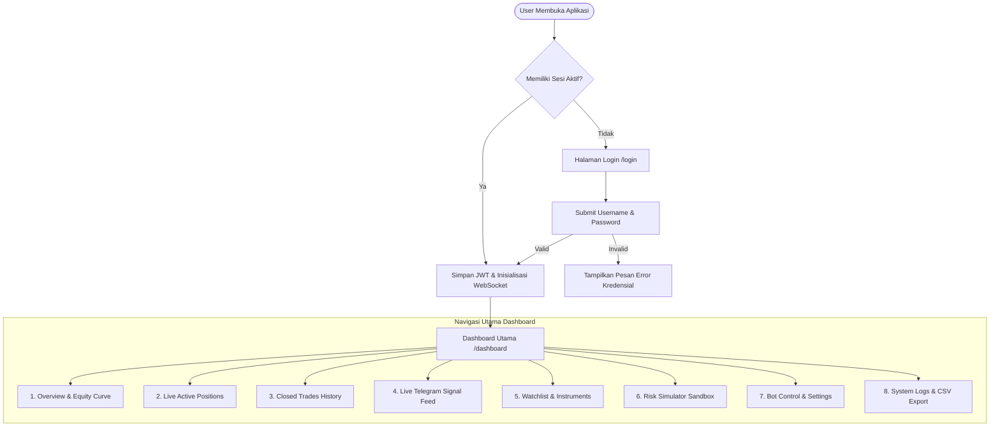
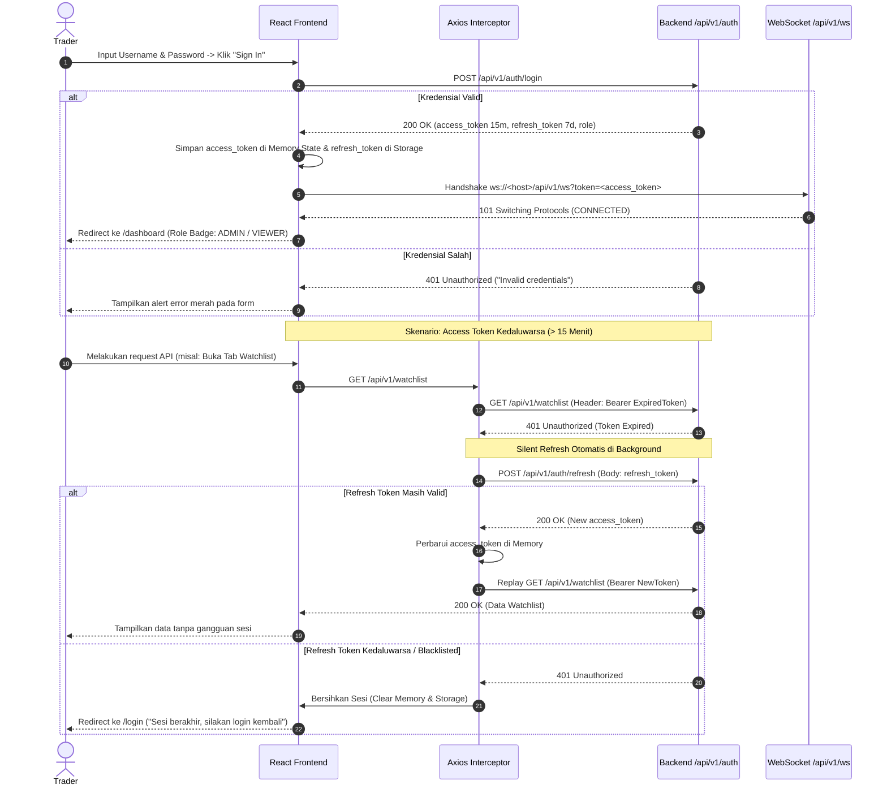
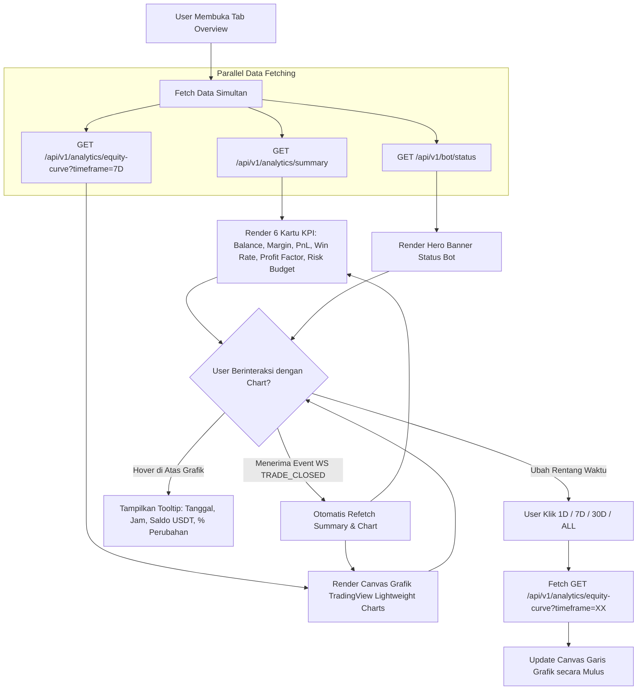
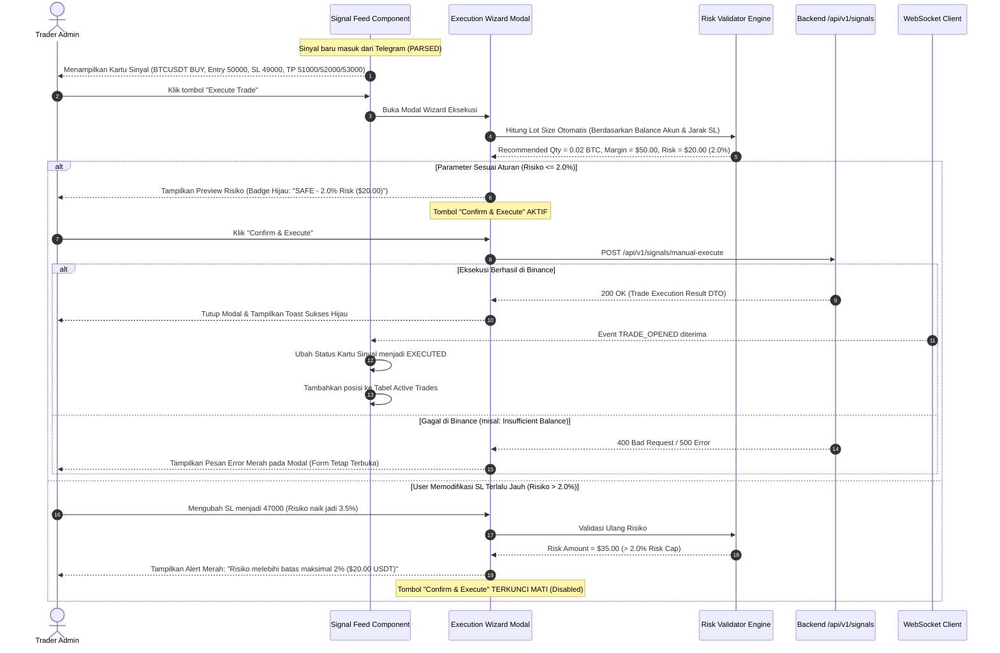
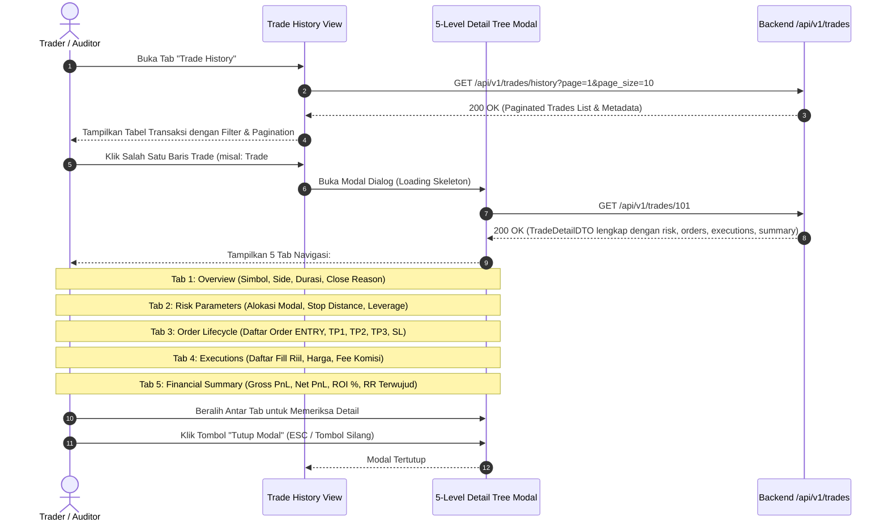
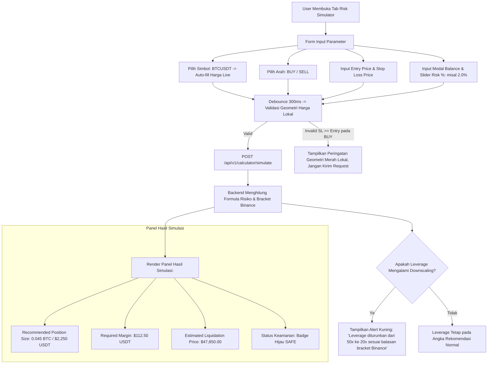
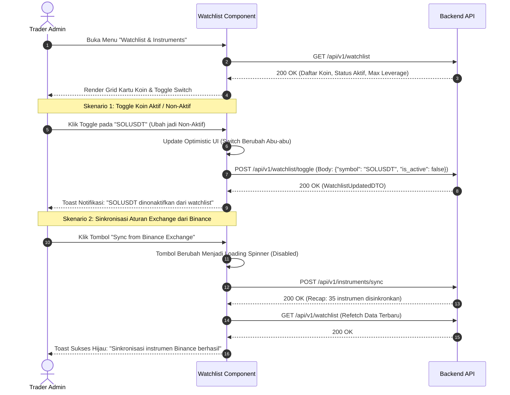
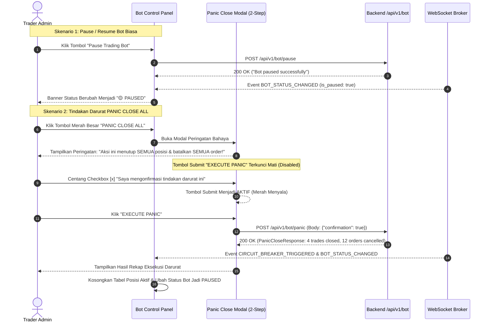
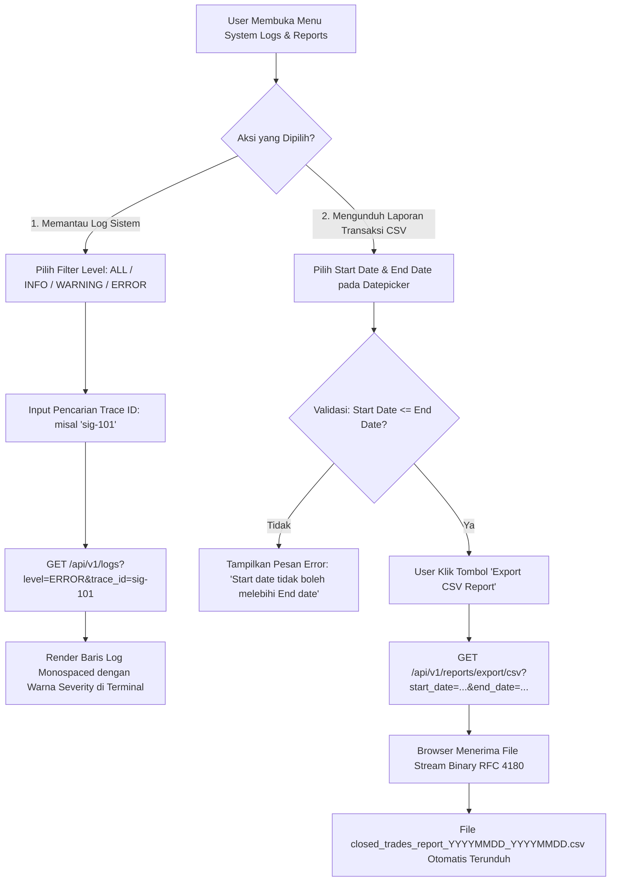
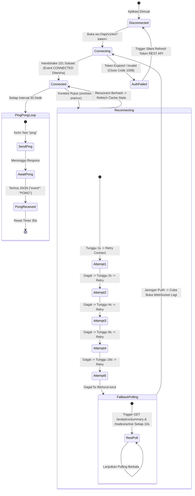

# User Flow & Interaction Specification (USER_FLOW.md)
**Project**: SMC CryptoBot – Professional Binance Futures Trading Dashboard  
**Document**: Frontend User Flow & Journey Maps (`USER_FLOW.md`)  
**Version**: 2.0.0  
**Status**: Approved / In Development  
**Target Platform**: Web Frontend (Next.js 14 / Vite React + TypeScript)  
**Related Documents**: [docs/frontend/PRD.md](file:///home/rodex/Documents/cell/projects/crypto-bot/docs/frontend/PRD.md) | [docs/frontend/REQUIREMENTS.md](file:///home/rodex/Documents/cell/projects/crypto-bot/docs/frontend/REQUIREMENTS.md) | [docs/frontend/FEATURES.md](file:///home/rodex/Documents/cell/projects/crypto-bot/docs/frontend/FEATURES.md)  

---

## 1. Peta Navigasi & Arsitektur Alur Pengguna



---

## 2. Rincian Alur Pengguna (User Flows)

---

### 🔐 FLOW-01: Autentikasi, Inisialisasi Sesi & Silent Token Refresh

Diagram berikut menggambarkan alur login pengguna, inisialisasi koneksi WebSocket real-time, serta mekanisme *silent token refresh* otomatis saat access token kedaluwarsa tanpa memutus aktivitas pengguna.



#### Langkah-Langkah Keputusan & State:
1. **Input Kredensial**: Pengguna memasukkan username dan password. Form memvalidasi bahwa kedua field tidak boleh kosong sebelum tombol aktif.
2. **Handshake WebSocket**: Begitu token access diperoleh, client langsung membuka koneksi stream `/api/v1/ws?token=...` untuk menerima event real-time.
3. **Queue Locking pada Interceptor**: Jika ada 5 request REST simultan yang menerima 401, hanya request pertama yang memanggil `/auth/refresh`, sementara 4 lainnya menunggu di antrian (*Promise queue*) untuk di-replay bersamaan setelah token baru tersedia.

---

### 📊 FLOW-02: Monitoring Harian & Inspeksi Kurva Pertumbuhan Ekuitas

Alur pemantauan kesehatan finansial portofolio, saldo USDT, margin terpakai, dan pemilihan rentang waktu kurva ekuitas.



#### Detail Interaksi:
* **Tooltip Data Multi-Dimensi**: Saat kursor digeser di atas kurva ekuitas, titik data menampilkan saldo ekuitas pada jam tersebut dan nominal perubahan PnL dibandingkan titik sebelumnya.
* **Auto-Sync**: Saat ada trade yang selesai ditutup di exchange, event WebSocket `TRADE_CLOSED` memicu invalidasi query cache TanStack Query sehingga angka PnL harian dan total balance bertambah/berkurang seketika.

---

### ⚡ FLOW-03: Ingesti Sinyal Telegram & Eksekusi Manual 1-Klik

Alur dari penerimaan sinyal Telegram hingga pembukaan posisi Binance Futures dengan validasi proteksi risiko (*Hard 2% Risk Cap*).



#### Validasi Geometri Harga di Level Frontend:
* **Posisi BUY (LONG)**: Wajib $\text{Stop Loss} < \text{Entry Price} < \text{TP1} < \text{TP2} < \text{TP3}$.
* **Posisi SELL (SHORT)**: Wajib $\text{Stop Loss} > \text{Entry Price} > \text{TP1} > \text{TP2} > \text{TP3}$.
* Jika terjadi pelanggaran geometri harga (misal: SL di atas Entry pada posisi BUY), form menampilkan pesan error instan dan tombol submit dikunci.

---

### 🛡️ FLOW-04: Pemantauan Posisi Aktif, TP Scaling & Manual Close

Alur pemantauan posisi live, animasi progres Take Profit bertingkat, dan penutupan pasar manual darurat.

```mermaid
flowchart TD
    A[Tabel Active Trades] --> B{Pembaruan Event dari WebSocket?}
    
    B -- Event TP_HIT (TP1) --> C1[Animasi Milestone TP1 Berubah Hijau]
    C1 --> C2[Badge SL Berubah dari INITIAL_SL ke BEP_SL]
    C2 --> C3[Volume Remaining Qty Berkurang 50%]
    C3 --> C4[Toast Notifikasi Hijau: TP1 Hit + Realized Profit]

    B -- Event TP_HIT (TP2) --> D1[Animasi Milestone TP2 Berubah Hijau]
    D1 --> D2[Badge SL Berubah menjadi TRAILING_SL Level TP1]
    D2 --> D3[Volume Remaining Qty Berkurang 30%]
    D3 --> D4[Toast Notifikasi Hijau: TP2 Hit + Trailing SL Active]

    B -- Event SL_HIT / TP3_HIT --> E1[Event TRADE_CLOSED Diterima]
    E1 --> E2[Hapus Baris Posisi dari Tabel Active Trades]
    E2 --> E3[Pindahkan Data ke Tabel Closed Trades History]
    E3 --> E4[Toast Rekap Hasil: WIN / LOSS]

    B -- User Ingin Tutup Posisi Sendiri --> F[User Klik Tombol Merah 'Close Position']
    F --> G[Buka Modal Konfirmasi: 'Tutup 0.02 BTC pada Harga Pasar?']
    G --> H{User Konfirmasi?}
    H -- Batal --> I[Tutup Modal, Posisi Tetap Berjalan]
    H -- Ya, Tutup --> J[POST /api/v1/trades/{id}/close]
    J --> K[Posisi Ditutup di Binance & Pindah ke Riwayat]
```

---

### 🔍 FLOW-05: Riwayat Closed Trades & Modal Inspeksi 5-Level

Alur penelusuran riwayat transaksi masa lalu dan audit mendalam riwayat eksekusi order exchange.



---

### 🧮 FLOW-06: Sandbox Simulasi Risiko & Dynamic Leverage Testing

Alur kalkulator simulasi risiko untuk menguji skenario ukuran posisi dan mendeteksi penyesuaian leverage exchange (*downscaling*) sebelum trading riil.



---

### 👁️ FLOW-07: Manajemen Watchlist & Sinkronisasi Instrumen Binance

Alur pengaktifan instrumen perdagangan kripto dan sinkronisasi aturan exchange 1-klik.



---

### 🚨 FLOW-08: Operasional Bot, Pause/Resume & 2-Step Panic Close

Alur komando status operasional bot trading dan tindakan darurat penutupan seluruh posisi pasar saat terjadi *flash crash*.



---

### 📋 FLOW-09: Penelusuran Audit Log & Ekspor Laporan CSV

Alur pemantauan log internal berbasis severity dan pengunduhan laporan riwayat transaksi berformat CSV.



---

### 🌐 FLOW-10: Siklus Hidup WebSocket, Heartbeat & Auto-Reconnect

Alur ketahanan konektivitas streaming dua arah dari koneksi awal, *ping/pong keepalive*, hingga *exponential backoff reconnect* dan *REST polling fallback*.



---

## 3. Matriks Error & Recovery Actions

| Kondisi Error / Interupsi | Deteksi oleh Frontend | Tindakan Pemulihan Otomatis (*Recovery Action*) | Umpan Balik Visual ke Pengguna |
| :--- | :--- | :--- | :--- |
| **Token Access Expired** | HTTP 401 dari endpoint REST | Axios interceptor memanggil `/auth/refresh` secara transparan lalu me-replay request. | Tidak ada gangguan (Seamless). |
| **Refresh Token Expired** | HTTP 401 dari endpoint `/auth/refresh` | Hapus sesi dari memory state dan redirect ke `/login`. | Toast: *"Sesi Anda telah kedaluwarsa. Silakan login kembali."* |
| **Koneksi WebSocket Putus** | Event `onclose` pada client WebSocket | Jalankan algoritma *Exponential Backoff Reconnect* (1s..30s). | Badge navbar kuning berkedip: `🟡 Reconnecting in 3s...`. |
| **Server WebSocket Offline** | Gagal rekoneksi 5 kali berturut-turut | Aktifkan *REST Polling Fallback Mode* setiap 10 detik. | Badge navbar merah: `🔴 Offline (Polling Active)`. |
| **Eksekusi Sinyal Gagal (Exchange Margin Error)** | HTTP 400 dari `/signals/manual-execute` | Tangkap pesan error dari Binance, pertahankan form modal terbuka agar user bisa menyesuaikan parameter. | Alert box merah pada modal wizard dengan rincian error Binance. |
| **Tab Browser Masuk Mode Tidur (*Sleep*)** | Event `visibilitychange` (tab kembali aktif) | Evaluasi koneksi WebSocket; jika stale, paksa reconnect dan trigger refetch query cache. | Indikator loading halus sejenak saat data diperbarui. |
