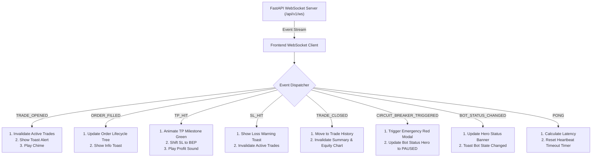

# Task 03: Duplex Real-Time WebSocket Client & Event Broker Engine

## 1. Deskripsi Task
Membangun klien WebSocket berdaya tahan tinggi (*Resilient Real-Time WebSocket Client*) yang mengelola siklus hidup koneksi duplex ke endpoint backend `/api/v1/ws?token=<JWT>`, mengorkestrasi protokol *heartbeat keep-alive*, melakukan rekoneksi otomatis berbasis *exponential backoff*, mendistribusikan event real-time ke TanStack Query cache dan Zustand stores, serta mengaktifkan mode *REST Polling Fallback* jika koneksi terputus:
1. Membangun **Klien WebSocket Reaktif (`src/services/websocketService.ts` & `src/hooks/useWebSocket.ts`)** yang otomatis terhubung saat user terotentikasi dan terputus saat logout.
2. Mengimplementasikan **Heartbeat Ping/Pong Protocol**: Mengirimkan pesan keep-alive text `"ping"` setiap 30 detik dan mendeteksi respons `{"event": "PONG", "data": {"status": "alive"}}`.
3. Mengimplementasikan **Algoritma Auto-Reconnect Exponential Backoff**: Delay rekoneksi berjenjang (1s, 2s, 4s, 8s, 16s, maksimal 30s) dengan jitter acak untuk mencegah thundering herd.
4. Membangun **Event Dispatcher & Cache Invalidator**: Menerima event trading dan secara cerdas meng-invaliasi query cache TanStack Query terkait:
   * `TRADE_OPENED` -> Invalidate `['trades', 'active']`, `['analytics', 'summary']` + Toast Notifikasi.
   * `ORDER_FILLED` -> Invalidate `['trades', 'active']`, `['trades', tradeId]` + Toast Notifikasi.
   * `TP_HIT` -> Invalidate `['trades', 'active']`, `['analytics', 'summary']` + Audio Alert Chime.
   * `SL_HIT` -> Invalidate `['trades', 'active']`, `['analytics', 'summary']` + Toast Peringatan.
   * `TRADE_CLOSED` -> Invalidate `['trades', 'active']`, `['trades', 'history']`, `['analytics', 'summary']`, `['analytics', 'equity-curve']` + Toast Rekap PnL.
   * `CIRCUIT_BREAKER_TRIGGERED` -> Invalidate `['bot', 'status']`, `['analytics', 'summary']` + Tampilkan Modal/Banner Darurat.
   * `BOT_STATUS_CHANGED` -> Invalidate `['bot', 'status']` + Update Banner Hero.
   * `TICKER_UPDATE` -> Update live mark price di runtime memory store tanpa re-render berlebihan (throttling 100ms).
5. Membangun komponen **`ConnectionStatusBadge`** di top navbar (`🟢 Connected`, `🟡 Reconnecting...`, `🔴 Offline`).
6. Membangun sistem **Audio Alert Chime** (Web Audio API) untuk notifikasi profit TP hit dan eksekusi order.

---

## 2. File yang Akan Dibuat / Dimodifikasi

### Service & Client:
* `frontend/src/services/websocketService.ts`: Core WebSocket manager dengan listener register, reconnect backoff, ping interval, dan connection state machine.
* `frontend/src/hooks/useWebSocket.ts`: React custom hook pembungkus WebSocket service dengan integrasi lifecycle komponen.
* `frontend/src/stores/wsStore.ts`: Zustand store untuk memantau status koneksi (`status: 'CONNECTED' | 'CONNECTING' | 'RECONNECTING' | 'DISCONNECTED'`, `latencyMs`, `lastPingTimestamp`).
* `frontend/src/types/websocket.ts`: TypeScript definitions untuk seluruh jenis envelope WebSocket (`WebSocketEventEnvelope<T>`, event payload DTOs).

### Notifikasi & Audio:
* `frontend/src/utils/sound.ts`: Utilitas pemutar suara notifikasi (*profit chime*, *warning tone*) menggunakan Web Audio API sintesis.
* `frontend/src/components/layout/ConnectionStatusBadge.tsx`: Badge visual status koneksi live di navbar dengan tooltip detail latensi.

### Unit & Integration Tests:
* `frontend/tests/services/websocket_service.test.ts`: Mock testing koneksi WS, handshake JWT, heartbeat ping/pong, dan reconnection loop.
* `frontend/tests/hooks/use_websocket.test.ts`: Pengujian dispatching event ke TanStack Query client.

---

## 3. Rincian Event WebSocket & Reaksi UI

---

## 4. Edge Cases & Resilience Strategy

### 4.1 Token Kedaluwarsa saat Handshake WebSocket
* Jika backend menolak koneksi WebSocket dengan error close code `1008 Policy Violation` (JWT Expired):
  1. WebSocket Client menangkap kode 1008.
  2. Memicu fungsi `useAuthStore.getState().refreshToken()`.
  3. Setelah token baru diperoleh, WebSocket Client otomatis membuka koneksi ulang dengan URL baru `ws://.../api/v1/ws?token=<NewToken>`.

### 4.2 Tab Browser Mengalami Sleep / Throttling
* Saat user beralih tab dan kembali setelah beberapa menit, browser mungkin menahan event loop:
  * Begitu window event `visibilitychange` aktif (`document.visibilityState === 'visible'`), client memverifikasi kesegaran koneksi (`readyState === WebSocket.OPEN`). Jika stale, lakukan reconnect instan dan refetch seluruh active queries.

### 4.3 REST Polling Fallback Mode
* Jika setelah 5 kali berturut-turut koneksi WebSocket gagal terhubung kembali:
  * Aktifkan fallback background polling interval 10 detik via TanStack Query (`refetchInterval: 10000`).
  * Tampilkan badge navbar: `🔴 Offline (Polling Active)`.
  * Begitu koneksi WebSocket pulih, otomatis hentikan polling REST.

---

## 5. Kriteria Keberhasilan (Acceptance Criteria)
1. WebSocket terhubung otomatis saat user login dan disconnect saat logout.
2. Ping dikirimkan secara presisi setiap 30 detik dan dijawab dengan event `PONG`.
3. Event `TRADE_OPENED`, `TP_HIT`, `TRADE_CLOSED`, dan `BOT_STATUS_CHANGED` memperbarui data UI dan query cache dalam waktu $< 30\text{ms}$ tanpa me-reload halaman.
4. Simulasi putus jaringan memicu reconnect otomatis dengan exponential backoff dan transisi badge status warna (`🟡` -> `🟢`).
5. Seluruh unit test di `frontend/tests/services/websocket_service.test.ts` dan `frontend/tests/hooks/use_websocket.test.ts` lulus 100%.
