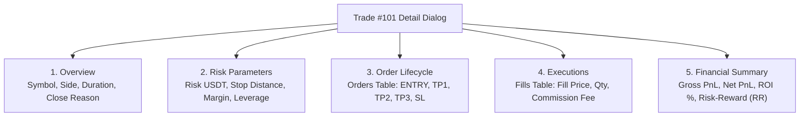

# Task 06: Closed Trade History & Multi-Level Detail Drilldown Modal

## 1. Deskripsi Task
Membangun modul riwayat perdagangan tertutup (*Closed Trades History*) yang menyajikan rekam jejak transaksi secara terpaginasi, dilengkapi filter multi-kriteria, serta modal dialog inspeksi mendalam hierarki 5-level (Overview, Risk Parameters, Order Lifecycle, Executions, dan Financial Summary):
1. Membangun komponen **Paginated Trade History Table (`src/features/trades/components/TradeHistoryTable.tsx`)** yang mengonsumsi endpoint `GET /api/v1/trades/history`:
   * Kontrol server-side pagination (halaman aktif, total records, tombol Previous/Next, dropdown *Items per page: 10, 20, 50*).
   * Filter Bar interaktif: Filter simbol koin, filter hasil (`ALL`, `WIN`, `LOSS`, `BREAKEVEN`, `CANCELLED`), dan rentang tanggal transaksi.
   * Kolom tabel: ID Trade, Symbol, Side (`BUY`/`SELL`), Entry Price, Exit Price, Position Size, Net PnL ($) & ROI (%), Badge Hasil (`WIN` hijau, `LOSS` merah, `BREAKEVEN` slate), Close Reason (`TP3_HIT`, `SL_HIT`, dll), dan Timestamp penutupan.
2. Membangun komponen **5-Level Trade Detail Modal (`src/features/trades/components/TradeDetailModal.tsx`)** yang mengonsumsi endpoint `GET /api/v1/trades/{id}` saat baris riwayat diklik:
   * **Tab 1: Overview**: Rincian umum transaksi, waktu buka/tutup, total durasi aktif (jam:menit:detik), leverage, dan alasan penutupan (*Close Reason*).
   * **Tab 2: Risk Parameters**: Parameter alokasi risiko modal (`risk_amount_usdt`), jarak toleransi stop loss (`stop_distance`), margin terpakai (`required_margin`), dan verifikasi limit leverage exchange.
   * **Tab 3: Order Lifecycle**: Daftar seluruh order exchange terkait (`ENTRY`, `TP1`, `TP2`, `TP3`, `SL`) lengkap dengan status (`FILLED`, `CANCELED`), tipe order (`LIMIT`, `MARKET`, `STOP_MARKET`), harga, volume, dan exchange order ID.
   * **Tab 4: Fill Executions**: Riwayat fills eksekusi parsial/penuh, harga fill aktual, volume koin terisi, biaya komisi exchange (`commission`), dan realized PnL per eksekusi.
   * **Tab 5: Financial Summary**: Rekapitulasi finansial komprehensif: Gross PnL, Total Komisi Exchange, Net Realized PnL, ROI %, dan rasio Risk-to-Reward (RR) yang terwujud.
3. Menyiapkan state handling untuk trade berstatus `CANCELLED` (misal: order entry dibatalkan sebelum terisi) tanpa menyebabkan bug pembagian nol (*division by zero*).

---

## 2. File yang Akan Dibuat / Dimodifikasi

### API Endpoints & Types:
* `frontend/src/api/endpoints/trades.ts`: Fungsi API `getTradeHistoryApi(params: TradeHistoryQueryParams)` dan `getTradeDetailApi(id: number)`.
* `frontend/src/types/trades.ts`: TypeScript interfaces (`TradeHistoryItemDTO`, `PaginatedTradeHistoryDTO`, `TradeDetailDTO`, `TradeRiskDTO`, `OrderItemDTO`, `ExecutionItemDTO`, `TradeSummaryDTO`).

### Komponen UI Riwayat & Detail:
* `frontend/src/features/trades/TradeHistoryPage.tsx`: Halaman utama riwayat closed trades.
* `frontend/src/features/trades/components/TradeHistoryTable.tsx`: Tabel riwayat dengan header filter dan pagination bar.
* `frontend/src/features/trades/components/TradeHistoryFilterBar.tsx`: Baris filter simbol, dropdown result, dan datepicker.
* `frontend/src/features/trades/components/TradeDetailModal.tsx`: Modal dialog 5-level dengan tab navigasi berbasis Radix Tabs.
* `frontend/src/features/trades/components/tabs/OverviewTab.tsx`: Rincian Level 1.
* `frontend/src/features/trades/components/tabs/RiskParametersTab.tsx`: Rincian Level 2.
* `frontend/src/features/trades/components/tabs/OrderLifecycleTab.tsx`: Rincian Level 3.
* `frontend/src/features/trades/components/tabs/ExecutionsTab.tsx`: Rincian Level 4.
* `frontend/src/features/trades/components/tabs/FinancialSummaryTab.tsx`: Rincian Level 5.

### Unit & Integration Tests:
* `frontend/tests/features/trade_history_table.test.tsx`: Pengujian pagination, filter query parameters, dan render badge status.
* `frontend/tests/features/trade_detail_modal.test.tsx`: Pengujian rendering 5 tab modal dan kalkulasi summary ratio RR.

---

## 3. Rincian Endpoint API yang Diintegrasikan

### 1. `GET /api/v1/trades/history`
* **Query Parameters**:
  * `page` (integer, default: 1)
  * `page_size` (integer, default: 20)
  * `symbol` (string, opsional)
  * `result` (`WIN` | `LOSS` | `BREAKEVEN` | `CANCELLED`, opsional)
  * `start_date` (string format `YYYY-MM-DD`, opsional)
  * `end_date` (string format `YYYY-MM-DD`, opsional)
* **Response (200 OK)**:
  ```json
  {
    "total": 120,
    "page": 1,
    "page_size": 20,
    "items": [
      {
        "id": 45,
        "symbol": "ETHUSDT",
        "side": "BUY",
        "entry_price": 3000.00,
        "exit_price": 3150.00,
        "position_size": 0.50,
        "net_pnl": 75.00,
        "roi_percent": 5.00,
        "result": "WIN",
        "close_reason": "TP3_HIT",
        "opened_at": "2026-08-20T10:00:00Z",
        "closed_at": "2026-08-20T14:30:00Z"
      }
    ]
  }
  ```

### 2. `GET /api/v1/trades/{id}`
* **Path Parameter**: `id` (integer, Trade ID).
* **Response (200 OK)**: `TradeDetailDTO` (Berisi object `risk_details`, array `orders`, array `executions`, array `events`, dan object `summary`).
* **Response (404 Not Found)**: `{"detail": "Trade not found."}`.

---

## 4. Rincian Struktur Modal 5-Level



---

## 5. Edge Cases & Error Handling
1. **Trade Dibatalkan Sebelum Terisi (Cancelled Trade)**: Tab Executions dan Financial Summary menampilkan badge `CANCELLED - NO FILLS RECORDED` secara bersih tanpa menyebabkan error pembagian nol saat menghitung ROI/RR.
2. **Navigasi Pagination di Luar Jangkauan**: Jika filter baru menghasilkan total halaman lebih kecil dari halaman aktif saat ini $\rightarrow$ State pagination otomatis di-reset ke halaman 1.
3. **Trade ID Tidak Ditemukan**: Modal menampilkan pesan error: *"Trade tidak ditemukan atau telah dihapus"* disertai tombol *Tutup*.

---

## 6. Kriteria Keberhasilan (Acceptance Criteria)
1. Tabel Trade History menyajikan data tertutup lengkap dengan badge WIN/LOSS/BREAKEVEN dan format mata uang monospaced.
2. Filter bar (simbol, result, rentang tanggal) dan pagination bekerja presisi memanggil API backend dengan query parameter yang tepat.
3. Mengklik baris transaksi membuka modal detail 5 tab yang menampilkan seluruh riwayat order, fills eksekusi, parameter risiko, dan rekap finansial.
4. Seluruh unit test di `frontend/tests/features/trade_history_table.test.tsx` dan `frontend/tests/features/trade_detail_modal.test.tsx` lulus 100%.
