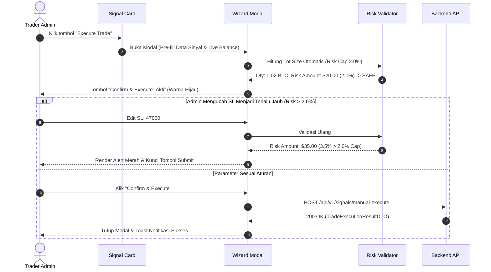

# Task 07: Live Telegram Signal Feed & 1-Click Execution Wizard Modal

## 1. Deskripsi Task
Membangun modul konsumsi sinyal trading real-time dari channel Telegram (*Live Signal Feed*) dan modal wizard eksekusi manual berkecepatan tinggi (*1-Click Execution Wizard*) yang memvalidasi kepatuhan batas risiko maksimal 2% modal (*Hard 2% Risk Cap*) dan geometri harga sebelum transaksi dikirim ke exchange Binance Futures:
1. Membangun komponen **Signal Feed List (`src/features/signals/components/SignalFeedList.tsx`)** yang mengonsumsi endpoint `GET /api/v1/signals`:
   * Filter feed berdasarkan status sinyal: `ALL`, `PENDING` (Parsed/Ready to Execute), `PROCESSED` (Executed), `REJECTED`, `EXPIRED`.
   * Komponen **Signal Card (`src/features/signals/components/SignalCard.tsx`)**: Menampilkan nama provider/channel, simbol koin, badge arah (`BUY` hijau / `SELL` merah), harga entry, stop loss, target TP bertingkat, skor keyakinan (*confidence score* misal `95%`), trace ID (`sig-a1b2c3d4`), dan timestamp diterima.
   * Tombol aksi *Execute Trade* pada kartu sinyal berstatus `PENDING` (hanya aktif untuk Admin).
2. Membangun komponen **1-Click Execution Wizard Modal (`src/features/signals/components/SignalExecutionWizardModal.tsx`)**:
   * Form interaktif yang terisi otomatis (*pre-filled*) dengan parameter sinyal yang dipilih.
   * Kalkulasi ukuran lot otomatis (*Auto Position Sizing*) berdasarkan saldo live akun dan jarak stop loss.
   * **Proteksi Risiko Mutlak (Hard 2.0% Risk Cap)**:
     * Menghitung nilai risiko: $\text{Risk \$} = \text{Position Size} \times |\text{Entry} - \text{SL}|$.
     * Jika $\text{Risk \$} \le 2.0\%$ dari total saldo ekuitas: Tombol *Confirm & Execute* aktif dengan badge hijau: `SAFE (Risk <= 2.0%)`.
     * Jika pengguna mengubah SL sehingga $\text{Risk \$} > 2.0\%$: Tombol *Confirm & Execute* otomatis terkunci mati (disabled) dengan alert merah mencolok: *"Pelanggaran Risiko: Alokasi kerugian ($XX.XX) melebihi batas toleransi 2.0% ($20.00)"*.
   * **Validasi Geometri Harga Lokal**:
     * Posisi BUY: Memastikan $\text{Stop Loss} < \text{Entry Price} < \text{TP1} < \text{TP2} < \text{TP3}$.
     * Posisi SELL: Memastikan $\text{Stop Loss} > \text{Entry Price} > \text{TP1} > \text{TP2} > \text{TP3}$.
3. Mengirimkan payload eksekusi ke endpoint `POST /api/v1/signals/manual-execute` (`ManualSignalExecutionRequest`):
   * Menampilkan loading state pada tombol submit.
   * Menutup modal seketika setelah respons sukses (`TradeExecutionResultDTO`), memperbarui status kartu sinyal menjadi `PROCESSED`, dan menampilkan toast notifikasi sukses lengkap dengan order ID Binance.
   * Memastikan seluruh alur eksekusi selesai dalam waktu **$< 2\text{ detik}$**.

---

## 2. File yang Akan Dibuat / Dimodifikasi

### API Endpoints & Types:
* `frontend/src/api/endpoints/signals.ts`: Fungsi API `getSignalsFeedApi(params: SignalQueryParams)`, `manualExecuteSignalApi(payload: ManualSignalExecutionRequestDTO)`.
* `frontend/src/types/signals.ts`: TypeScript interfaces (`SignalItemDTO`, `PaginatedSignalListDTO`, `ManualSignalExecutionRequestDTO`, `TradeExecutionResultDTO`).

### Komponen UI Sinyal:
* `frontend/src/features/signals/SignalsFeedPage.tsx`: Halaman utama live signal feed.
* `frontend/src/features/signals/components/SignalFeedList.tsx`: Daftar kartu sinyal dengan filter status dan pagination.
* `frontend/src/features/signals/components/SignalCard.tsx`: Kartu sinyal dengan badge status, indikator confidence, dan tombol aksi.
* `frontend/src/features/signals/components/SignalExecutionWizardModal.tsx`: Modal wizard eksekusi 1-klik dengan validasi risiko dan geometri harga.
* `frontend/src/features/signals/components/RiskCapIndicator.tsx`: Visual badge & meter indikator persentase risiko modal.

### Unit & Integration Tests:
* `frontend/tests/features/signal_feed.test.tsx`: Pengujian filter sinyal feed dan render badge confidence score.
* `frontend/tests/features/execution_wizard.test.tsx`: Pengujian validasi Hard 2% Risk Cap, validasi geometri harga (BUY & SELL), dan submisi API.

---

## 3. Rincian Endpoint API yang Diintegrasikan

### 1. `GET /api/v1/signals`
* **Query Parameters**:
  * `page` (integer, default: 1)
  * `page_size` (integer, default: 20)
  * `status` (`PENDING` | `PROCESSED` | `REJECTED` | `EXPIRED`, opsional)
* **Response (200 OK)**:
  ```json
  {
    "total": 50,
    "page": 1,
    "page_size": 20,
    "items": [
      {
        "id": 1,
        "trace_id": "sig-a1b2c3d4",
        "raw_text": "BUY BTCUSDT Entry: 50000 SL: 49000 TP: 51000/52000/53000",
        "symbol": "BTCUSDT",
        "side": "BUY",
        "entry_price": 50000.00,
        "sl_price": 49000.00,
        "tp_targets": [51000.00, 52000.00, 53000.00],
        "confidence_score": 0.95,
        "status": "PENDING",
        "created_at": "2026-08-24T14:00:00Z"
      }
    ]
  }
  ```

### 2. `POST /api/v1/signals/manual-execute`
* **Request Body** (`ManualSignalExecutionRequest`):
  ```json
  {
    "symbol": "BTCUSDT",
    "side": "BUY",
    "entry_price": 50000.00,
    "sl_price": 49000.00,
    "tp_targets": [51000.00, 52000.00, 53000.00],
    "leverage": 20,
    "auto_tp_sl": true
  }
  ```
* **Response (200 OK)**:
  ```json
  {
    "is_success": true,
    "trade_id": 88,
    "symbol": "BTCUSDT",
    "side": "BUY",
    "position_size": 0.02,
    "leverage": 20,
    "entry_order_id": "12345678",
    "sl_order_id": "12345679",
    "tp_order_ids": ["12345680", "12345681", "12345682"]
  }
  ```
* **Response (400 Bad Request)**: `{"detail": "Validation or risk calculation failure: Risk exceeds 2.0% cap."}`.

---

## 4. Rincian Alur Interaksi & Validasi Risiko



---

## 5. Edge Cases & Error Handling
1. **Simbol Sinyal Tidak Aktif di Watchlist**: Backend merespons HTTP 400 (*"Symbol is not active in watchlist"*). Frontend menampilkan dialog: *"Simbol ini dinonaktifkan di Watchlist. Aktifkan sekarang di menu Watchlist?"*
2. **Posisi Aktif Sudah Ada untuk Simbol Tersebut**: Backend mengembalikan HTTP 409 Conflict. Frontend menampilkan toast peringatan: *"Sudah ada posisi aktif untuk pasangan ini. Duplikasi posisi dicegah."*
3. **Sinyal Expired / Kedaluwarsa**: Sinyal dengan status `EXPIRED` ditampilkan dengan watermark abu-abu dan tombol eksekusi terkunci.

---

## 6. Kriteria Keberhasilan (Acceptance Criteria)
1. Feed menampilkan seluruh kartu sinyal Telegram dengan badge status (`PENDING`, `PROCESSED`, `REJECTED`, `EXPIRED`) dan skor confidence.
2. Modal wizard eksekusi terisi otomatis dengan parameter entry, SL, TP, dan kalkulasi lot size.
3. Tombol *Confirm & Execute* otomatis terkunci jika risiko melebihi batas 2.0% modal atau jika terjadi pelanggaran geometri harga.
4. Submisi berhasil memicu request ke `/signals/manual-execute`, memperbarui status sinyal menjadi `PROCESSED`, dan menutup modal dalam $< 2\text{ detik}$.
5. Seluruh unit test di `frontend/tests/features/signal_feed.test.tsx` dan `frontend/tests/features/execution_wizard.test.tsx` lulus 100%.
