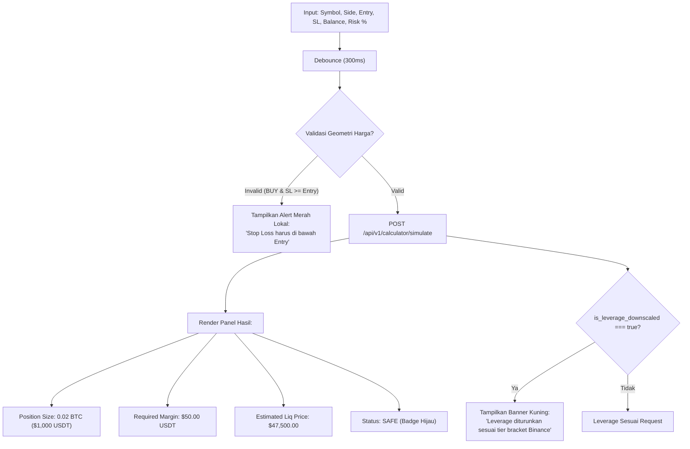

# Task 10: Risk Simulator & Dynamic Leverage Sandbox Calculator

## 1. Deskripsi Task
Membangun modul kalkulator simulasi risiko interaktif (*Risk Simulator Sandbox*) yang memungkinkan trader menguji berbagai skenario ukuran posisi, memverifikasi kepatuhan batas risiko 2% modal (*Strict 2.0% Loss Cap*), memprediksi estimasi harga likuidasi, serta mendeteksi penyesuaian leverage otomatis (*dynamic leverage downscaling*) akibat batasan tier notional bracket exchange Binance Futures:
1. Membangun komponen **Interactive Simulation Form (`src/features/calculator/components/RiskSimulatorForm.tsx`)**:
   * Pilihan Simbol koin (Dropdown dengan live search, misal: `BTCUSDT`, `ETHUSDT`).
   * Tombol Toggle Arah Posisi (`BUY / LONG` hijau vs `SELL / SHORT` merah).
   * Input Harga Entry & Stop Loss (dilengkapi tombol cepat *Use Current Market Price*).
   * Input Saldo Akun (*Wallet Balance USDT*), terisi otomatis dari saldo live dashboard saat pertama kali dibuka.
   * Input Persentase Risiko (*Risk %*): Slider interaktif dan number input (rentang $0.1\% - 5.0\%$, default $2.0\%$).
   * Pilihan Leverage yang Diinginkan (*Requested Leverage*, misal: `20x`, `50x`).
2. Mengimplementasikan **Debounced API Dispatching (300ms)** ke endpoint `POST /api/v1/calculator/simulate`:
   * Validasi geometri harga lokal sebelum pengiriman:
     * Posisi BUY: Wajib $\text{Stop Loss} < \text{Entry Price}$.
     * Posisi SELL: Wajib $\text{Stop Loss} > \text{Entry Price}$.
   * Jika tidak valid: Tampilkan badge peringatan geometri lokal tanpa mengirimkan request berlebih ke server.
3. Membangun komponen **Simulation Results Panel (`src/features/calculator/components/SimulationResultCard.tsx`)** yang mengonsumsi respon `RiskSimulationResponse`:
   * **Recommended Position Size**: Ukuran volume koin (misal: `0.02 BTC`) dan nilai notional USDT (`$1,000.00 USDT`).
   * **Required Margin**: Modal jaminan USDT yang dibutuhkan (`$50.00 USDT`).
   * **Effective Leverage & Downscaling Alert**: Menampilkan tingkat leverage efektif. Jika terjadi penyesuaian otomatis akibat batasan tier notional bracket exchange (`is_leverage_downscaled === true`), tampilkan banner alert kuning: *"Leverage disesuaikan dari 50x ke 20x untuk mematuhi batas maksimal notional bracket Binance."*
   * **Estimated Liquidation Price**: Perkiraan harga likuidasi posisi dengan visual perbandingan terhadap titik Stop Loss.
   * **Projected Loss at SL**: Nominal proyeksi kerugian jika menyentuh SL.
   * **Safety Status Badge**:
     * Badge Hijau: `SAFE (Margin <= Wallet Balance & Loss <= 2%)`
     * Badge Merah: `UNSAFE / INSUFFICIENT MARGIN` (jika margin melebihi saldo akun).

---

## 2. File yang Akan Dibuat / Dimodifikasi

### API Endpoints & Types:
* `frontend/src/api/endpoints/calculator.ts`: Fungsi API `simulateRiskApi(payload: RiskSimulationRequestDTO)`.
* `frontend/src/types/calculator.ts`: TypeScript interfaces (`RiskSimulationRequestDTO`, `RiskSimulationResponseDTO`).

### Komponen UI Kalkulator:
* `frontend/src/features/calculator/RiskSimulatorPage.tsx`: Halaman utama sandbox simulator risiko.
* `frontend/src/features/calculator/components/RiskSimulatorForm.tsx`: Form input interaktif dengan debounce dan slider persentase risiko.
* `frontend/src/features/calculator/components/SimulationResultCard.tsx`: Panel output kalkulasi risiko, notional, dan margin.
* `frontend/src/features/calculator/components/LiquidationVisualizer.tsx`: Diagram visual perbandingan harga Entry, Stop Loss, dan Harga Likuidasi.

### Custom Hooks:
* `frontend/src/hooks/useRiskSimulation.ts`: Custom hook pembungkus query simulasi dengan debounced state.

### Unit & Integration Tests:
* `frontend/tests/features/risk_simulator.test.tsx`: Pengujian kalkulasi formula lot size, validasi geometri harga, deteksi leverage downscaled, dan render badge keamanan modal.

---

## 3. Rincian Endpoint API yang Diintegrasikan

### `POST /api/v1/calculator/simulate`
* **Request Body** (`RiskSimulationRequest`):
  ```json
  {
    "symbol": "BTCUSDT",
    "side": "BUY",
    "entry_price": 50000.00,
    "sl_price": 49000.00,
    "wallet_balance": 1000.00,
    "requested_leverage": 20,
    "risk_percent": 2.0
  }
  ```
* **Response (200 OK)** (`RiskSimulationResponse`):
  ```json
  {
    "symbol": "BTCUSDT",
    "side": "BUY",
    "max_allowed_loss_usdt": 20.00,
    "calculated_position_size": 0.02,
    "required_margin_usdt": 50.00,
    "effective_leverage": 20,
    "is_leverage_downscaled": false,
    "estimated_liquidation_price": 47500.00,
    "stop_distance_usdt": 1000.00,
    "projected_loss_at_sl_usdt": 20.00,
    "is_safe": true
  }
  ```

---

## 4. Rincian Logika & Visual Interaktif



---

## 5. Edge Cases & Error Handling
1. **Jarak Stop Loss Nol**: Jika user memasukkan harga SL sama persis dengan Entry $\rightarrow$ Form memunculkan validasi error lokal seketika: *"Jarak Stop Loss tidak boleh nol (Stop Distance > 0)"*.
2. **Saldo Akun Kosong / Nol**: Jika saldo akun terisi 0 $\rightarrow$ Hasil kalkulasi menampilkan peringatan: *"Saldo akun tidak mencukupi untuk melakukan simulasi posisi"*.
3. **Inversi Geometri Harga**: Jika arah BUY tetapi Stop Loss dimasukkan lebih tinggi dari Entry $\rightarrow$ Form tidak menembakkan request ke server dan menampilkan badge error: *"Invalid Price Geometry: SL harus lebih rendah dari Entry untuk posisi BUY"*.

---

## 6. Kriteria Keberhasilan (Acceptance Criteria)
1. Form kalkulator interaktif menerima input parameter dan melakukan kalkulasi otomatis dengan debounce 300ms.
2. Hasil simulasi menyajikan ukuran posisi, margin terpakai, proyeksi kerugian di SL, dan harga likuidasi secara presisi dalam font monospaced.
3. Banner peringatan kuning muncul saat terjadi *leverage downscaling* dari backend.
4. Badge status `SAFE` / `UNSAFE` berubah secara akurat berdasarkan ketersediaan margin terhadap saldo akun.
5. Seluruh unit test di `frontend/tests/features/risk_simulator.test.tsx` lulus 100%.
