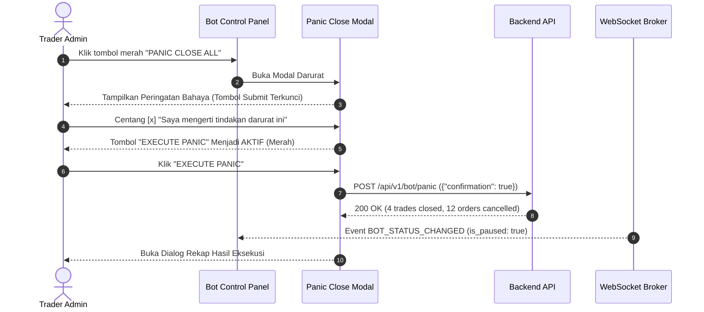

# Task 11: Bot Operations Command, Circuit Breaker & Credential Vault

## 1. Deskripsi Task
Membangun pusat komando operasional bot trading (*Bot Operations Control Panel*), visualisasi status heartbeat engine terintegrasi, tombol darurat *PANIC CLOSE ALL* dengan konfirmasi bertahap 2-langkah, konfigurasi pengaturan bot dinamis, serta vault pengelolaan rotasi kunci API Binance dengan fitur handshake connection test:
1. Membangun komponen **Bot Status Hero Banner (`src/features/bot-settings/components/BotStatusHero.tsx`)** yang mengonsumsi endpoint `GET /api/v1/bot/status`:
   * Status Engine: `🟢 ACTIVE / RUNNING` atau `🟡 PAUSED`.
   * Status Koneksi Binance WebSocket: `🟢 Connected` / `🔴 Disconnected`.
   * Status Telegram Ingestion: `🟢 Polling Active`.
   * Status Background Scheduler: `🟢 Healthy (7 Jobs Active)`.
   * Status Circuit Breaker: `🟢 Normal` atau `🚨 TRIPPED (Daily Loss Limit Exceeded)`.
   * Heartbeat Timestamp terakhir.
2. Membangun komponen **Pause & Resume Controls (`src/features/bot-settings/components/BotControlButtons.tsx`)**:
   * Tombol *Pause Trading Bot* yang memanggil `POST /api/v1/bot/pause` (menolak konsumsi sinyal baru masuk).
   * Tombol *Resume Trading Bot* yang memanggil `POST /api/v1/bot/resume` (mengaktifkan kembali perdagangan).
3. Membangun komponen **Emergency Panic Close All Modal (`src/features/bot-settings/components/PanicCloseModal.tsx`)**:
   * Tombol merah mencolok dengan animasi pendaran bahaya: **PANIC CLOSE ALL** (Terproteksi RBAC Admin).
   * Modal konfirmasi 2-langkah (*2-Step Confirmation*):
     * Peringatan bahaya merah: *"Aksi ini akan menutup SELURUH posisi terbuka di pasar secara instan dan membatalkan SEMUA limit/TP/SL order yang aktif."*
     * Checkbox wajib centang: `[x] Saya mengerti aksi darurat ini akan menutup semua posisi market dan membatalkan seluruh order`.
     * Tombol submit *EXECUTE PANIC CLOSE* terkunci mati hingga checkbox tercentang.
     * Mengirim payload `{"confirmation": true}` ke `POST /api/v1/bot/panic`.
     * Menampilkan dialog rekap eksekusi: jumlah posisi yang ditutup dan jumlah order yang dibatalkan.
4. Membangun komponen **Bot Settings Form (`src/features/bot-settings/components/BotSettingsForm.tsx`)** yang mengonsumsi `GET /api/v1/settings` dan `PUT /api/v1/settings`:
   * Form pengaturan: Default Leverage (`20x`), Confidence Threshold (`0.70`), Risk Percent per Trade (`2.0%`), Max Daily Loss Percent (`6.0%`), dan Max Open Trades (`3`).
5. Membangun komponen **Binance Credential Vault (`src/features/bot-settings/components/CredentialVaultCard.tsx`)** yang memanggil `POST /api/v1/settings/credentials`:
   * Field API Key & Secret Key dengan masking password dan tombol show/hide.
   * Switch Environment: `TESTNET` vs `LIVE`.
   * Tombol *Test Handshake Connection*: Memverifikasi kunci ke Binance dan menampilkan saldo live exchange jika berhasil sebelum menyimpan.

---

## 2. File yang Akan Dibuat / Dimodifikasi

### API Endpoints & Types:
* `frontend/src/api/endpoints/bot.ts`: Fungsi API `getBotStatusApi()`, `pauseBotApi()`, `resumeBotApi()`, `panicCloseApi(confirmation: boolean)`, `getSettingsApi()`, `updateSettingsApi(payload: BotSettingsUpdateRequestDTO)`, `saveCredentialsApi(payload: TradingCredentialCreateRequestDTO)`.
* `frontend/src/types/bot.ts`: TypeScript interfaces (`BotStatusDTO`, `BotSettingsDTO`, `BotSettingsUpdateRequestDTO`, `TradingCredentialCreateRequestDTO`, `PanicCloseResponseDTO`).

### Komponen UI Operasional & Pengaturan:
* `frontend/src/features/bot-settings/BotOperationsPage.tsx`: Halaman utama pusat komando operasional bot.
* `frontend/src/features/bot-settings/components/BotStatusHero.tsx`: Hero banner indikator status engine, scheduler, dan exchange WS.
* `frontend/src/features/bot-settings/components/BotControlButtons.tsx`: Tombol pause, resume, dan panic trigger.
* `frontend/src/features/bot-settings/components/PanicCloseModal.tsx`: Modal darurat 2 langkah dengan checkbox verifikasi.
* `frontend/src/features/bot-settings/components/PanicRecapDialog.tsx`: Dialog rekap hasil eksekusi panic close.
* `frontend/src/features/bot-settings/components/BotSettingsForm.tsx`: Form pengaturan leverage, threshold, dan risk profile.
* `frontend/src/features/bot-settings/components/CredentialVaultCard.tsx`: Form input kredensial API Binance dengan tombol test handshake.

### Unit & Integration Tests:
* `frontend/tests/features/bot_operations.test.tsx`: Pengujian hero banner, aksi pause/resume, dan modal darurat panic close.
* `frontend/tests/features/credential_vault.test.tsx`: Pengujian validasi field API key, masking input, dan handshake test.

---

## 3. Rincian Endpoint API yang Diintegrasikan

### 1. `GET /api/v1/bot/status`
* **Response (200 OK)**:
  ```json
  {
    "is_running": true,
    "is_paused": false,
    "trading_status": "ACTIVE",
    "circuit_breaker_active": false,
    "binance_ws_connected": true,
    "telegram_polling_active": true,
    "scheduler_jobs_count": 7,
    "last_heartbeat": "2026-08-24T14:30:00Z"
  }
  ```

### 2. `POST /api/v1/bot/pause` & `POST /api/v1/bot/resume`
* **Response (200 OK)**: `{"success": true, "message": "Bot paused successfully."}`.

### 3. `POST /api/v1/bot/panic`
* **Request Body**: `{"confirmation": true}`.
* **Response (200 OK)**:
  ```json
  {
    "success": true,
    "closed_trades_count": 4,
    "canceled_orders_count": 12,
    "timestamp": "2026-08-24T14:30:15Z"
  }
  ```

### 4. `GET /api/v1/settings` & `PUT /api/v1/settings`
* **GET Response (200 OK)**:
  ```json
  {
    "default_leverage": 20,
    "confidence_threshold": 0.70,
    "risk_percent_per_trade": 2.0,
    "max_daily_loss_percent": 6.0,
    "max_open_trades": 3,
    "is_paused": false
  }
  ```

### 5. `POST /api/v1/settings/credentials`
* **Request Body** (`TradingCredentialCreateRequest`):
  ```json
  {
    "api_key": "apiKeyStringLongEnough123",
    "secret_key": "apiSecretKeyStringLongEnough456",
    "environment": "TESTNET"
  }
  ```
* **Response (200 OK)**:
  ```json
  {
    "success": true,
    "account_id": 1,
    "credential_id": 1,
    "wallet_balance_usdt": 10450.50,
    "environment": "TESTNET"
  }
  ```

---

## 4. Rincian Alur Interaksi Panic Close All



---

## 5. Edge Cases & Error Handling
1. **Eksekusi Panic Close saat Tidak Ada Posisi Aktif**: Backend tetap membatalkan order terbuka yang menggantung dan mengembalikan `{ "closed_trades_count": 0, "canceled_orders_count": 2 }`. Frontend menyajikan dialog rekap tanpa error.
2. **Kredensial Binance Gagal Handshake**: Jika API Key salah atau IP terblokir $\rightarrow$ Tampilkan alert error spesifik: *"Exchange Authentication Failed: Invalid API Key or IP restriction error (-2015)"*.
3. **Circuit Breaker Tripped Otomatis**: Jika batas kerugian harian terlampaui di backend, WebSocket mengirim event `CIRCUIT_BREAKER_TRIGGERED`. Dashboard otomatis memunculkan banner modal merah darurat: *"🚨 DAILY LOSS LIMIT REACHED! Trading engine otomatis dijeda."*

---

## 6. Kriteria Keberhasilan (Acceptance Criteria)
1. Hero banner menyajikan status live engine, scheduler, dan Binance WebSocket secara akurat.
2. Tombol Pause dan Resume mengubah status bot seketika dengan toast konfirmasi.
3. Modal Panic Close All mewajibkan centang checkbox konfirmasi sebelum tombol submit aktif; setelah eksekusi, seluruh posisi tertutup dan dialog rekap ditampilkan.
4. Form pengaturan bot berhasil menyimpan perubahan parameter via `PUT /api/v1/settings`.
5. Vault kredensial berhasil menguji koneksi handshake ke Binance dan menampilkan saldo live exchange sebelum menyimpan kunci.
6. Seluruh unit test di `frontend/tests/features/bot_operations.test.tsx` dan `frontend/tests/features/credential_vault.test.tsx` lulus 100%.
