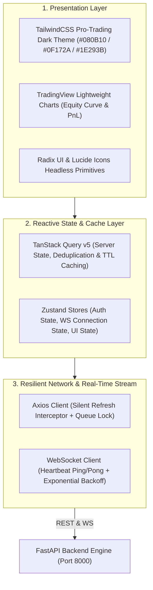

# 🚀 Frontend Web Dashboard Development Roadmap

Dokumen master roadmap ini berisi rincian terstruktur, panduan arsitektur, dan pelacak progres seluruh task modular untuk implementasi **Frontend Web Dashboard UI (SMC CryptoBot)** berdasarkan blueprint [`docs/frontend/`](../../docs/frontend/) dan spesifikasi OpenAPI 3.1.0 di [`docs/openapi.yaml`](../../docs/openapi.yaml).

---

## 🗂️ Daftar Seluruh Task Modular Frontend

| No | File Task | Modul & Cakupan Fitur | Target Endpoint / WebSocket Events | Akses RBAC | Status |
| :---: | :--- | :--- | :--- | :---: | :---: |
| **01** | [`01_project_bootstrap_and_design_system.md`](./01_project_bootstrap_and_design_system.md) | Setup Proyek (Vite + TS), Tailwind Design System, Komponen UI Atomik & Formatters | - | All | ✅ Completed |
| **02** | [`02_network_layer_auth_and_session.md`](./02_network_layer_auth_and_session.md) | Axios Interceptor (Silent Refresh), Zustand Auth Store, Login Page & RBAC Guards | `/api/v1/auth/login` `/api/v1/auth/refresh` `/api/v1/auth/me` | Admin, Viewer | ✅ Completed |
| **03** | [`03_realtime_websocket_client_and_event_broker.md`](./03_realtime_websocket_client_and_event_broker.md) | Duplex Resilient WebSocket Client, Heartbeat Ping/Pong, Auto-Reconnect & Event Bus | `/api/v1/ws` `TRADE_OPENED`, `TP_HIT`, `TRADE_CLOSED`, dll | All | ✅ Completed |
| **04** | [`04_analytics_and_equity_curve.md`](./04_analytics_and_equity_curve.md) | 6 Executive KPI Summary Cards, TradingView Equity Curve Chart & Real-Time Sync | `/api/v1/analytics/summary` `/api/v1/analytics/equity-curve` | Admin, Viewer | ✅ Completed |
| **05** | [`05_active_positions_and_tp_tracker.md`](./05_active_positions_and_tp_tracker.md) | Live Active Positions Table, Price Flash, Take Profit 3-Stage Progress & Manual Close | `/api/v1/trades/active` `/api/v1/trades/{id}/close` | Admin, Viewer (Close: Admin) | ✅ Completed |
| **06** | [`06_trade_history_and_detail_drilldown.md`](./06_trade_history_and_detail_drilldown.md) | Paginated Trade History Table & Modal Dialog Inspeksi Hierarki 5-Level | `/api/v1/trades/history` `/api/v1/trades/{id}` | Admin, Viewer | ✅ Completed |
| **07** | [`07_signals_feed_and_execution_wizard.md`](./07_signals_feed_and_execution_wizard.md) | Telegram Signal Feed Stream & 1-Click Wizard Modal (Hard 2% Risk Cap & Sub-2s Exec) | `/api/v1/signals` `/api/v1/signals/manual-execute` | Admin (Exec), Viewer (Read) | ✅ Completed |
| **08** | [`08_watchlist_and_instruments.md`](./08_watchlist_and_instruments.md) | Watchlist Grid with Instant Toggle, Leverage Bracket Inspector & Binance Sync | `/api/v1/watchlist` `/api/v1/watchlist/toggle` `/api/v1/instruments/sync` | Admin (Mutate), Viewer (Read) | ✅ Completed |
| **09** | [`09_signal_providers_and_strategies.md`](./09_signal_providers_and_strategies.md) | Channel Providers Management, Provider Analytics & Strategy TP 100% Config | `/api/v1/providers` `/api/v1/providers/{id}/analytics` `/api/v1/strategies/{id}` | Admin (Mutate), Viewer (Read) | ✅ Completed |
| **10** | [`10_risk_simulator_sandbox.md`](./10_risk_simulator_sandbox.md) | Risk Simulator Sandbox, Debounced Lot Sizing & Dynamic Leverage Downscale Warning | `/api/v1/calculator/simulate` | Admin, Viewer | ✅ Completed |
| **11** | [`11_bot_operations_and_settings.md`](./11_bot_operations_and_settings.md) | Bot Status Hero, Pause/Resume, 2-Step Panic Close All, Settings & Credential Vault | `/api/v1/bot/status`, `/pause`, `/resume` `/api/v1/bot/panic` `/api/v1/settings`, `/credentials` | Admin (Control), Viewer (Read) | ✅ Completed |
| **12** | [`12_logs_and_reports.md`](./12_logs_and_reports.md) | Live Audit Log Terminal (Severity Highlighting) & Generator Laporan CSV RFC 4180 | `/api/v1/logs` `/api/v1/reports/export/csv` | Admin, Viewer | ✅ Completed |
| **13** | [`13_app_shell_navigation_and_e2e_integration.md`](./13_app_shell_navigation_and_e2e_integration.md) | Responsive Pro-Terminal Layout, Sidebar/Navbar, Error Boundaries & E2E Verification | Seluruh Modul & Routing | All | ✅ Completed |

---

## 🏗️ Arsitektur Teknologi Frontend

---

## 🛡️ Standar Kualitas & Kriteria Pengujian (Testing Standards)

Setiap task wajib mematuhi matriks kualitas berikut:
1. **Static Typing & Zero Lint Error**:
   * TypeScript Strict Mode (`tsconfig.json`) dengan 0 type error (`npm run typecheck`).
   * ESLint & Prettier passing 100%.
2. **OpenAPI Spec 100% Compliance**:
   * Seluruh request body, query parameters, dan DTO response harus identik 100% dengan skema di [`docs/openapi.yaml`](../../docs/openapi.yaml).
3. **Unit & Component Testing**:
   * Setiap fitur memiliki test suite di folder `frontend/tests/` (Vitest + React Testing Library).
4. **Performance & Ergonomics**:
   * Latensi render update WebSocket $< 30\text{ms}$.
   * Virtual scrolling pada tabel dengan 100+ baris data stabil pada 60 FPS.
   * Nilai Cumulative Layout Shift (CLS) $< 0.05$ menggunakan skeleton placeholders.
