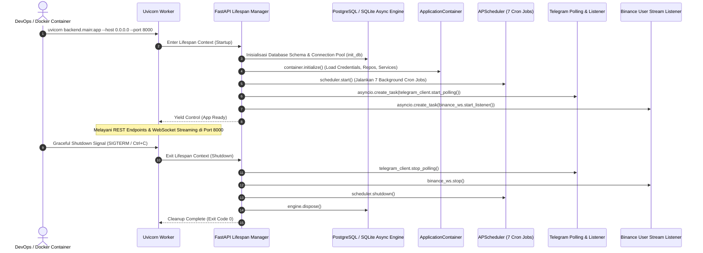

# Task 11: Application Lifecycle Wiring, FastAPI Lifespan & Production Containerization

## 1. Deskripsi Task
Mengintegrasikan seluruh sub-sistem (FastAPI REST & WebSocket Server, Telegram Polling Bot, Binance WebSocket Stream Listener, dan APScheduler Background Cron Jobs) ke dalam satu *entry point* terpadu pada `backend/main.py` menggunakan FastAPI Lifespan Manager (`@asynccontextmanager`), serta memperbarui konfigurasi `Dockerfile` dan `docker-compose.yml` agar siap dijalankan secara simultan di environment production.

Implementasi ini menerapkan arsitektur terintegrasi:
* **Unified Lifespan Context Manager (`@asynccontextmanager`)**:
  * Menggantikan event listener usang (`@app.on_event("startup")`) dengan context manager modern FastAPI.
  * **Startup Phase**: Menginisialisasi koneksi database engine pool (`init_db()`), bootstrap master admin default, mengaktifkan `SchedulerService` (7 background cron jobs), menjalankan `TelegramChannelListener`/bot poller, dan mengaktifkan `BinanceWebSocketClient` user data stream.
  * **Shutdown Phase**: Memastikan graceful termination pada seluruh async background tasks, menghentikan polling Telegram, menutup Binance WebSocket client, mematikan APScheduler, dan membuang pool koneksi database (`engine.dispose()`).
* **Production Dockerization**:
  * Memperbarui `Dockerfile` entrypoint untuk menjalankan `uvicorn backend.main:app --host 0.0.0.0 --port 8000`.
  * Memperbarui `docker-compose.yml` dengan port mapping `8000:8000` dan healthcheck endpoint `GET /health` atau `GET /api/v1/bot/status`.
* **CORS & Documentation**:
  * Menjamin CORS middleware dikonfigurasi secara aman untuk frontend dashboard.
  * Menjamin Swagger UI (`/docs`) dan ReDoc (`/redoc`) menyajikan seluruh 25+ endpoint REST dan WebSocket stream secara akurat.

---

## 2. File yang Akan Dibuat & Dimodifikasi

### File Baru:
1. `backend/tests/api/test_e2e_api_lifecycle.py`: Test suite end-to-end untuk memvalidasi siklus startup lifespan, ketersediaan API documentation `/docs` & `/openapi.json`, CORS headers, dan graceful shutdown handling.

### Modifikasi File:
1. `backend/main.py`:
   * Mengintegrasikan `create_app(lifespan=lifespan)` dengan `ApplicationContainer`.
   * Mendefinisikan `@asynccontextmanager async def lifespan(app: FastAPI)` yang mengorkestrasi startup dan shutdown seluruh sub-komponen.
   * Menyediakan entry point CLI via `uvicorn.run("backend.main:app", ...)` saat dieksekusi langsung (`python backend/main.py`).
2. `backend/src/api/app.py`:
   * Menerima opsional parameter `lifespan` pada `create_app(lifespan=None)` agar kompatibel dengan testing fixtures maupun production runtime.
3. `Dockerfile`:
   * Memperbarui `CMD` agar menjalankan Uvicorn production server (`uvicorn backend.main:app --host 0.0.0.0 --port 8000`).
4. `docker-compose.yml`:
   * Membuka port `8000:8000` dan menambahkan healthcheck API.
5. `tasks/web_dashboard_api/README.md`:
   * Menandai Task 11 sebagai `✅ Done` setelah seluruh verifikasi pengujian selesai.

---

## 3. Alur Kerja Lifespan Startup & Shutdown

---

## 4. Matriks Pengujian Lengkap (Test Matrix)

Test suite `backend/tests/api/test_e2e_api_lifecycle.py` mencakup:

| Kategori | Nama Test | Deskripsi Skenario | Expected Result |
| :--- | :--- | :--- | :--- |
| **Lifespan Startup** | `test_lifespan_startup_initializes_services` | Menjalankan context lifespan app via `LifespanManager` / `TestClient`. | Database terhubung, background tasks terdaftar, status bot `ACTIVE` atau `PAUSED`. |
| **Health Check** | `test_healthcheck_endpoint_returns_ok` | Mengakses endpoint `GET /health`. | Status HTTP 200 OK dengan payload `{"status": "ok", "service": "binance-trading-bot-api"}`. |
| **OpenAPI Docs** | `test_openapi_schema_generation` | Mengakses endpoint `GET /openapi.json` dan `GET /docs`. | Status HTTP 200 OK, memuat seluruh tags (`Auth`, `Analytics`, `Trades`, `Signals`, `Watchlist`, `Instruments`, `Providers`, `Strategies`, `Calculator`, `Bot`, `Settings`, `Logs`, `Reports`, `WebSocket`). |
| **CORS Middleware** | `test_cors_preflight_headers` | Mengirimkan preflight `OPTIONS /api/v1/trades/active` dengan origin `http://localhost:3000`. | Header `access-control-allow-origin`, `access-control-allow-methods`, dan `access-control-allow-headers` dikembalikan dengan benar. |
| **Lifespan Shutdown** | `test_lifespan_graceful_shutdown_cleanup` | Menutup context lifespan app. | Seluruh background tasks dibatalkan dengan bersih tanpa *dangling coroutines* atau unhandled exceptions. |
| **Concurrent Load** | `test_concurrent_rest_and_websocket_requests` | Menjalankan request REST API simultan bersamaan dengan koneksi WebSocket aktif. | Seluruh request berhasil diproses secara konkuren dengan latency stabil. |

---

## 5. Kriteria Keberhasilan (Acceptance Criteria)
1. **Single Entry Point**: Perintah tunggal `uvicorn backend.main:app --host 0.0.0.0 --port 8000` atau `python backend/main.py` berhasil mengaktifkan seluruh komponen secara simultan.
2. **Graceful Termination**: Penghentian container atau server (`SIGINT`/`SIGTERM`) membersihkan seluruh koneksi dan task asinkron tanpa meninggalkan lock database atau thread menggantung.
3. **OpenAPI & Swagger UI**: Dokumentasi interaktif Swagger UI tersedia lengkap di `http://localhost:8000/docs`.
4. **Production Readiness**: Dockerfile dan docker-compose.yml terkonfigurasi dengan port mapping dan healthcheck yang tepat.
5. **Mypy Static Typing**: 0 errors pada static type checking (`mypy backend/src/`).
6. **Full Test Suite**: Seluruh 340+ unit & integration tests serta test lifecycle baru lulus 100%.
