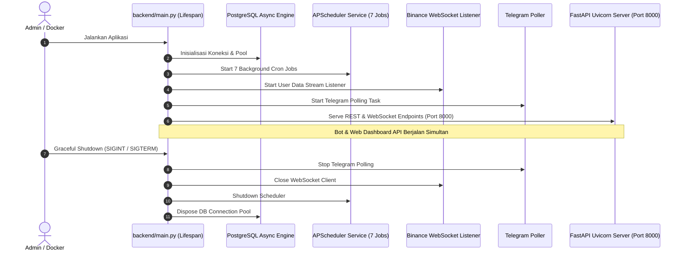

# Task 11: Application Lifecycle Wiring & Docker Integration

## 1. Deskripsi Task
Mengintegrasikan seluruh sub-sistem (FastAPI REST & WebSocket Server, Telegram Polling Bot, Binance WebSocket Stream Listener, dan APScheduler Background Cron Jobs) ke dalam satu *entry point* terpadu pada `backend/main.py`, serta memperbarui konfigurasi `Dockerfile` dan `docker-compose.yml` agar siap dijalankan secara simultan di environment production.

---

## 2. File yang Akan Ditambah / Dimodifikasi

### File Baru:
* `backend/tests/api/test_e2e_api_lifecycle.py`: Test suite *end-to-end* yang memverifikasi lifecycle startup, lifespan hooks, database session cleanup, dan graceful shutdown.

### Modifikasi File:
* `backend/main.py`:
  * Menggunakan FastAPI Lifespan Context (`@asynccontextmanager`) untuk menginisialisasi database tables/engine, menjalankan 7 background cron jobs (`SchedulerService`), mengaktifkan `BinanceStreamListener`, dan menjalankan Telegram polling secara concurrent menggunakan `asyncio.TaskGroup` / `asyncio.gather`.
* `Dockerfile`:
  * Memperbarui `CMD` untuk menjalankan `uvicorn main:app --host 0.0.0.0 --port 8000`.
* `docker-compose.yml`:
  * Membuka port `8000:8000` untuk akses Web Dashboard API dan menambahkan healthcheck endpoint `GET /api/v1/bot/status`.
* `requirements.txt`:
  * Memastikan seluruh dependensi FastAPI, Uvicorn, dan JWT terdaftar rapi.

---

## 3. Alur Kerja Lifespan Startup & Shutdown

---

## 4. Kriteria Keberhasilan (Acceptance Criteria)
1. **Single Command Run**: Perintah tunggal `uvicorn main:app --host 0.0.0.0 --port 8000` atau `docker compose up` berhasil menjalankan:
   * REST & WebSocket API di `http://0.0.0.0:8000`
   * Dokumentasi interaktif Swagger UI di `http://0.0.0.0:8000/docs`
   * 7 Background Scheduler Cron Jobs
   * Telegram Bot Handler & User Data Stream Listener
2. **Graceful Shutdown**: Penghentian container (`docker stop` / `Ctrl+C`) menutup seluruh koneksi database dan task asynchronous dengan bersih tanpa *dangling tasks*.
3. **Testing**: Test di `backend/tests/api/test_e2e_api_lifecycle.py` lulus 100% dan seluruh 220+ test terdahulu tetap lulus tanpa regresi.
